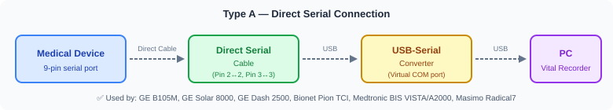
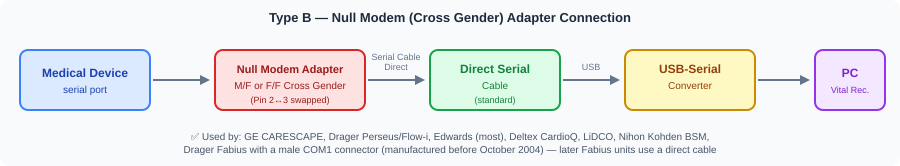
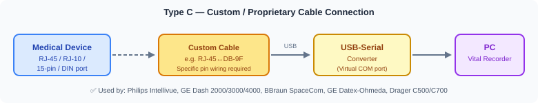
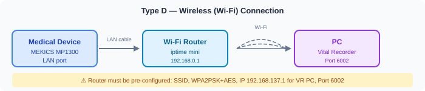
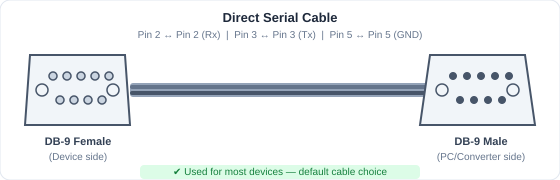
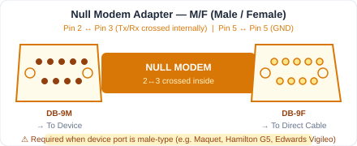
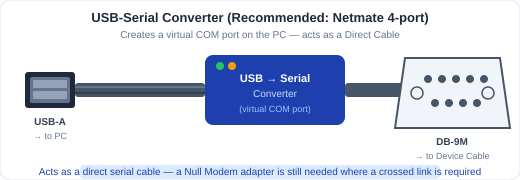

# Hardware Connection Guide

> **Disclaimer:** This document is for reference only. Our team is not responsible for connection errors. If discrepancies exist between this document and the device manufacturer's manual, **always follow the manufacturer's manual**.

This guide covers Vital Recorder hardware setup for **48 medical devices** across 7 categories. Use the Quick Reference tables below to identify your cable type, then click the device name to open its full setup instructions.

## System Overview

One recording PC collects from several devices at once. Serial devices reach the PC through USB-Serial converters gathered on a powered USB hub; a Null Modem adapter is fitted only at the device ports that need one.

---

## Table of Contents

- [System Overview](#system-overview)
- [Quick Reference — All Devices](#quick-reference--all-devices)
  - [Patient Monitors](#patient-monitors)
  - [Anesthesia Machines](#anesthesia-machines)
  - [Mechanical Ventilators](#mechanical-ventilators)
  - [Hemodynamic Monitors](#hemodynamic-monitors)
  - [Syringe Pumps](#syringe-pumps)
  - [Brain Monitors](#brain-monitors)
  - [Others](#others)
- [Getting Started](#getting-started)
  - [Requirements](#requirements)
  - [Connection Types](#connection-types)
  - [Cable Types](#cable-types)

---

## Quick Reference — All Devices

> Find your device below and identify the cable type before connecting. Click the device name to open its full setup instructions.
>
> **Vital Recorder version:** always run the latest release — [official version history](https://vitaldb.net/vital-recorder/?action=versions). Device-related release notes are summarised in [version-notes.md](version-notes.md).

### Patient Monitors

| Device | Cable | Adapter | Port | VR Device Name |
|--------|-------|---------|------|----------------|
| [GE CARESCAPE B850 / B650 / B450](patient_monitors/ge_carescape.md) | USB-Serial converter — **model depends on software version** (see page) | Null Modem F/F | USB port | `Bx50` |
| [GE S/5 AM](patient_monitors/ge_s5am.md) | Direct Serial | Null Modem F/F | Port X8 | `Bx50` |
| [GE B40 / B20](patient_monitors/ge_b40_b20.md) | 9-pin serial (pin 4 removed) | Null Modem F/F | 9-pin | `Bx50` |
| [GE B105M / B125M / B155M](patient_monitors/ge_b105m.md) | Direct Serial | None | Red-marked serial | `B1x5M` |
| [GE Solar 8000m / 8000i](patient_monitors/ge_solar8000.md) | Direct Serial | None | RS-232 1 | `Solar8000` |
| [GE Dash 2000 / 3000 / 4000 / 5000](patient_monitors/ge_dash2000.md) | Custom DB-9F ↔ RJ-45 | None | RJ-45 AUX | `Dashx000` |
| [GE Dash 2500](patient_monitors/ge_dash2500.md) | Direct Serial | None | Host Comm Port | `Dash2500` |
| [GE TRAM-RAC 4A](patient_monitors/ge_tram_rac.md) | ADC required (analog) | — | 15-pin ANALOG OUT | *(per ADC type)* |
| [GE Defib Connectors](patient_monitors/ge_defib.md) | 7-pin DIN → ADC | — | Defib.Sync | *(per ADC type)* |
| [Philips Intellivue MP / MX](patient_monitors/philips_intellivue.md) | Custom RJ-45 ↔ DB-9F | None | **`MIB/RS232`** port — not the standalone `RS232` port | `Intellivue` |
| [Dräger Infinity Kappa](patient_monitors/drager_infinity_kappa.md) | 14-pin Mini-D ↔ DB-9F (part #5206441) | None | X5 or X3 docking — **pinouts differ** | `Infinity` |
| [Dräger Infinity C500 / C700](patient_monitors/drager_infinity_c500.md) | Custom RJ10 ↔ DB-9F | None | P2500 RJ10 port | `Infinity` |
| [MEKICS MP1300](patient_monitors/mekics_mp1300.md) | Wireless (Wi-Fi) | — | LAN port | `MEKICS` |
| [Nihon Kohden BSM](patient_monitors/nihon_kohden_bsm.md) | Direct Serial | Null Modem M/F | RS-232C interface board, **model-dependent** | `BSM` |
| [GE Corometrics 170 / 250cx](patient_monitors/ge_corometrics.md) | 170: Custom RJ-45 ↔ DB-9F (CTS looped to RTS) · 250cx: **RJ11** cable (pinout pending) | None | 170: RS-232 Port 1 or 2 (RJ-45) — **service setup required** · 250cx: RJ11 | `Coro` |

### Anesthesia Machines

| Device | Cable | Adapter | Port | VR Device Name |
|--------|-------|---------|------|----------------|
| [Dräger Apollo / Cicero EM Color / Julian / Vamos](anesthesia_machines/drager_apollo.md) | Direct Serial | None | COM1 | `Medibus` |
| [Dräger Primus](anesthesia_machines/drager_primus.md) | Direct Serial | None | COM1 | `Primus` |
| [Dräger Fabius](anesthesia_machines/drager_fabius.md) | Direct Serial | **Depends on COM1 connector** — None if female (Oct 2004 →), Null Modem F/F if male (before Oct 2004) | COM1 | `Fabius` |
| [Dräger Zeus](anesthesia_machines/drager_zeus.md) | Direct Serial | Null Modem — gender per connector *(unverified)* | COM (rear) | `Medibus` |
| [Dräger Perseus](anesthesia_machines/drager_perseus.md) | Direct Serial | Null Modem F/F | COM1 or COM2 | `MedibusX` |
| [GE Datex-Ohmeda](anesthesia_machines/ge_datex_ohmeda.md) | Custom 9-pin ↔ 15-pin | None | 15-pin (under cover) | `Datex-Ohmeda` |
| [Maquet Flow-i](anesthesia_machines/maquet_flow_i.md) | Direct Serial | Null Modem M/F | Serial port | `Flow-i` |

### Mechanical Ventilators

| Device | Cable | Adapter | Port | VR Device Name |
|--------|-------|---------|------|----------------|
| [Dräger EVITA V300 / V500 / V600 / V800](mechanical_ventilators/drager_evita.md) | Direct Serial | Null Modem *(gender unverified)* | RS-232 COM1 | `MedibusX` (19200) |
| [Maquet / Getinge Servo-i / Servo-s / Servo-U](mechanical_ventilators/maquet_servo.md) | Direct Serial | Null Modem M/F | **BOTTOM** RS-232 only | `Servo-i` |
| [Hamilton G5 / C-series](mechanical_ventilators/hamilton.md) | Direct Serial | Null Modem M/F | Monitoring Interface 1 or 2 — set to **Block** | `Hamilton` |

### Hemodynamic Monitors

| Device | Cable | Adapter | Port | VR Device Name |
|--------|-------|---------|------|----------------|
| [Edwards EV-1000 (old model)](hemodynamic_monitors/edwards_ev1000.md) | Direct Serial | Null Modem **F/F** | 2nd port from right | `EV1000` |
| [Edwards EV-1000A (new model)](hemodynamic_monitors/edwards_ev1000.md) | Direct Serial | Null Modem **M/F** | Serial port | `EV1000` |
| [Edwards Vigilance](hemodynamic_monitors/edwards_vigilance.md) | Direct Serial | Null Modem M/F | COM1 (or COM2) | `Vigilance` |
| [Edwards Vigilance II](hemodynamic_monitors/edwards_vigilance2.md) | Direct Serial | Null Modem M/F | Port 1 (top) | `Vigilance` |
| [Edwards Vigileo](hemodynamic_monitors/edwards_vigileo.md) | Direct Serial | Null Modem M/F | Serial port | `Vigileo` |
| [Edwards Hemosphere](hemodynamic_monitors/edwards_hemosphere.md) | Direct Serial | Null Modem M/F | Serial port | `Hemosphere` |
| [Deltex CardioQ](hemodynamic_monitors/deltex_cardioq.md) | Direct Serial | Null Modem **F/F** | Male serial port | `CardioQ` |
| [LiDCO](hemodynamic_monitors/lidco.md) | Direct Serial | Null Modem M/F | Serial port | `LiDCO` |

### Syringe Pumps

| Device | Cable | Adapter | Port | VR Device Name |
|--------|-------|---------|------|----------------|
| [Fresenius Vial Orchestra](syringe_pumps/fresenius_orchestra.md) | Direct Serial | Null Modem M/F | RS 232-3 (rightmost) | `Orchestra` |
| [Fresenius Kabi Agilia](syringe_pumps/fresenius_agilia.md) | Proprietary Fresenius cable | None | Device-specific | `Agilia` |
| [Fresenius Kabi Link+ Agilia](syringe_pumps/fresenius_link_agilia.md) | USB 2.0 AM-Mini 5-pin | None | USB-B (side, bottom) | `Link+` |
| [BBraun SpaceCom](syringe_pumps/bbraun_spacecom.md) | Custom Mini-DIN ↔ DB-9F | None | Mini-DIN port | `SpaceCom` |
| [Bionet Pion TCI](syringe_pumps/bionet_pion.md) | Direct Serial | None | 9-pin port | `Pion` |
| [Belmont FMS (RI-2)](syringe_pumps/belmont_fms.md) | Direct Serial | Null Modem F/F | Serial port (behind vent panel) | `FMS` |

### Brain Monitors

| Device | Cable | Adapter | Port | VR Device Name |
|--------|-------|---------|------|----------------|
| [Medtronic BIS VISTA](brain_monitors/medtronic_bis_vista.md) | Direct Serial | **None** ⚠️ cross cable causes error | RS-232 (rear panel) | `VISTA` (ASCII) / `BIS (binary)` (Legacy Binary + EEG) |
| [Medtronic BIS A2000](brain_monitors/medtronic_bis_a2000.md) | Direct Serial | None | **J1** (RS-232) — not J2, which is the printer port | `A2000` |
| [Medtronic INVOS Cerebral/Somatic Oximetry](brain_monitors/medtronic_invos.md) | Direct Serial | Null Modem F/F | `\|O\|O\|` port (male connector) | `Invos` |

### Others

| Device | Cable | Adapter | Port | VR Device Name |
|--------|-------|---------|------|----------------|
| [Masimo Radical7](others/masimo_radical7.md) | Direct Serial | None | P1 RS-232 (Docking Station) | `Radical7` |
| [Masimo ROOT](others/masimo_root.md) | Masimo data-acquisition USB cable *(preferred)*; generic USB-Serial converter as fallback | None with the Masimo cable; **Null Modem F/F** with a generic converter | USB1 or USB2 *(both routes)* | `Root` |
| [Sentec SDM](others/sentec_sdm.md) | USB-Serial converter | None | Serial Data Port (RS-232), rear | `SDM` |
| [MDMS ANI Monitor V2](others/mdms_ani_monitor.md) | NEXT USB-Serial [NEXT-RS232U20] | None | `REAL TIME EXPORT` DB-9 — not `DATA EXPORT` | `ANIMonitor2` |
| [BlinkDC TwitchView](others/blink_twitchview.md) | Custom RJ45 (special wiring) | None | RJ45 on the **Charging Station** | `TwitchView` |
| [OBELAB NIRSIT-ON+](others/obelab_nirsit_on.md) | Direct Serial | None | Rear USB (serial) — **open TCP 5525** on the tablet | `NirsitON` |
| [IDMed TOFscan](others/idmed_tofscan.md) | TOF-RS1 / TOF-RS2 optic-serial cable (from IDMed) | None | **Optical** output | `TOFScan` |

---

## Getting Started

### Requirements

#### Computer

Vital Recorder runs on Windows (Vista, 7, 8, 8.1, 10 — 32-bit and 64-bit).

| Spec | Details |
|------|---------|
| Minimum CPU | Intel Atom N330 (up to 30% CPU at full-screen recording) |
| Recommended CPU | Intel i3 or higher (<5% CPU utilization) |
| USB Ports | Multiple full-size ports recommended; USB hub supported |

> **Tip:** A laptop or low-cost Windows tablet works well. Use a powered USB hub when connecting more than 2 devices.

#### Serial Cables

There are two types of serial cable. They are **physically identical in appearance** — the difference is in the internal wiring.

| Type | Wiring | Use in this guide |
|------|--------|-------------------|
| **Direct serial cable** — also called a *straight-through* cable | Pin 2 ↔ Pin 2 (Rx), Pin 3 ↔ Pin 3 (Tx) | Every serial device |
| **Cross cable** — also called a *crossover* or *null-modem cable* | Pin 2 ↔ Pin 3 (crossed) | Never specified as a cable. Where a crossed link is needed, the guide specifies a direct serial cable plus a **Null Modem adapter** |

> ⚠️ **WARNING:** Using a cross cable where a direct serial cable is required (or vice versa) can cause electrical shorts, device malfunction, or fire. **Always verify the cable type before connecting.**

**Recommended approach:** Use only direct serial cables for all runs. If a crossed link is required, attach a **Null Modem adapter** at the device port.

---

### Connection Types

Every device in this guide connects in one of four ways. Identify which type applies to your device, then follow its device page for the exact port and settings.

> The device lists in these diagrams are examples only. The [Quick Reference tables](#quick-reference--all-devices) and each device page are authoritative for cable, adapter and port.

#### Type A — Direct Serial

Device serial port → direct serial cable → USB-Serial converter → PC. No adapter.

#### Type B — Null Modem Adapter

Same as Type A, with a Null Modem adapter fitted **at the device port**.

#### Type C — Custom / Proprietary Cable

The device port is not a standard DB-9 — RJ-45, RJ-10, 15-pin or DIN — so a cable with specific pin wiring is required.

#### Type D — Wireless (Wi-Fi)

The device sends data over the network instead of a serial line. The router must be configured in advance.

---

### Cable Types

The images below show the cables and adapters referenced throughout this guide.

#### Direct Serial Cable

#### Null Modem Adapter — F/F (Female / Female)

A **Null Modem adapter** swaps the TX and RX lines (pins 2 and 3) and is specified by the gender of its two connectors, **M/F** or **F/F**. It is also sold as a *cross-gender* adapter.

> Korean cable shops sell Null Modem adapters as **"크로스 젠더" (cross gender)**. Ask for that name when buying locally — a plain *gender changer* (젠더) is wired straight through and will **not** work.

| Adapter | Description | Purchase (Korea) |
|---------|-------------|-----------------|
| Null Modem M/F | Male on one side, Female on the other | [cableguy.com](http://cableguy.com/shop/mall.php?cat=007001001&query=view&no=33688) |
| Null Modem F/F | Female on both sides | [cableguy.com](http://cableguy.com/shop/mall.php?cat=007001001&query=view&no=189324) |

#### Null Modem Adapter — M/F (Male / Female)

#### USB-Serial Converter

Laptops and tablets typically lack a built-in serial port. A **USB-Serial converter** — also sold as a *USB-to-RS232* or *Serial-to-USB* converter — creates a virtual COM port and **acts as a direct serial cable**. Devices that require a cross connection still need a Null Modem adapter.

**Recommended:** Netmate 4-port USB-Serial converter (Kangwon Electronics) — creates four COM ports from one USB connection. [Purchase link (Korea)](http://cableguy.com/shop/mall.php?cat=005004003&query=view&no=39206)

> Some devices accept only specific converter models. The **GE CARESCAPE** accepts one converter per monitor software version — see its device page before buying.

#### USB Hub

Use a **powered USB hub** (with its own external power adapter) to prevent insufficient USB power — the most common cause of intermittent data loss.

[Purchase — ORICO 4-port Powered USB Hub (Korea)](http://www.enuri.com/detail.jsp?modelno=10534644)

#### USB Extension Cable

Cables under 10 meters do not risk signal degradation. Use shielded cables in OR environments.

[Purchase link (Korea)](http://cableguy.com/shop/mall.php?cat=025011002&query=view&no=541)

