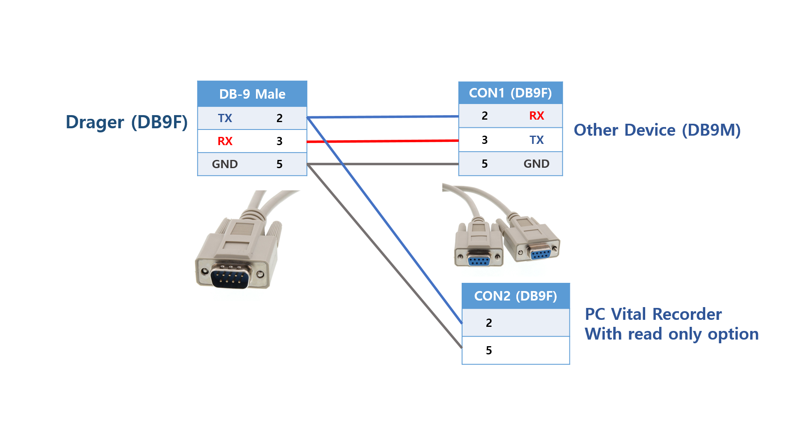

# Dräger Apollo / Cicero EM Color / Julian / Vamos

<!-- meta
category: Anesthesia Machine
manufacturer: Dräger
vr_device_name: Medibus
-->
> **Note:** These machines ship with COM1 already set up for MEDIBUS, so **no additional device configuration is normally required**. Only verify the serial parameters if no data appears.

| Cable | Adapter | Port | Serial | VR Device Name |
|-------|---------|------|--------|----------------|
| direct serial cable | None | COM1 (rear) | 9600 baud, 8 data bits, Even parity, 1 stop bit — MEDIBUS | `Medibus` |

## Connection Steps
1. Locate **COM 1** on the rear connector panel. The panel carries **COM 1**, **COM 2** and an **IV System** connector side by side — use **COM 1**.

   

2. Connect a **direct serial cable** to COM 1. No Null Modem adapter is needed on these models.
3. Connect the other end to the PC via a USB-Serial converter.
4. In Vital Recorder, add the device as **`Medibus`** — see [Vital Recorder Setup](#vital-recorder-setup).

> If COM1 is already in use, see [When the COM1 Port is Already in Use](#when-the-com1-port-is-already-in-use) below.

### When the COM1 Port is Already in Use

If the Dräger COM1 port is already transmitting data to a patient monitor (e.g., CO2 curve, airway pressure), use a **Y-cable** to read data without disrupting existing communication.

> ⚠️ When using a Y-cable, enable **"Read Only Mode"** in Vital Recorder when adding the device.

**Y-cable Wiring:**

The machine's COM1 is **DB-9 female**, so the Y-cable's machine end is a **DB-9 male plug** and mates with it directly. CON1 is **DB-9 female** and mates with the existing device's DB-9 male connector. **No gender adapter is used anywhere in this assembly.**

```
Dräger COM1 (DB9F) ──┤ DB9M  Y-cable  CON1 (DB9F) ├── existing device (DB9M)
                                      CON2 (DB9F) ├── PC via USB-Serial converter
```

| Machine end — DB-9 male plug | CON1 — to the existing device (DB-9F) | CON2 — to Vital Recorder (DB-9F) |
|-------------------------------|----------------------------------------|-----------------------------------|
| 2 — TX (machine transmit)     | 2 — RX                                 | 2 — RX                            |
| 3 — RX (machine receive)      | 3 — TX                                 | *not connected*                   |
| 5 — GND                       | 5 — GND                                | 5 — GND                           |

Only the machine's transmit line and ground are branched to CON2, so Vital Recorder listens without ever driving the line.

> **Reading the pin numbers.** Signal names here are given **from the machine's side**: on the Dräger COM1, pin 2 transmits and pin 3 receives. Seen **from the PC's side**, the same pins are named the other way round: pin 2 receives and pin 3 transmits. Both describe the same direct serial cable.



## Device Configuration
Nothing has to be changed on these models. If no data arrives, check the machine's serial parameters and set them to:

- Serial: **9600 baud, 8 data bits, Even parity, 1 stop bit**
- Protocol: **MEDIBUS**

On machines that expose the setting on screen it is reached from the interface page of the system setup menu (**System setup → System → Interfaces** on newer software). Select the COM port that matches the cable you connected — the other COM port is frequently occupied by the hospital EMR gateway.

> ⚠️ **Keep the baud rate at 9600.** Any other value appears as a `MEDIBUS COM2` message or as a repeated `COM1 failure` on the machine.

## Vital Recorder Setup
- Add the device as **`Medibus`**. Vital Recorder has no separate entry for these models.
- With **`AUTO_DETECT=1`** in `vr.conf`, the machine is found on the serial line with no `[DEV/...]` section.
- **Waveforms:** Vital Recorder asks the machine which waveforms it offers and requests up to 4 of them, so `wavs=` is not needed. Set `wavs=` in the device section only to choose specific ones, e.g. `wavs=AWP,AWF`.
- **On a Y-cable tap** Vital Recorder cannot send requests. It records the waveforms the existing device has requested.

## Troubleshooting
- **Numerics arrive but no waveforms.** If `wavs=` is set, remove it and test again. On a Y-cable tap, waveforms arrive only when the existing device requests them.
- **Waveforms come out in the wrong order on a Y-cable (read-only) tap.** The order is detected automatically when the existing device's requests are visible on the line. Otherwise list the waveforms with `wavs=` in the order the existing device requests them.
- **The port does not open.** In `vr.conf`, `port=` must be the actual serial port name of the converter channel (e.g. `C1`), not `COM1`.
