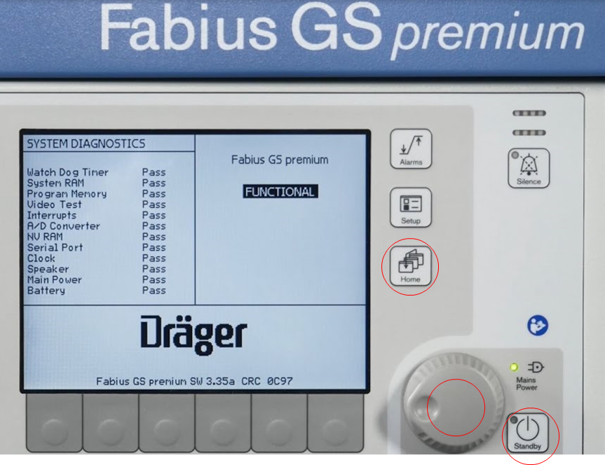

# Drager Fabius / Zeus / Infinity

<!-- meta
category: Anesthesia Machine
manufacturer: Drager
vr_device_name: MedibusX
-->
> ⚠️ **A Null Modem (cross-gender) adapter is required** in addition to a direct serial cable.

| Cable | Adapter | Port | VR Device Name |
|-------|---------|------|----------------|
| Direct Serial | Null Modem (cross gender) | Serial port | `MedibusX` |

## Connection Steps
1. Attach a **Null Modem cross-gender adapter** to the serial port.
2. Connect a direct serial cable from the adapter to the PC via USB-Serial converter.
3. **Fabius only:** Press the **three buttons marked in red** simultaneously to enter service mode and change serial settings.

   
