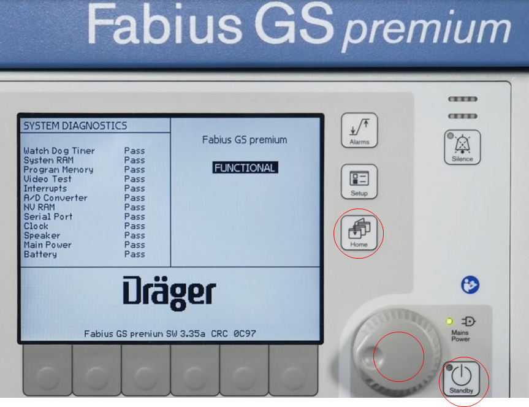

# Dräger Fabius

<!-- meta
category: Anesthesia Machine
manufacturer: Dräger
vr_device_name: Fabius
-->
> ⚠️ **Check the machine's manufacture date before ordering a cable.** The Fabius shipped with two different COM1 connectors, and the adapter you need depends on which one is fitted. Read [Before You Start](#before-you-start) first.

| Model (COM1 connector) | Cable | Adapter | Port | Serial | VR Device Name |
|--------------------------|-------|---------|------|--------|----------------|
| **Female** COM1 — manufactured Oct 2004 onward | Direct Serial | **None** | COM1 | 9600, 8 / Even / 1 — MEDIBUS | `Fabius` |
| **Male** COM1 — manufactured before Oct 2004 | Direct Serial | **Null Modem F/F** | COM1 | 9600, 8 / Even / 1 — MEDIBUS | `Fabius` |

## Before You Start

This page covers the **Fabius GS**, **Fabius Tiro** and **Fabius plus**. The **Zeus** has its own page — [Dräger Zeus](drager_zeus.md) — and the **Infinity Evita V500** is a ventilator, covered in [Dräger EVITA](../mechanical_ventilators/drager_evita.md).

Per Dräger's documentation the Fabius COM1 connector changed in **October 2004**, and the two versions assign the transmit and receive pins differently:

| Manufactured | COM1 connector | What to fit |
|---|---|---|
| Before Oct 2004 | **Male** (pins) | Null Modem **F/F** Null Modem adapter at COM1, then a direct serial cable |
| Oct 2004 onward | **Female** (sockets) | Direct serial cable only — **no** adapter |

Identify the connector by looking at COM1 on the machine, not by the model name: the same model was sold across the change. The gender rule is the same one used throughout this guide — an adapter fitted to a **male** device port must be **F/F**, one fitted to a **female** device port must be **M/F**.

If the machine's purchase date is unknown, the connector itself is the answer. Fit nothing on the first attempt if COM1 is female, and see [Troubleshooting](#troubleshooting) if no data arrives.

## Connection Steps

1. Look at **COM1** on the machine and note whether it is male or female.
2. Fit the adapter, if the connector calls for one:
   - **Female COM1** — nothing to fit. Connect a direct serial cable straight from COM1.
   - **Male COM1** — attach a **Null Modem (F/F)** adapter at COM1, then the direct serial cable.
3. Connect the other end of the cable to the PC through a USB-Serial converter.
4. Enter service mode and set the serial parameters — see [Device Configuration](#device-configuration).
5. In Vital Recorder, add the device as **`Fabius`** — see [Vital Recorder Setup](#vital-recorder-setup).

## Device Configuration

1. Press the **three controls circled in red** at the same time — the **Home** key, the **rotary knob**, and the **Standby** key — to enter service mode. The system diagnostics screen is shown while the machine starts into that mode.

   

2. Open **Service → Serial Port Parameters**, select **COM1**, and set:

   | Setting | Value |
   |---|---|
   | Baud rate | **9600** |
   | Data bits | **8** |
   | Parity | **Even** |
   | Stop bits | **1** |
   | Protocol | **MEDIBUS** |

   

> ⚠️ **Keep the baud rate at 9600.** Any other value appears as a `MEDIBUS COM2` message or a repeated `COM1 failure` on the machine.

## Vital Recorder Setup

- Add the device as **`Fabius`**.
- With **`AUTO_DETECT=1`** in `vr.conf` the machine is found on the serial line without a `[DEV/...]` section. Detection names it `Medibus`, not `Fabius`.
- **Waveforms:** Vital Recorder asks the machine which waveforms it offers and requests up to 4 of them, so `wavs=` is not needed. Set `wavs=` in the device section only to choose specific ones, e.g. `wavs=AWP,AWF`.
- In `vr.conf`, `port=` must be the actual serial port name of the converter channel (e.g. `C1`), not `COM1`.

## Troubleshooting

**The port opens but no data arrives.** Work through these in order — the first two are the common cause, and they are opposites, so establish the COM1 gender before changing anything.

1. **Female COM1 with a Null Modem fitted → remove the adapter.** This is the classic double-crossover: the direct serial cable is already wired pin-to-pin and the adapter swaps pins 2/3 a second time, so both ends transmit at each other.
2. **Male COM1 with no adapter → add a Null Modem F/F adapter** at COM1.
3. **Cable and adapter already match the connector → check the machine, not the cable.** Confirm in service mode that COM1 is set to **MEDIBUS at 9600**, and that the device was added in Vital Recorder as **`Fabius`**.
4. **The port opens but no data arrives.** Check the Vital Recorder version. The Fabius GS numeric-data fix is listed in [Version Notes](../version-notes.md); update before changing a cable that has already been verified.

## Known Limitations

- **Fabius machines provide the AWP and AWF waveforms only** — there is no CO2 waveform.
