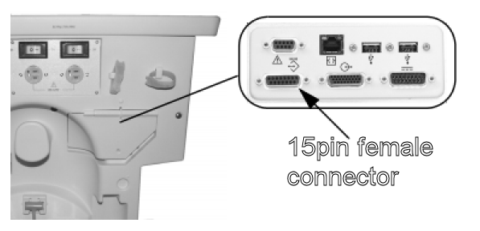
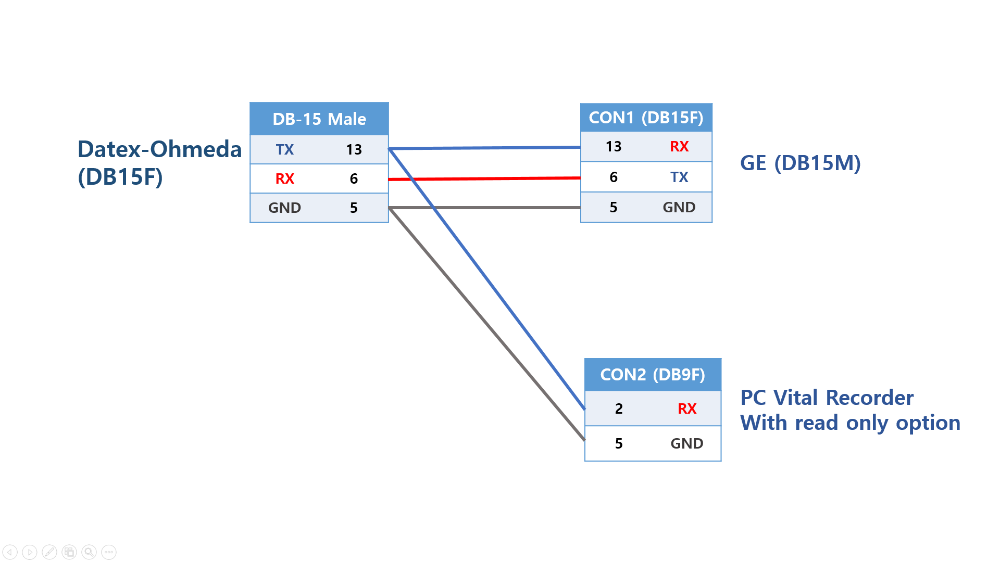
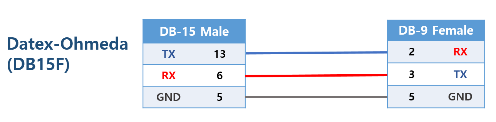

# GE Datex-Ohmeda Anesthesia Machine

<!-- meta
category: Anesthesia Machine
manufacturer: GE
vr_device_name: Datex-Ohmeda
-->
> **Note:** Protocol: **GE Ohmeda Serial Protocol**. Compatible with: Aespire, Aespire View, Aestiva, Avance, Avance CS2, Aisys, Aisys CS2, Carestation 620/650/650c.

| Cable | Adapter | Port | VR Device Name |
|-------|---------|------|----------------|
| Custom 9-pin ↔ 15-pin serial | None | 15-pin connector (under cover) | `Datex-Ohmeda` |

## Connection Steps
1. Open the **back cover** of the anesthesia machine to expose the 15-pin connector.

   

2. Connect the **custom 9-pin to 15-pin cable** to the connector.

   

3. Connect the 9-pin end to the PC via USB-Serial converter.

> If the 15-pin port is already in use, fabricate a **Y-cable** and enable **"Read Only Mode"** in Vital Recorder.

