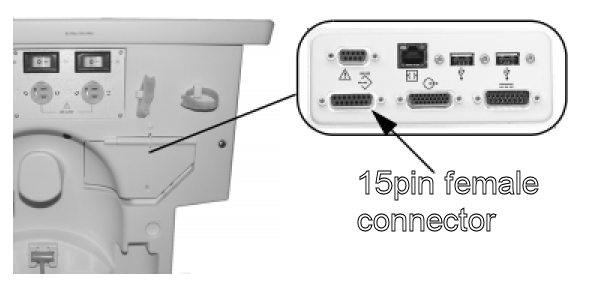
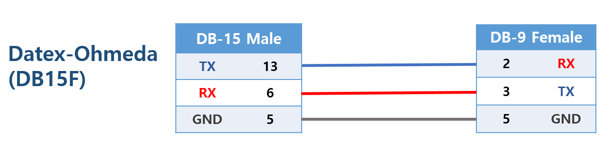

# GE Datex-Ohmeda Anesthesia Machine

<!-- meta
category: Anesthesia Machine
manufacturer: GE
vr_device_name: Datex-Ohmeda
-->
> **Note:** Protocol: **GE Ohmeda Serial Protocol**. Compatible with: Aespire, Aespire View, Aestiva, Avance, Avance CS2, Aisys, Aisys CS2, Carestation 620/650/650c.

| Cable | Adapter | Port | VR Device Name |
|-------|---------|------|----------------|
| Custom 9-pin ↔ 15-pin serial | None | 15-pin female connector (under the rear cover) | `Datex-Ohmeda` |

## Connection Steps
1. Open the **back cover** of the anesthesia machine to expose the **15-pin female** connector. It sits on the same panel as the 9-pin, RJ-45 and USB connectors; it is the same height as an ordinary DB-9 but noticeably longer.

   

2. Connect the **custom 15-pin to 9-pin cable** to that connector. Ordinary USB-Serial converters end in a 9-pin male plug, so this cable has to be built — the wiring is only three conductors:

   | Machine side — DB-15 male | PC side — DB-9 female |
   |---------------------------|------------------------|
   | 13 — TX                   | 2 — RX                 |
   | 6 — RX                    | 3 — TX                 |
   | 5 — GND                   | 5 — GND                |

   

3. Connect the 9-pin end to the PC via a USB-Serial converter.

### When the 15-pin Port is Already in Use

If the 15-pin port is already feeding a patient monitor (CO2 curve, airway pressure, etc.), build a **Y-cable** so Vital Recorder can listen without disturbing the existing link, and enable **"Read Only Mode"** in Vital Recorder when adding the device.

| Machine side — DB-15 male | CON1 — to the existing GE device (DB-15F) | CON2 — to Vital Recorder (DB-9F) |
|---------------------------|--------------------------------------------|-----------------------------------|
| 13 — TX                   | 13 — RX                                    | 2 — RX                            |
| 6 — RX                    | 6 — TX                                     | *not connected*                   |
| 5 — GND                   | 5 — GND                                    | 5 — GND                           |

Only the machine's transmit line and ground are branched to CON2, so Vital Recorder never drives the line.

## Device Configuration
No setting has to be changed on the machine — the serial port streams continuously, and Vital Recorder's `Datex-Ohmeda` driver applies the line settings itself.

## Vital Recorder Setup
- In Vital Recorder, add the device as **`Datex-Ohmeda`**.

## Troubleshooting
- **Waveform gaps and lagging numerics.** This is a link-capacity limit, not a cable fault (see Known Limitations). Reduce the requested waveforms.
- **Gas-agent values collide with a Philips monitor's on the same case.** Gas data from a Datex-Ohmeda machine arrives on the `AGENT1` track; keep the device types distinct so each source keeps its own tracks.

## Known Limitations
- **The 19200 baud link carries about 1,920 characters per second.** When many parameters are active the stream exceeds that, waves drop out and numerics arrive late.

## Notes
- Confirmed models in the field include the **Aisys CS2** and **Avance CS2**.
- With **`AUTO_DETECT=1`** in `vr.conf` GE / Datex-Ohmeda S/5 devices are identified on the serial line without a `[DEV/...]` section.
- Typical parameters recorded: Paw, Pplat, EtCO2, TV, MV, FiO2.
