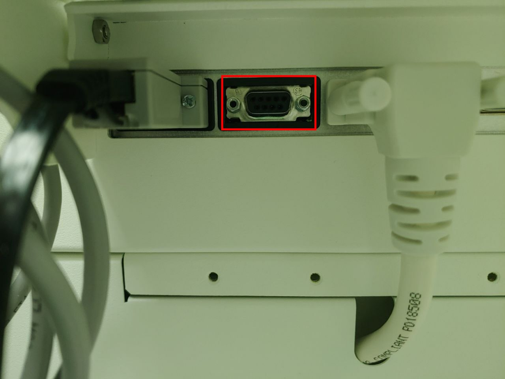

# Maquet Flow-i

<!-- meta
category: Anesthesia Machine
manufacturer: Maquet
vr_device_name: Flow-i
-->
> **Note:** Available in Vital Recorder **v1.8.16.0 or later**. No additional device configuration required.

| Cable | Adapter | Port | VR Device Name |
|-------|---------|------|----------------|
| Direct Serial | Null Modem M/F | Serial port — lower right | `Flow-i` |

## Connection Steps
1. Attach a **Null Modem (M/F)** adapter to the serial port on the lower right of the rear panel.
2. Connect a direct serial cable from the adapter to the PC via USB-Serial converter.

   
