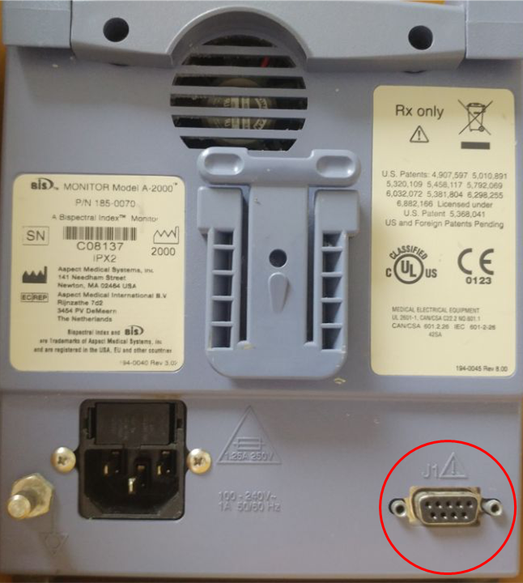
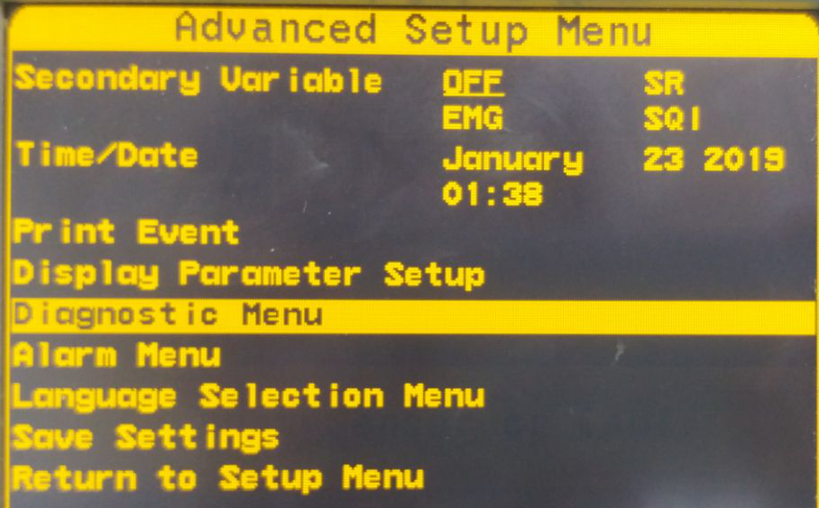
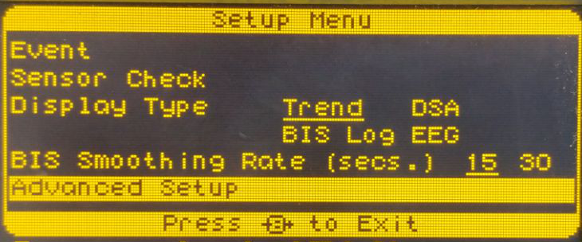

# Medtronic BIS A2000

<!-- meta
category: Brain Monitor
manufacturer: Medtronic
vr_device_name: A2000
-->
> **Note:** Supports **2-channel 256Hz EEG** acquisition. Similar to BIS VISTA.

| Cable | Adapter | Port | Protocol | VR Device Name |
|-------|---------|------|----------|----------------|
| Direct Serial | None | 9-pin port | Binary | `A2000` |

## Connection Steps
1. Connect a **direct serial cable** to the 9-pin port on the rear.
2. Connect the other end to the PC via USB-Serial converter.

   

## Device Configuration
1. Press **Menu → Advanced Setup → Diagnostic Menu → System Configuration Menu**.

   

2. Under **Serial Port Protocol**, select **Binary**.

   

3. Press **Return To Diagnostic Menu → Return to Advanced Setup Menu → Save Settings**.
