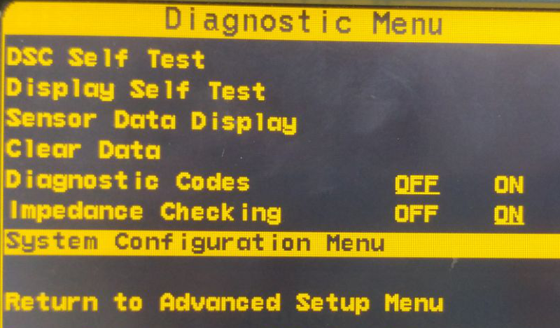

# Medtronic (Aspect Medical) BIS A-2000

<!-- meta
category: Brain Monitor
manufacturer: Medtronic
vr_device_name: A2000
-->
> ⚠️ **Use the `J1` port, not `J2`.** The A-2000 rear panel carries two connectors: **`J1` is the RS-232 serial port**, **`J2` is the printer port**. Connecting to `J2` will not produce data.
> Set **Serial Port Protocol = Binary** and **Save Settings**, otherwise Vital Recorder receives nothing.

| Cable | Adapter | Port | Serial | VR Device Name |
|-------|---------|------|--------|----------------|
| Direct Serial (DB-9M ↔ DB-9F) | None | `J1` — DB-9 **female**, rear panel | Binary | `A2000` |

The A-2000 presents a **DB-9 female** port, and the PC side is DB-9 male, so a plain **direct serial cable** is used — **no Null Modem adapter**. This distinguishes it from INVOS, whose port is male and therefore needs an F/F Null Modem.

Supports **2-channel, 256 Hz EEG** acquisition — the highest-resolution EEG of the BIS family. It shares the monitor family of the BIS VISTA, but the menu structure and protocol options differ.

## Connection Steps
1. Locate the **`J1` RS-232 serial port** on the lower right of the rear panel. It is a DB-9 female connector marked `J1` next to an attention symbol; the printer port `J2` is the other D-sub connector on the same panel.

   

2. Connect a **direct serial cable** (DB-9M to the monitor, DB-9F to the PC end) to `J1`.
3. Connect the other end to the PC's DB-9M serial port, or to a USB-Serial converter.

## Device Configuration
The serial protocol lives several levels deep, in the diagnostic/service area of the menu tree. Navigate with the front-panel keys.

1. Press **Menu** to open the **Setup Menu**, then select **Advanced Setup** (bottom row).

   

2. In the **Advanced Setup Menu**, select **Diagnostic Menu**.

   

3. In the **Diagnostic Menu**, select **System Configuration Menu**.

   

4. Set **Serial Port Protocol** to **Binary**. Leave **Extended Memory** and **ICU Mode** as configured by the site.

   

5. Press **Return To Diagnostic Menu → Return to Advanced Setup Menu → Save Settings**. Without **Save Settings**, the protocol reverts on the next power cycle.

- Serial: **57600 baud**, Binary protocol.
- The A-2000 serial port is isolated from ground (per the A-2000 service manual specifications), so no additional isolator is required.

## Vital Recorder Setup

- In Vital Recorder, select the device as **`A2000`**. The single-channel BISx module is a separate entry (`BISx`), and BIS VISTA is `VISTA` — do not mix them up.

## Troubleshooting

- **EEG scaling is wrong after the gain or sampling frequency was changed on the monitor.** Vital Recorder fixes gain, offset and sample rate per track at creation time — **delete and re-create** the affected track for the new scaling to apply.

## Known Limitations

- **BIS and Masimo PSI (SedLine) share the same index slot in Vital Recorder** and cannot both be recorded for the same patient at the same time.

## Notes

- The A-2000's serial port is also the software/firmware download path, so a cable left connected during a service update can interfere — disconnect Vital Recorder before servicing.
