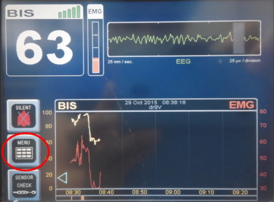
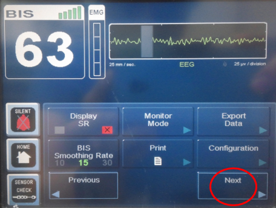
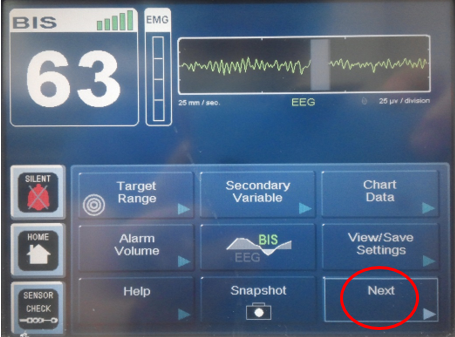

# Medtronic BIS VISTA

<!-- meta
category: Brain Monitor
manufacturer: Medtronic
vr_device_name: VISTA
-->
> ⚠️ **Use a direct cable only. Connecting a cross cable will trigger an error screen on the device.**
> Protocol changes take effect only **after device restart**.

| Cable | Adapter | Port | VR Device Name |
|-------|---------|------|----------------|
| Direct Serial — **NOT cross cable** | None | Serial port | `VISTA` |

| Protocol | Data |
|----------|------|
| ASCII | All numeric data |
| Legacy Binary | 128Hz EEG waveform |

## Connection Steps
1. Connect a **direct serial cable** (NOT a cross cable) to the rear serial port.
2. Connect the other end to the PC via USB-Serial converter.

   

## Device Configuration
1. Press **Menu → NEXT → NEXT → Maintenance → Serial Protocol**.

   

2. Choose protocol:
   - **ASCII** — for all numeric data
   - **Legacy Binary** — for 128Hz EEG waveform (then select **BIS (binary)** in Vital Recorder)

   

3. **Save settings → Return to Home → Restart the device.**
