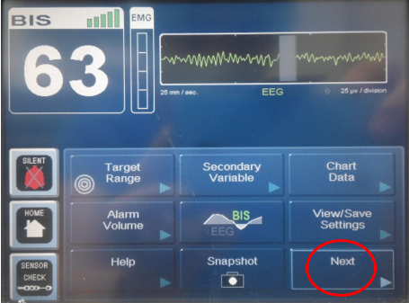
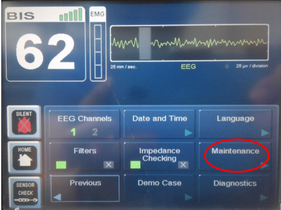

# Medtronic (Aspect Medical) BIS VISTA

<!-- meta
category: Brain Monitor
manufacturer: Medtronic
vr_device_name: VISTA
-->
> ⚠️ **Use a direct serial cable only. A cross cable can drive the monitor into an "Unrecoverable Monitor Exception" screen, which halts monitoring until the unit is reset.**
> Protocol changes take effect only **after the monitor is restarted**.

| Cable | Adapter | Port | VR Device Name |
|-------|---------|------|----------------|
| direct serial cable (DB-9M ↔ DB-9F) — **NOT a cross cable** | None | RS-232 port, rear panel (DB-9 **female**) | `VISTA` |

## Connection Requirements

The VISTA presents a **DB-9 female** RS-232 port and the PC side is DB-9 male, so a **direct serial cable** is correct and **no Null Modem adapter is used**.

| Serial Protocol option | What it carries | Vital Recorder device to select |
|----------|------|------|
| **ASCII** | All numeric parameters (BIS, EMG, SQI, SR) | `VISTA` |
| **Legacy Binary** | Numerics **plus 128 Hz EEG waveform** | `BIS (binary)` |
| VISTA Binary | Vendor-specific binary format — not used by Vital Recorder | — |

Serial: **57600 baud**. Choose **Legacy Binary** if the EEG waveform is needed; **ASCII** is sufficient for numerics only.

## Connection Steps
1. Locate the **RS-232 port** on the rear panel. The rear panel carries, from left to right, a **USB Type A** port, a **USB Type B** port, the speaker grille, and the **DB-9 RS-232 serial port**; the **Reset** button, battery/power-supply cover, clamp shoe and power inlet are also on this face.

   

2. Connect a **direct serial cable** (NOT a cross cable) to the RS-232 port.
3. Connect the other end to the PC's DB-9M serial port, or to a USB-Serial converter.

   

   If this screen appears, the cable is wrong. Disconnect it, press the on-screen **Reset** or the recessed reset button on the rear panel, and re-connect with a direct cable.

## Device Configuration
The VISTA menu is a touch screen paged with **Next**. **Serial Protocol** sits three pages in, under **Maintenance**.

1. Press the **MENU** key on the left-hand button strip of the monitoring screen.

   

2. On the first menu page press **Next**.

   

3. On the second menu page press **Next** again.

   

4. On the third menu page press **Maintenance**.

   

5. In the **Maintenance** menu press **Serial Protocol**.

   

6. Tick the protocol you need, then press **Save Setting**.

   - **ASCII** — all numeric data.

     

   - **Legacy Binary** — numerics plus the 128 Hz EEG waveform. Select **BIS (binary)** as the device in Vital Recorder.

     

7. Press **Return to Previous Menu → Home**, then **restart the monitor**. The new protocol is not active until the unit has been power-cycled.

## Vital Recorder Setup

- With **ASCII** selected on the monitor, add the device as **`VISTA`**.
- With **Legacy Binary** selected, add it as **`BIS (binary)`** instead — this is the only way to record the 128 Hz EEG waveform.
- The A-2000 (`A2000`) and the single-channel BISx module (`BISx`) are separate entries — do not mix them up.

## Troubleshooting

- **EEG scaling is wrong after the gain or sampling frequency was changed on the monitor.** Vital Recorder fixes gain, offset and sample rate per track at creation time — **delete and re-create** the affected track for the new scaling to apply.

## Known Limitations

- **BIS and Masimo PSI (SedLine) share the same index slot in Vital Recorder** and cannot both be recorded for the same patient at the same time.
- The **USB Type A** port is for data export to a removable drive and for monitor/BISx software updates — it is not a Vital Recorder data path. Use the RS-232 port.

## Notes

- The Maintenance menu also holds **BISx Connection History**, which lists the serial number of each BISx that was attached — useful when reconciling a recording with the sensor actually used.
