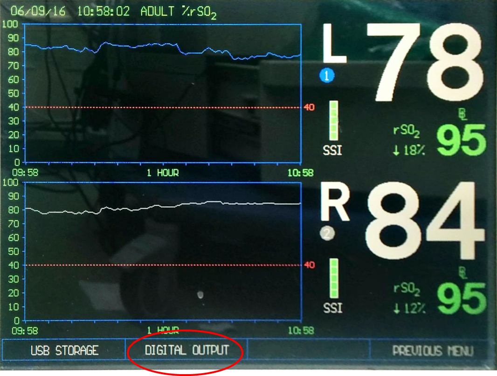

# Medtronic INVOS Cerebral/Somatic Oximetry (5100C)

<!-- meta
category: Brain Monitor
manufacturer: Medtronic
vr_device_name: Invos
-->
> ⚠️ **The INVOS RS-232 port is a DB-9 *male* connector, so a Null Modem adapter (F/F) is required.** This is the opposite of the BIS monitors, whose ports are female and take a direct serial cable.
> Select **PC LINK**, not **VUELINK** — VueLink is the Philips module format and runs at a different baud rate.

| Cable | Adapter | Port | VR Device Name |
|-------|---------|------|----------------|
| direct serial cable (DB-9M ↔ DB-9F) | **Null Modem adapter (F/F)** | `\|O\|O\|` RS-232 port (DB-9 **male**), rear panel | `Invos` |

## Connection Requirements

- Serial: **9600 baud, 8 data bits, No parity, 1 stop bit**.

## Connection Steps
1. Locate the **RS-232 port** on the rear panel — the upper DB-9 marked with the `|O|O|` serial symbol. It has **pins** (male). The DB-9 directly below it is the **VGA/monitor output**; do not use it.

   

2. Screw a **Null Modem adapter (F/F)** onto the male RS-232 port.
3. Connect a **direct serial cable** from the adapter to the PC's DB-9M serial port, or to a USB-Serial converter.

## Device Configuration
Digital output is off by default and is reached through the softkey row at the bottom of the monitoring screen.

1. On the monitoring screen press **NEXT MENU**.

   

2. Press **OUTPUT SELECT**.

   

3. Press **DIGITAL OUTPUT** (the other option, USB STORAGE, writes to a USB drive instead).

   

4. Press **PC LINK**. **Do not** select **VUELINK** — that format targets the Philips VueLink / IntelliBridge interface module and uses a different baud rate.

   

5. On the **RS-232 DIGITAL OUTPUT FORMAT SELECTION** screen choose **OUTPUT FORMAT 1**. The screen lists which monitor software versions each format belongs to, and an asterisk marks the format currently in use.

   

   | Output format | Monitor software version |
   |---|---|
   | **OUTPUT FORMAT 1** | 30.06.06 and newer |
   | OUTPUT FORMAT 2 | 30.02.02 – 30.05.05B |
   | OUTPUT FORMAT 3 | 30.01.01 |

   **OUTPUT FORMAT 1** is the format for current software. On an older monitor whose software predates 30.06.06, pick the format matching the version shown on this screen.

## Vital Recorder Setup

- In Vital Recorder, select the device as **`Invos`**. Recorded parameters are left and right **rSO2** (cerebral/somatic regional oxygen saturation).

## Notes

- The INVOS serial port uses pins 2 (RxD), 3 (TxD) and 5 (GND).
- Newer INVOS models place the serial port on the **docking station** rather than on the monitor body, and label the digital-output formats **PC LINK 1 / PC LINK 2** instead of OUTPUT FORMAT 1/2/3. The cable and gender requirements are unchanged.
