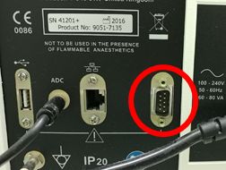
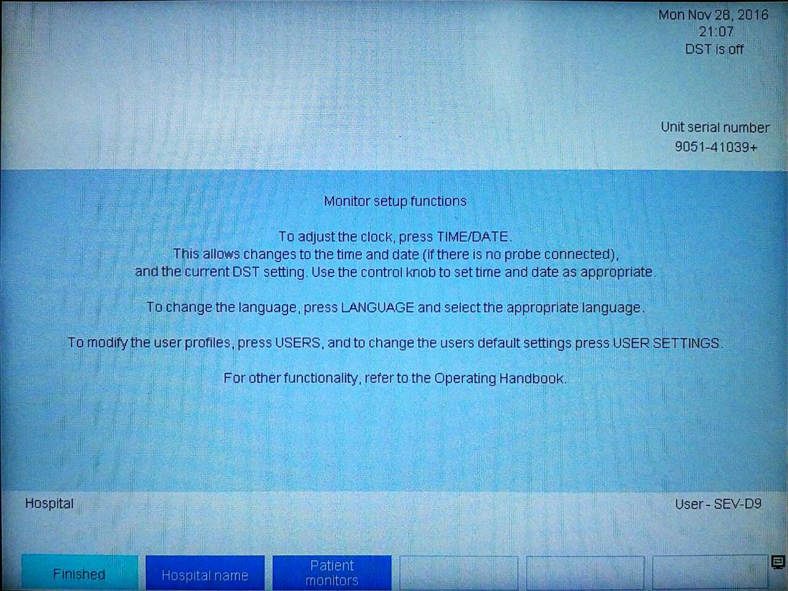
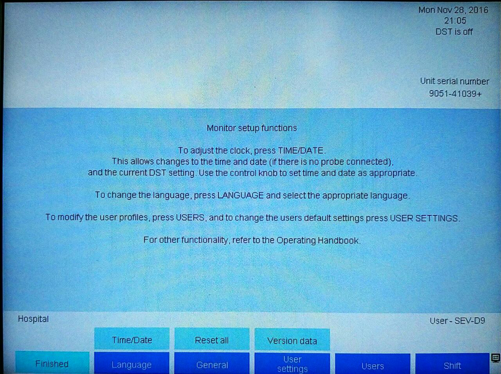

# Deltex CardioQ

<!-- meta
category: Hemodynamic Monitor
manufacturer: Deltex
vr_device_name: CardioQ
-->
> ⚠️ **Settings cannot be changed while the device is in use on a patient.** Configure using **DEMO mode** before patient connection.

| Cable | Adapter | Port | VR Device Name |
|-------|---------|------|----------------|
| Direct Serial | Null Modem **F/F** | Male serial port | `CardioQ` |

## Connection Steps
1. Attach a **Null Modem (F/F)** to the rear male serial port.
2. Connect a direct serial cable to the PC via USB-Serial converter.

   

## Device Configuration
1. At boot, navigate to **General → Patient Monitors → Monitor Setup**.
2. Select **CardioQ Serial Protocol v2**.

   

3. Verify **Baud Rate = 57600** and **Flow Control = No Flow Control** → **Finished**.

   

4. Verify data transmission in **DEMO mode** before patient connection.
