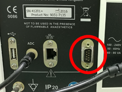
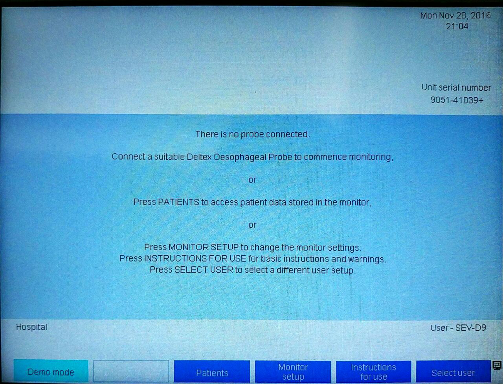
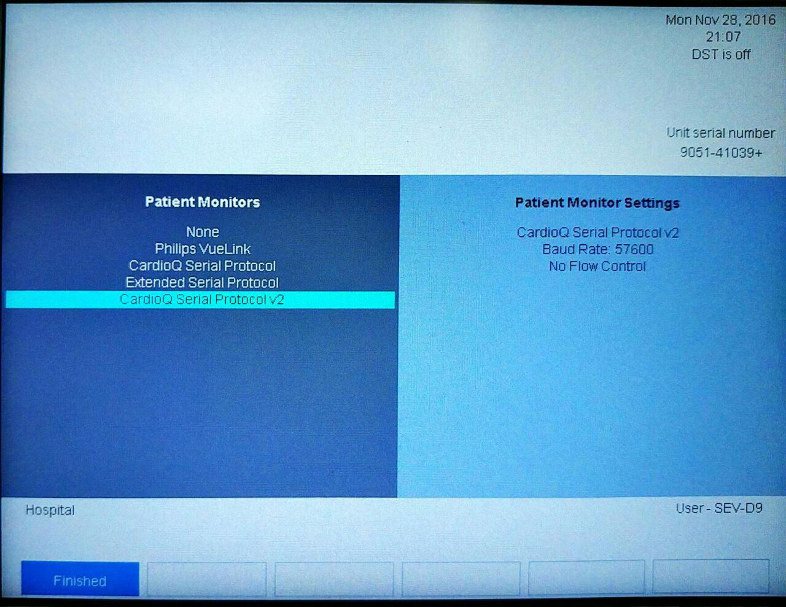

# Deltex CardioQ / CardioQ-ODM+

<!-- meta
category: Hemodynamic Monitor
manufacturer: Deltex
vr_device_name: CardioQ
-->
| Cable | Adapter | Port | VR Device Name |
|-------|---------|------|---------------- |
| direct serial cable | Null Modem adapter (F/F) | RS-232 serial port | `CardioQ` |

## Connection Steps
1. Connect a direct serial cable to the rear serial port using a **null modem adapter (F/F)**.

   

## Device Configuration
Configure the monitor with **no probe connected**.

1. On the start-up screen, select **Monitor setup**.

   

2. Select **General**.

   

3. Select **Patient monitors**.

   

4. Select **CardioQ Serial Protocol v2**, confirm the settings below, and press **Finished**.

   

| Parameter | Value |
|-----------|------- |
| Baud Rate | 57600 |
| Flow Control | None |

## Vital Recorder Setup

Add the device as **`CardioQ`** and select the PC serial port used for the connection.
