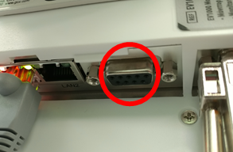
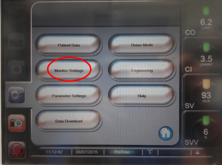
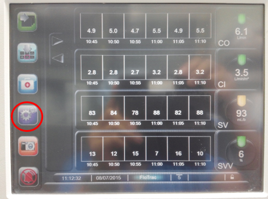
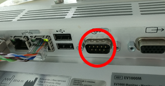

# Edwards Lifesciences EV-1000

<!-- meta
category: Hemodynamic Monitor
manufacturer: Edwards Lifesciences
vr_device_name: EV1000
-->
> **Note:** Old EV-1000 uses **F/F** adapter. New EV-1000A uses **M/F** adapter.

| Model | Cable | Adapter | Port | VR Device Name |
|-------|-------|---------|------|----------------|
| Old EV-1000 | Direct Serial | Null Modem **F/F** | 2nd port from right | `EV1000` |
| EV-1000A (new) | Direct Serial | Null Modem **M/F** | Serial port | `EV1000` |

## Connection Steps
- **Old EV-1000:** Attach **Null Modem (F/F)** to the second port from the right → connect direct serial cable to PC.

- **EV-1000A:** Attach **Null Modem (M/F)** to the rear serial port → connect direct serial cable to PC.

  

## Device Configuration
1. Press **Settings → Monitor Settings → Serial Port Setup**.

   

2. Set **Device → IFMout**.

   

3. Set **Baud Rate → 9600**.

   
