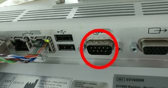
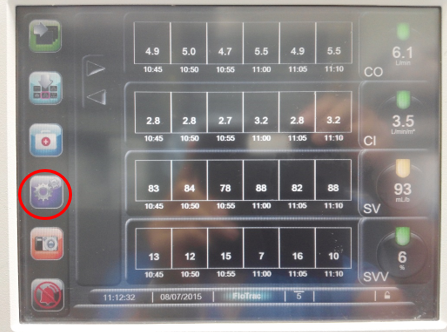
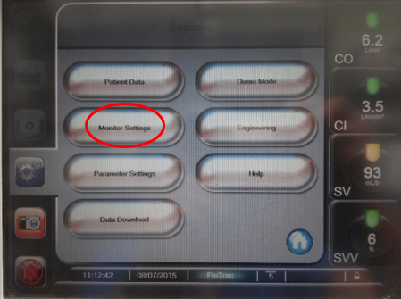
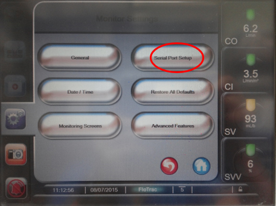

# Edwards Lifesciences EV-1000 / EV-1000A

<!-- meta
category: Hemodynamic Monitor
manufacturer: Edwards Lifesciences
vr_device_name: EV1000
-->
> ⚠️ **The adapter gender differs between the two generations.** The old **EV-1000** (label `REF EV1000M`) has a **male** DB-9, so it needs a **Null Modem F/F**. The newer **EV-1000A** (label `REF EV1000A`) has a **female** DB-9 and needs a **Null Modem M/F**. Check the REF label on the rear panel before ordering the adapter.

| Model | Cable | Adapter | Port | VR Device Name |
|-------|-------|---------|------|----------------|
| EV-1000 (old, `EV1000M`) | Direct Serial | Null Modem **F/F** | Rear **male** DB-9 — 2nd port from the right (the VGA connector is rightmost) | `EV1000` |
| EV-1000A (new, `EV1000A`) | Direct Serial | Null Modem **M/F** | Rear **female** DB-9, next to the LAN2 port | `EV1000` |

## Connection Steps
1. Identify the generation from the rear panel.

   - **Old EV-1000:** the serial connector is a **male** DB-9, second from the right — LAN, two USB ports, then the serial port, then VGA. Attach a **Null Modem (F/F)**.

     

   - **EV-1000A:** the serial connector is a **female** DB-9 immediately to the right of the port marked **LAN2**. Attach a **Null Modem (M/F)**.

     

2. Connect a direct serial cable from the adapter to the PC via a USB-Serial converter. A direct serial cable **without** the Null Modem adapter will not work — the link needs the TX/RX crossover.

## Device Configuration
1. On the monitoring screen, touch the **settings (gear)** icon in the left-hand icon strip.

   

2. Press **Monitor Settings**.

   

3. Press **Serial Port Setup**.

   

4. Set **Device** to **IFMout**.

   

5. Set **Baud Rate** to **9600** (the picker also offers 19200, 38400 and 57600).

   

Resulting serial settings:

| Parameter | Value |
|-----------|-------|
| Device | IFMout |
| Baud Rate | 9600 |
| Parity | None |
| Stop Bits | 1 |
| Data Bits | 8 |
| Flow Control | 2 seconds |

## Vital Recorder Setup

- In the Vital Recorder device list this appears under **Cardiac monitor** as **Edwards Lifesciences: EV-1000**; recorded tracks are prefixed `EV1000/` (CO, CI, SV, SVI, SVV, SVR, SVRI, CVP, ART_MBP).
- Both generations use the same `EV1000` device entry in Vital Recorder — only the adapter gender and port position differ.
