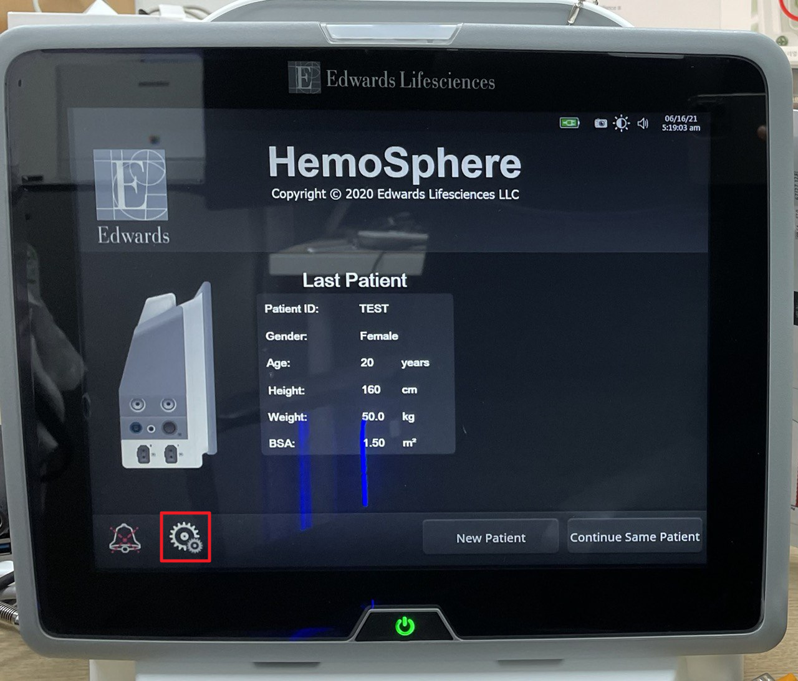
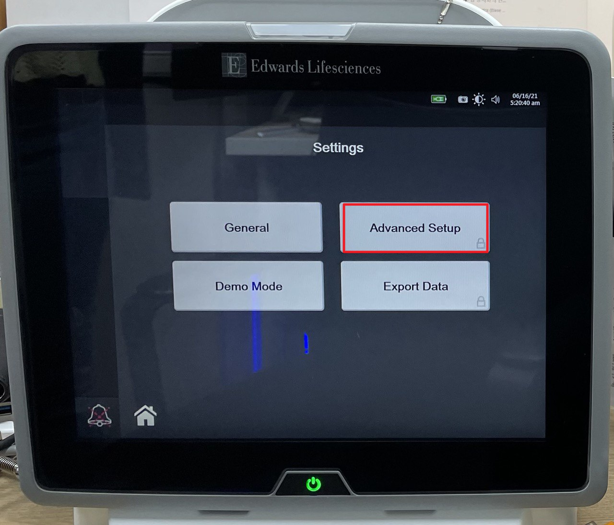
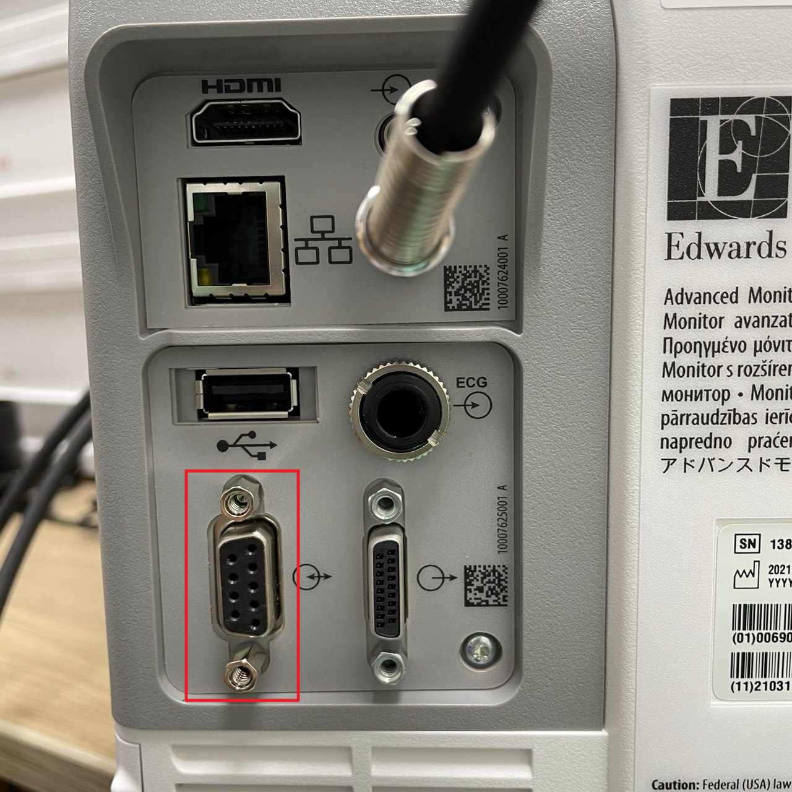

# Edwards Lifesciences Hemosphere

<!-- meta
category: Hemodynamic Monitor
manufacturer: Edwards Lifesciences
vr_device_name: Hemosphere
-->
> **Note:** Available in Vital Recorder **v1.8.16.4 or later**. Restart the device after changing settings.

| Cable | Adapter | Port | VR Device Name |
|-------|---------|------|----------------|
| Direct Serial | Null Modem M/F | Serial port | `Hemosphere` |

## Connection Steps
1. Attach a **Null Modem (M/F)** to the rear serial port.
2. Connect a direct serial cable to the PC via USB-Serial converter.

   

## Device Configuration
1. Press the **setup button** (bottom left) → **Advanced Setup**. Enter password **`55555555`**.

   

2. Press **Connectivity → Serial Port Setup**.
3. Set **Device → IFMout** and **Baud Rate → 9600** → **Restart the device**.

   
