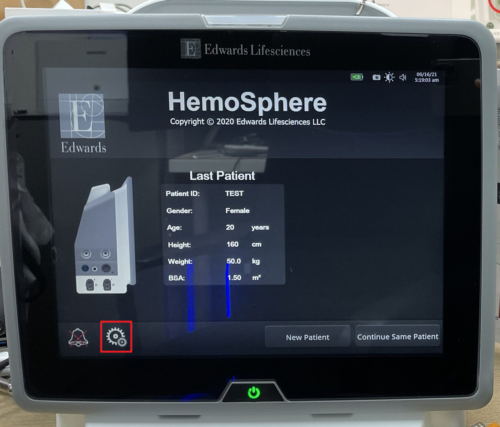
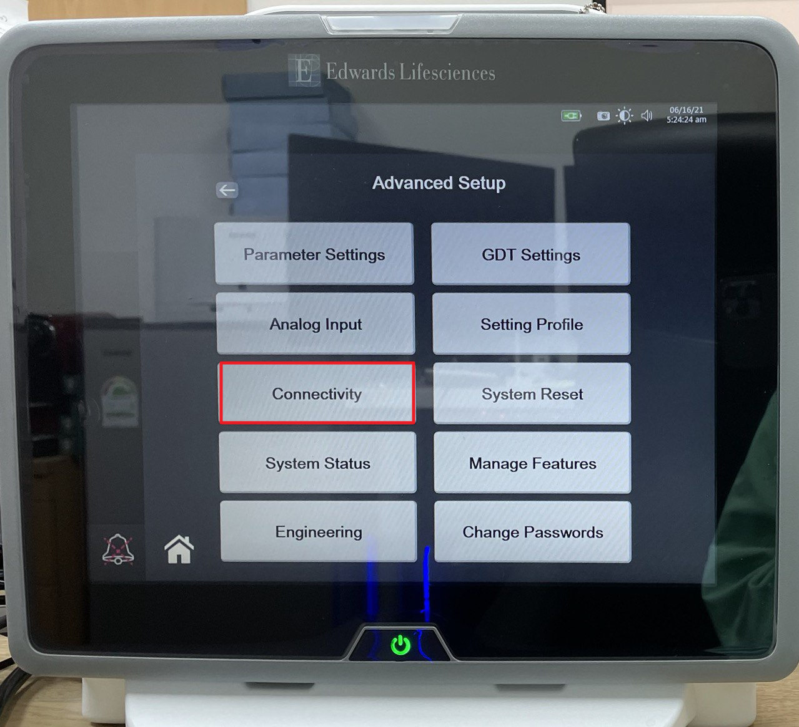
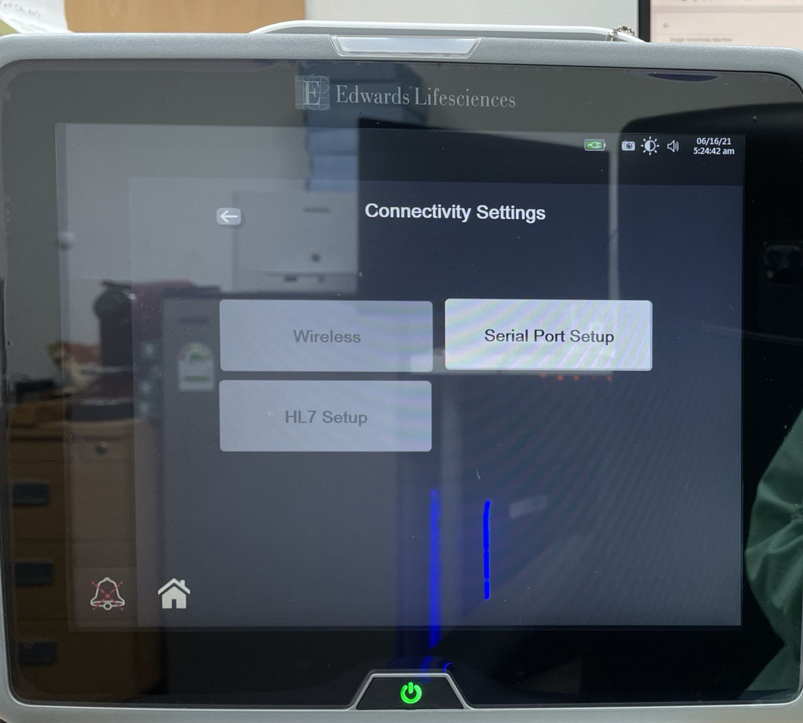
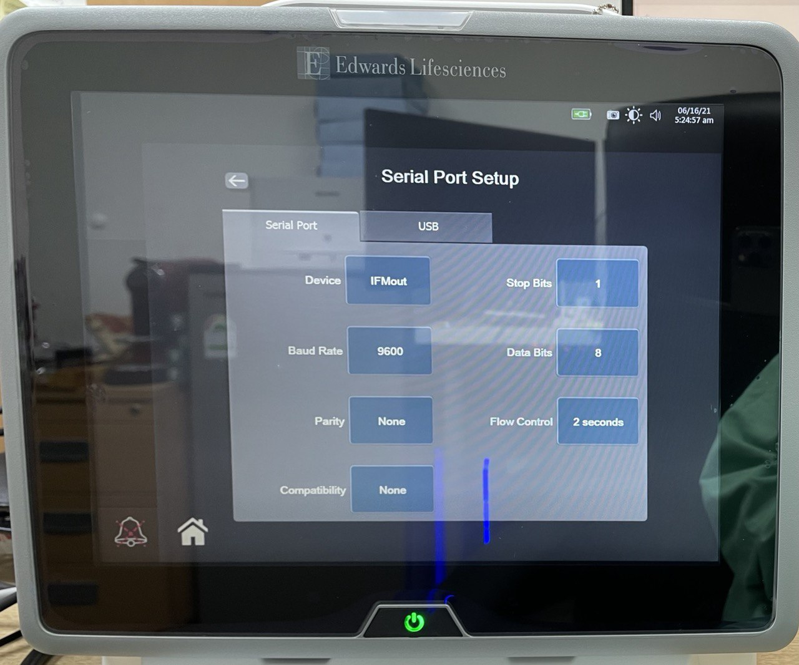

# Edwards Lifesciences HemoSphere

<!-- meta
category: Hemodynamic Monitor
manufacturer: Edwards Lifesciences
vr_device_name: Hemosphere
-->
> **Note:** Serial output is enabled in the password-protected **Advanced Setup** menu. The monitor must be **restarted** for the change to take effect.

| Cable | Adapter | Port | VR Device Name |
|-------|---------|------|----------------|
| direct serial cable | Null Modem adapter (M/F) | Rear **female** DB-9 serial port | `Hemosphere` |

## Connection Steps
1. Locate the serial port on the rear panel. It is the **female DB-9** in the lower connector block, to the left of the wider DB-15 connector; the upper block carries HDMI and Ethernet, and the lower block also has USB and the ECG input.

   

2. Attach a **Null Modem adapter (M/F)** to that port.
3. Connect a direct serial cable from the adapter to the PC via a USB-Serial converter.

## Device Configuration
1. On the start-up screen (or from the home screen), touch the **settings (gear)** icon at the bottom left.

   

2. Press **Advanced Setup** (padlock icon indicates it is password protected).

   

3. Enter the Advanced Setup password — default **`55555555`** — and confirm.

   

4. Press **Connectivity**.

   

5. Press **Serial Port Setup**.

   

6. On the **Serial Port** tab set **Device = IFMout** and **Baud Rate = 9600**, then **restart the monitor**.

   

Resulting serial settings:

| Parameter | Value |
|-----------|-------|
| Device | IFMout |
| Baud Rate | 9600 |
| Parity | None |
| Stop Bits | 1 |
| Data Bits | 8 |
| Flow Control | 2 seconds |
| Compatibility | None |

## Vital Recorder Setup

- In the Vital Recorder device list this appears under **Cardiac monitor** as **Edwards Lifesciences: HemoSphere**.

## Troubleshooting

- **Configured but nothing arrives.** Check that **Connectivity → Serial Port Setup** was used, not **Analog Input** (also in Advanced Setup) — analog input is for external pressure signals, not for Vital Recorder. On the Serial Port Setup screen itself, confirm the settings were made on the serial tab, not the second **USB** tab; Vital Recorder reads the DB-9 serial port.

## Known Limitations

- Edwards specifies the HemoSphere RS-232 port as using an Edwards proprietary protocol with a maximum data rate of 57.6 kbaud; **9600** is the rate Vital Recorder expects, so do not raise it.
