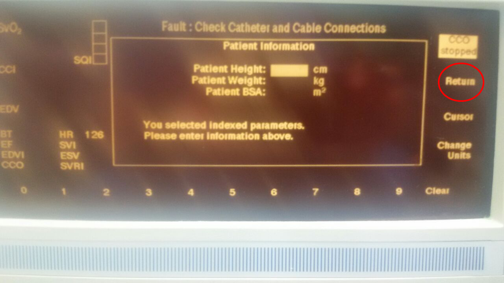

# Edwards Lifesciences Vigilance

<!-- meta
category: Hemodynamic Monitor
manufacturer: Edwards Lifesciences
vr_device_name: Vigilance
-->
> ⚠️ **A direct serial cable alone will not work** — the link needs the TX/RX crossover, so the **Null Modem adapter (M/F)** is mandatory. Configure the **Digital Ports** menu on the System Configuration screen.

| Cable | Adapter | Port | VR Device Name |
|-------|---------|------|----------------|
| direct serial cable | Null Modem adapter (M/F) | **COM 1** (rear, **female** DB-9; COM 2 also usable) | `Vigilance` |

## Connection Steps
1. Locate **COM 1** on the rear panel. There are two identical **female** DB-9 ports labeled **COM 1** and **COM 2**; COM 1 is the left-hand one, below the *ECG MONITOR IN* legend. The two phono jacks to the right are **ANALOG IN 1/2** — not serial.

   

2. Attach a **Null Modem adapter (M/F)** to COM 1.
3. Connect a direct serial cable from the adapter to the PC via a USB-Serial converter.

## Device Configuration
1. From the home screen press the **Setup** softkey on the right-hand edge.

   

2. On the **Display Format** screen press **System Config**.

   

3. If the **Patient Information** screen appears (it does when indexed parameters are selected), press **Return** to continue without entering height and weight.

   

4. On the **System Configuration** screen press **Digital Ports**.

   

5. Select **COM1** and set its parameters as below (**Change** edits the highlighted field).

   

   | Parameter | Value |
   |-----------|-------|
   | Device | IFMout |
   | Baud Rate | 9600 |
   | Parity | None |
   | Stop Bits | 1 |
   | Data Bits | 8 |
   | Flow Control | 2 seconds |

## Vital Recorder Setup

- In the Vital Recorder device list this appears under **Cardiac monitor** as **Edwards Lifesciences: Vigilance**; recorded tracks are prefixed `Vigilance/` (CO, CI, SV, SVI, EDV, EDVI, ESV, ESVI, RVEF, HR_AVG, BT_PA, SQI, SNR).

## Troubleshooting

- **COM 1 is already taken by another system.** COM 2 can be configured identically — use it instead.
- **Configured but nothing arrives.** Check that the serial port was configured, not **Analog Input** / **Analog Output** on the same **System Configuration** screen — those are unrelated to Vital Recorder.

## Notes

- The **System Configuration** screen shows an **IFMout ID #** — its presence confirms the monitor has the IFMout interface.
