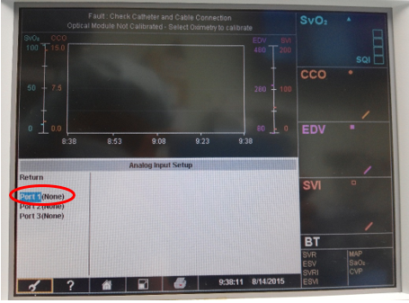

# Edwards Lifesciences Vigilance II

<!-- meta
category: Hemodynamic Monitor
manufacturer: Edwards Lifesciences
vr_device_name: Vigilance
-->
> ⚠️ **Select `Vigilance` in Vital Recorder** — there is no separate "Vigilance II" entry. And a **direct serial cable alone will not work**: the link needs the TX/RX crossover from the **Null Modem adapter (M/F)**.

| Cable | Adapter | Port | VR Device Name |
|-------|---------|------|----------------|
| direct serial cable | Null Modem adapter (M/F) | Port **1** — the **upper** of the two rear **female** DB-9 ports | `Vigilance` |

## Connection Steps
1. Locate port **1** on the rear panel. Two identical **female** DB-9 ports are stacked vertically, marked **1** (upper) and **2** (lower). Use the upper one.

   

2. Attach a **Null Modem adapter (M/F)** to port 1.
3. Connect a direct serial cable from the adapter to the PC via a USB-Serial converter.

## Device Configuration
1. Touch the **wrench (setup)** icon in the tool bar at the bottom left of the screen.

   

2. In the **Setup Menu** select **Serial Port Setup**.

   

3. On the **Com 1** column set **Device = IFMout** and **Baud Rate = 9600**, then **Return**.

   

Resulting serial settings:

| Parameter | Value |
|-----------|-------|
| Device | IFMout |
| Baud Rate | 9600 |
| Parity | None |
| Stop Bits | 1 |
| Data Bits | 8 |
| Flow Control | 2 seconds |

## Vital Recorder Setup

- In the Vital Recorder device list this appears under **Cardiac monitor** as **Edwards Lifesciences: Vigilance** — the same entry as the first-generation Vigilance. Selecting anything else will record nothing.

## Troubleshooting

- **Configured but nothing arrives.** Check that **`Serial Port Setup`**, not **`Analog Input Setup`**, was used. The two entries sit next to each other in the Setup Menu, and Analog Input Setup lists **Port 1 / Port 2 / Port 3** which look deceptively like the serial ports. Analog input carries external pressure signals and is not used by Vital Recorder.

  
