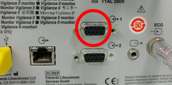
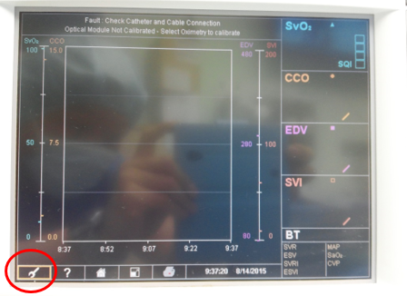
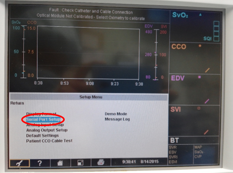
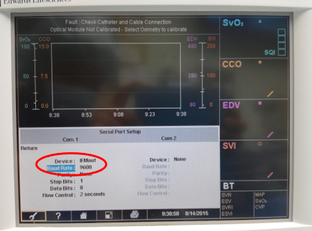

# Edwards Lifesciences Vigilance II

<!-- meta
category: Hemodynamic Monitor
manufacturer: Edwards Lifesciences
vr_device_name: Vigilance
-->
| Cable | Adapter | Port | VR Device Name |
|-------|---------|------|---------------- |
| Direct serial cable | Null modem adapter (M/F) | Rear serial port 1 (upper DB-9) | `Vigilance` |

## Connection Steps
1. Connect a direct serial cable to serial port **1** using a **null modem adapter (M/F)**.

   

## Device Configuration
1. Select the **Setup** icon (wrench).

   

2. In the **Setup Menu** select **Serial Port Setup**.

   

3. In the **Com 1** column, apply the settings below and press **Return**.

   

Resulting serial settings:

| Parameter | Value |
|-----------|------- |
| Device | IFMout |
| Baud Rate | 9600 |
| Parity | None |
| Stop Bits | 1 |
| Data Bits | 8 |
| Flow Control | 2 seconds |

## Vital Recorder Setup

Add the device as **`Vigilance`** and select the PC serial port used for the connection.
