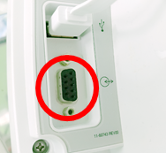

# Edwards Lifesciences Vigileo

<!-- meta
category: Hemodynamic Monitor
manufacturer: Edwards Lifesciences
vr_device_name: Vigileo
-->
> ⚠️ **The setup menu has no visible button.** Tap the blank strip at the **bottom left** of the monitoring screen to open the Status Menu. A **Null Modem (M/F)** is also mandatory — a straight-through cable will not work.

| Cable | Adapter | Port | VR Device Name |
|-------|---------|------|----------------|
| Direct Serial | Null Modem **M/F** | Rear **female** DB-9 serial port | `Vigileo` |

## Connection Steps
1. Locate the serial port on the rear of the monitor. It is a **female** DB-9 recessed below the USB port.

   

2. Attach a **Null Modem (M/F)** adapter to that port.
3. Connect a direct serial cable from the adapter to the PC via a USB-Serial converter.

## Device Configuration
1. Tap the **blank strip at the bottom left** of the monitoring screen — there is no labeled button — to open the Status Menu.

   

2. In the **Status Menu** select **Serial Port Setup**.

   

3. Set **Device** to **IFMout**.

   

4. Set **Baud Rate** to **9600**, then **Return** and exit.

   

- Device: **IFMout** — not `Batch IFMout` and not `Flexport`.
- Serial: **9600 baud**. The screen also exposes Parity, Stop Bits, Data Bits and Flow Control; leave these at the monitor defaults (Flow Control shows **2 seconds**), matching the other Edwards IFMout monitors at 8-N-1.

## Vital Recorder Setup

- In the Vital Recorder device list this appears under **Cardiac monitor** as **Edwards Lifesciences: Vigileo**; recorded tracks are prefixed `Vigileo/`.

## Troubleshooting

- **Configured but nothing arrives.** Check that **`Serial Port Setup`** was used, not **`Analog In Setup`** / **`Analog Out Setup`** — they sit in the same Status Menu but are unrelated to Vital Recorder.
