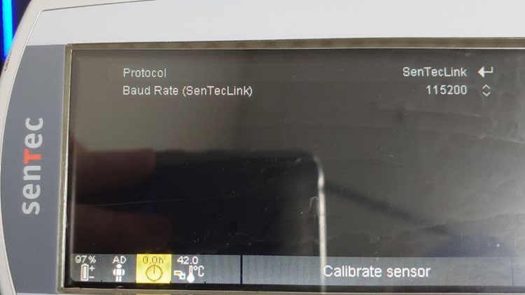
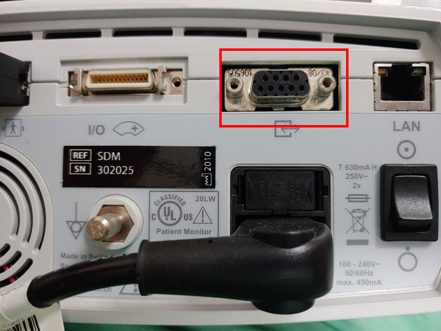

# Sentec SDM

<!-- meta
category: Multifunction Monitor
manufacturer: Sentec
vr_device_name: SDM
-->
> **Note:** **The serial interface is disabled while trend data are being downloaded over the LAN port.** It is reactivated automatically once the LAN download finishes.

| Cable | Adapter | Port | Serial | VR Device Name |
|-------|---------|------|--------|----------------|
| USB-Serial converter (PC without a built-in serial port) or direct serial cable (PC with a built-in serial port) | None | Serial Data Port (RS-232) — rear panel | SenTecLink — 115200 baud | `SDM` |

## Connection Requirements

The SenTec Digital Monitor (SDM) provides transcutaneous PCO₂ and PO₂ along with SpO₂, pulse rate and heating power.

## Connection Steps

1. Locate the **Serial Data Port (RS-232)** on the **rear panel** of the SDM. It sits between the Multipurpose I/O port (nurse call / analog output) and the Network (LAN) port — do not confuse the three.

   

2. Connect a **USB-Serial converter** directly to the serial data port if the PC has no built-in serial port. If the PC has a built-in serial port, connect it with a direct serial cable instead.

3. If using a USB-Serial converter, connect its USB end to the PC.

**Pin assignment of the SDM serial data port (DB-9):**

| Pin | Signal |
|-----|--------|
| 1 | reserved |
| 2 | Transmitted Data (TX, **from** SDM) |
| 3 | Received Data (RX, **to** SDM) |
| 4 | reserved |
| 5 | Signal Ground |
| 6–9 | reserved |

## Device Configuration

Navigate to **Interfaces → Serial Interface** and configure:

| Parameter | Value |
|-----------|-------|
| Protocol | SenTecLink |
| Baud Rate | 115200 |

- Baud rates **other than 115200 will not work** with the SenTecLink protocol.

## Vital Recorder Setup

- Add the device in Vital Recorder as **`SDM`**.

## Known Limitations

- The SDM's three interface connectors — serial data port, Multipurpose I/O port, LAN port — are **not isolated from each other**. Connecting accessory equipment to only one of them needs no extra measures; connecting to two or three simultaneously may require additional safety measures under IEC 60601-1. Consult a qualified technician if in doubt.
- Any equipment attached to the SDM's data ports must be certified to IEC 60950, and the resulting combination must comply with IEC 60601-1.

## Notes

- **Firmware requirement:** SenTecLink at 115200 baud requires SDM software **SMB SW-V08.00.xx or higher**.
