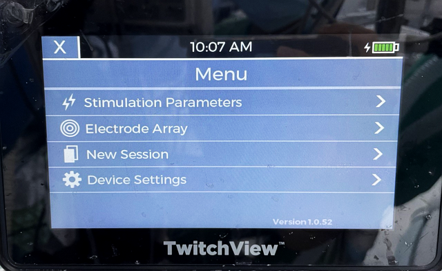
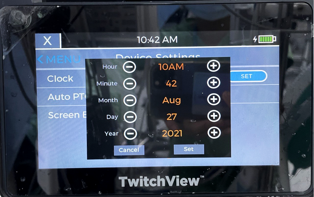
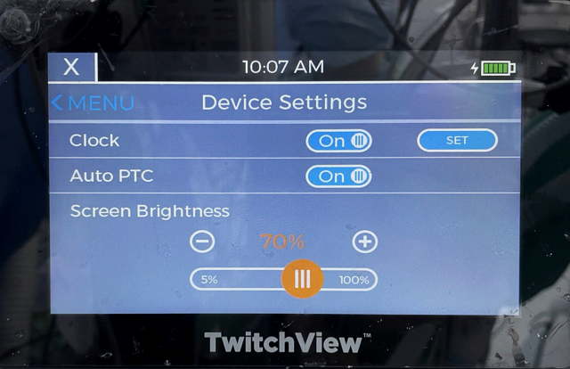

# BlinkDC TwitchView

<!-- meta
category: Other
manufacturer: BlinkDC
vr_device_name: TwitchView
-->
> **Note:** When docked in the Charging Station, data is output via the **RJ45 connector at the bottom** of the device.

| Cable | Adapter | Port | VR Device Name |
|-------|---------|------|----------------|
| Custom cable (USB-Serial converter with special wiring) | None | RJ45 — bottom of device (when docked) | `TwitchView` |

## Connection Steps
1. Dock the monitor in the Charging Station.
2. Build the custom cable per the wiring diagram.

   

3. Connect the **RJ45 end** to the bottom of the docked monitor → USB end to PC.

## Device Configuration
1. Enter the configuration code to access settings menu.

   

2. Press **Clock → SET**. Set clock to: **Hour 1AM, Minute 2, Month March, Day 4, Year 2018** → **Set**.

   

3. Select **Serial → Set**.
