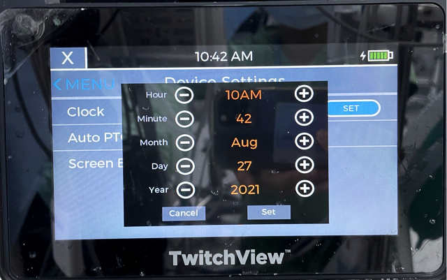
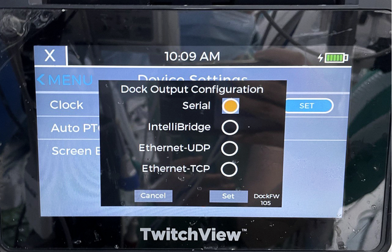

# Blink Device TwitchView

<!-- meta
category: Other
manufacturer: Blink Device Company
vr_device_name: TwitchView
-->
> ⚠️ **The Monitor itself has no data port.** Data leaves the system only through the **RJ45 connector on the Charging Station**, and only while the Monitor is docked.

| Cable | Adapter | Port | VR Device Name |
|-------|---------|------|----------------|
| Custom RJ45 ↔ DB-9F (see pinout) | None | RJ45 on the Charging Station | `TwitchView` |

The Charging Station carries a **combined RS-232 serial + Ethernet port on a single industry-standard RJ45 connector**. Selecting which of the two is active is done on the Monitor (see [Device Configuration](#device-configuration)). Exported values are the **TOF Ratio, TOF Count and PTC Count**.

## Connection Steps

1. Dock the Monitor in the Charging Station. The Monitor sends its data to the Charging Station over an **infrared link**, so keep the IR ports clear — one on the **back of the Monitor**, one on the **front of the Charging Station**. If the IR path is blocked, nothing is transmitted on the RJ45 cable even though the cable itself is fine.

2. Build the custom cable. Only three conductors are used:

   | DB-9 Female (PC side) | | RJ45 (Charging Station side) |
   |---|---|---|
   | 2 — RX | ← | 4 — TX |
   | 3 — TX | → | 5 — RX |
   | 5 — GND | ↔ | 7 — GND |

   

3. Plug the **RJ45 end** into the Charging Station and the **DB-9F end** into a USB-Serial converter, then into the PC.

## Device Configuration

1. On the Monitor, open **MENU**. The menu lists Stimulation Parameters, Electrode Array, New Session and **Device Settings**.

   

2. Select **Device Settings**. It contains **Clock**, **Auto PTC** and **Screen Brightness**.

   

3. Press **SET** next to **Clock**. The date/time dialog opens with Hour / Minute / Month / Day / Year fields.

   

4. Enter the unlock sequence in this dialog — **Hour 1AM, Minute 2, Month March, Day 4, Year 2018** — then press **Set**. This reveals the **Dock Output Configuration** entry.

   > This unlock sequence is not documented in the TwitchView Operating Manual; it is carried over from the original Vital Recorder connection guide. If it does not work on your firmware, ask Blink Device Company for the current service procedure.

5. Open **Dock Output Configuration** and select **Serial**, then press **Set**. The other options (IntelliBridge, Ethernet-UDP, Ethernet-TCP) will not produce serial data.

   

6. Remember to set the clock back to the correct date and time afterwards.

## Vital Recorder Setup

- Add the device in Vital Recorder as **`TwitchView`**.

## Notes

- **Serial parameters (baud rate, data bits, parity) are not published.** The Operating Manual directs users to contact the manufacturer for "data format and connectivity details" — *verify with Blink Device Company*.
- No data is output while the Monitor is undocked.
- The TwitchView never transmits patient-identifying information over this link, but the traffic is unencrypted — keep the PC on a trusted network.

## Sources

- TwitchView System Operating Manual, PN00211 Rev O (Blink Device Company) — RJ45 combined RS-232/Ethernet output, infrared Monitor→Charging Station link, Device Settings menu contents, exported parameters.
- Pinout and Dock Output Configuration values: photographs in this guide.
