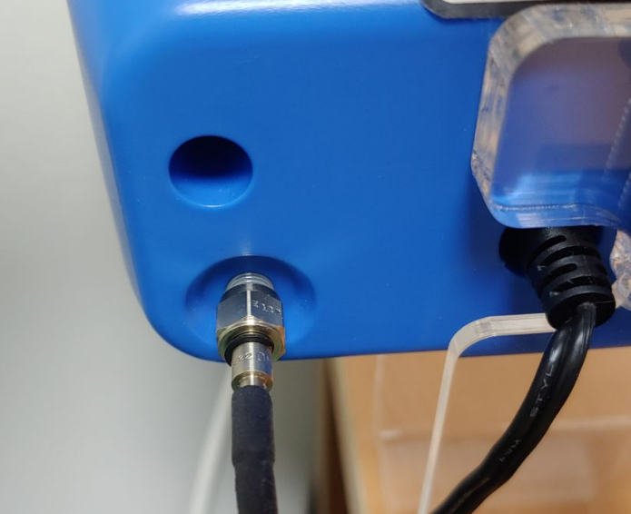

# IDMED TOFscan

<!-- meta
category: Other
manufacturer: IDMED
vr_device_name: TOFScan
-->
> ⚠️ **The TOFscan data port is optical, not electrical.** The **TOF-RS1** (or TOF-RS2) accessory cable is an optic-to-serial converter cable — a plain serial cable cannot be used, and no generic substitute exists.

| Cable | Adapter | Port | VR Device Name |
|-------|---------|------|----------------|
| TOF-RS1 optic-serial cable (from IDMED) — DB-9F output | None | Optical output port on the device | `TOFScan` |

## Connection Steps

1. Obtain the **TOF-RS1** cable from IDMED. Per the TOFscan manual, **TOF-RS1 and TOF-RS2 are the only recommended optic-serial (RS-232) cables** for connecting the TOFscan to other monitors.

2. Screw the cable's optical connector onto the **optical output port** on the device.

   

3. Plug the cable's **DB-9F end directly into a USB-Serial converter** — no Null Modem or gender changer is needed.

4. Connect the USB-Serial converter to the PC.

## Device Configuration

No on-device output setting is documented for the TOFscan; the optic-serial cable is expected to stream data as soon as it is attached.

- **Serial parameters (baud rate, data bits, parity) are not published** in the publicly available TOFscan manuals — *verify with IDMED*.
- Whether a menu option must be enabled on some firmware versions is likewise unconfirmed — *verify with IDMED*.

## Troubleshooting

Most problems are hardware-related — usually a loose optical connector or the wrong cable. Report unresolved issues at [vitaldb.org](https://vitaldb.org).

## Notes

- The optical connector is threaded; hand-tighten it so it cannot work loose during a case.
- Because the link is optical on the device side, the TOFscan is galvanically isolated from the recording PC through this cable.

## Sources

- IDMED ToFscan Neuromuscular Transmission Monitor User Manual — "Optical output for fiber optic connection"; "TOF-RS1 and TOF-RS2 are the only recommended Optic-Serial (RS232) cable to connect ToFscan to other monitors."
- Cable routing to the USB-Serial converter: original Vital Recorder connection guide.
