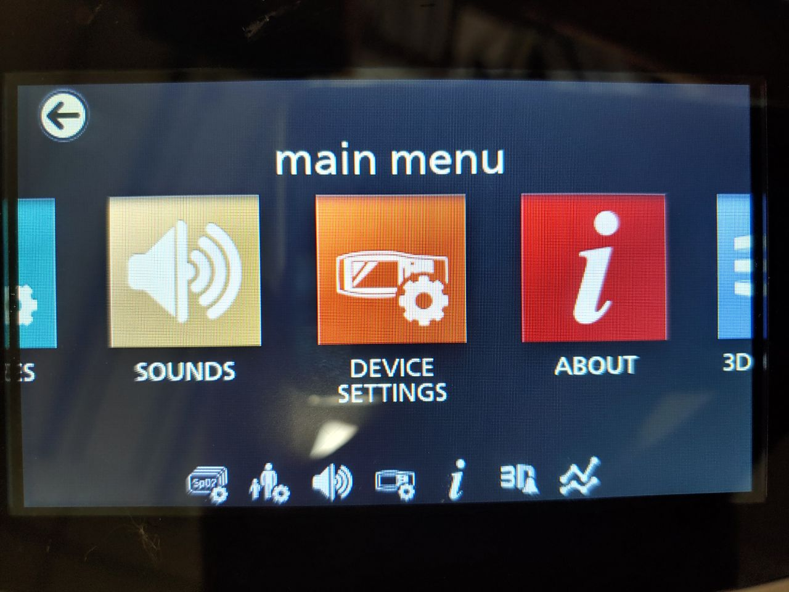
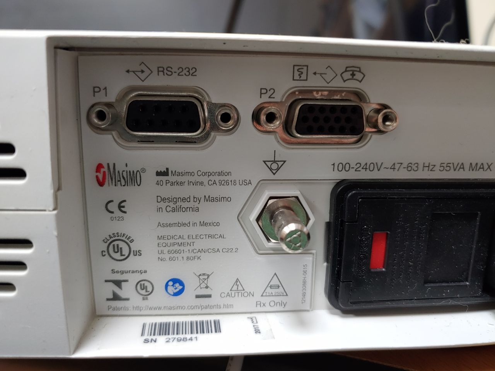
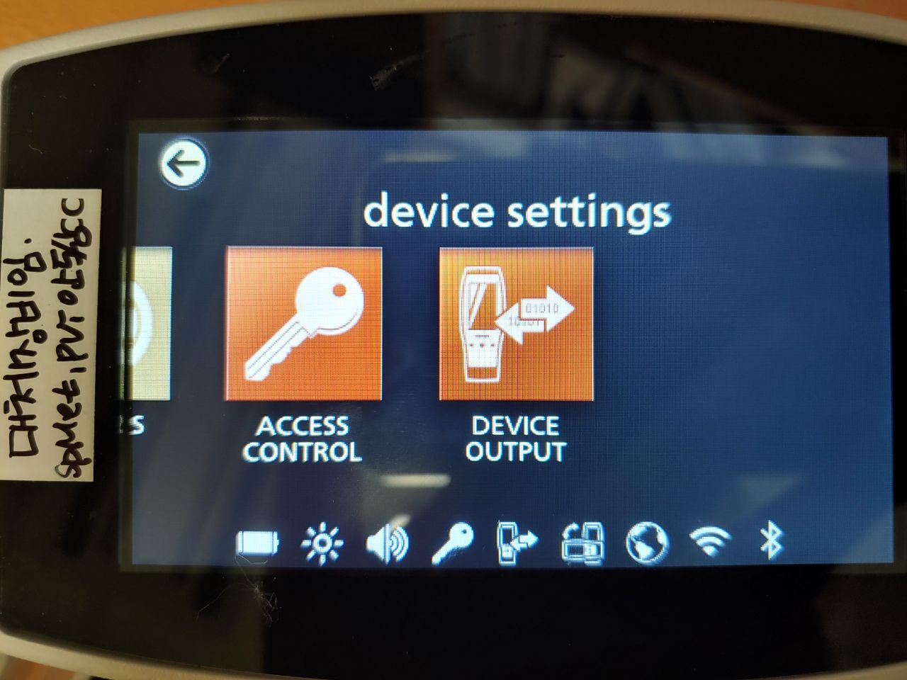

# Masimo Radical7

<!-- meta
category: Other
manufacturer: Masimo
vr_device_name: Radical7
-->
> **Note:** Extracts real-time SpO₂, HR, PI, and digital waveforms via the **P1 (RS-232)** port on the rear of the Docking Station.

| Cable | Adapter | Port | Serial Output | Baud Rate | VR Device Name |
|-------|---------|------|---------------|-----------|----------------|
| Direct male serial (or USB-Serial directly) | None | P1 RS-232 — Docking Station | ASCII 1 | 9600 | `Radical7` |

## Connection Steps
1. Connect a **direct male serial cable** to the P1 (RS-232) port on the rear of the Docking Station. If using a USB-Serial converter, it connects directly without a gender adapter.
2. Connect the other end to the PC.

   

## Device Configuration
1. Navigate to **Device Setup → Device Settings**.

   

2. Swipe right → **Device Output**.
3. Set **Serial → ASCII 1**. Set **Analog 1** and **Analog 2 → Pleth**.
4. Swipe down → set Docking Station **Baud Rate → 9600**.

   
