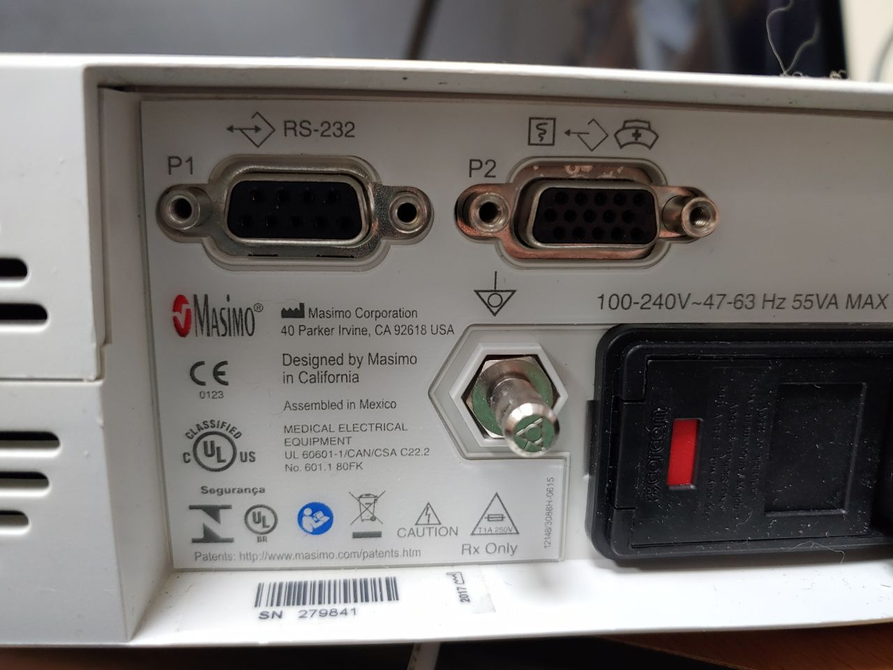
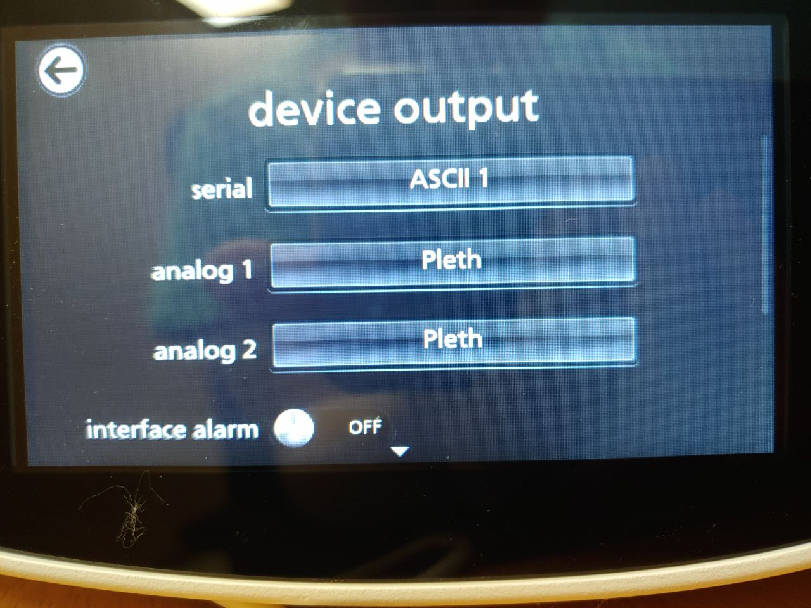

# Masimo Radical-7

<!-- meta
category: Other
manufacturer: Masimo
vr_device_name: Radical7
-->
> ⚠️ **The Radical-7 serial interface exists only on the Docking Station (RDS).** The handheld must be seated in the dock — undocked, there is no serial port and the device-output settings cannot even be changed.

| Cable | Adapter | Port | Serial Output | Baud Rate | VR Device Name |
|-------|---------|------|---------------|-----------|----------------|
| Direct Serial (DB-9M ↔ DB-9F) | None | **P1 (RS-232)** — Docking Station rear | ASCII 1 | 9600 | `Radical7` |

Extracts SpO₂, pulse rate, PI and the digital pleth waveform.

## Connection Steps

1. Locate the **P1** connector on the rear of the Docking Station — it is the one marked **RS-232**. The adjacent **P2** is the wider high-density **analog output** connector: with *analog 1 / analog 2* set to Pleth (step 3 below) it carries the pleth waveform as a voltage, which needs an ADC. It is not used for the serial link.

   

2. Connect a **direct serial cable** from P1 to the PC's serial port. A USB-Serial converter can also be plugged straight into P1 — **no Null Modem adapter is required**.

3. Confirm that the handheld is fully docked before recording.

## Device Configuration

1. From the **main menu**, select **DEVICE SETTINGS**.

   

2. The device settings screen offers **ACCESS CONTROL** and **DEVICE OUTPUT**. Select **DEVICE OUTPUT**.

   

3. Set **serial → ASCII 1**, and **analog 1** and **analog 2 → Pleth**.

   

4. Scroll down and set **docking station baud rate → 9600**. **SatShare diagnostics** may be left **Enable**.

   

- Serial: **9600 baud, 8 data bits, No parity, 1 stop bit, no handshaking (RS-232)**

## Vital Recorder Setup

- Add the device in Vital Recorder as **`Radical7`**.

## Notes

- ASCII 1 is the Radical-7's default serial output mode; if someone has changed it, step 3 restores it.
- When the Radical-7 is docked, the docking-station field is reported as `ASCII1 IAP FLEXPORT` — this is normal.
- Device-output settings are inaccessible while undocked, so make all changes with the handheld in the dock.
- If the Radical-7 is used **together with a Masimo Root**, power on the **Radical-7 first**, then the Root. See [Masimo ROOT](masimo_root.md).

## Sources

- Masimo Radical-7 Operator's Manual (Serial Interface Specifications / Serial Interface Setup) — serial connector on the rear of the Docking Station, serial interface only available when docked, 9600 bps / 8 data bits / 1 stop bit / No parity / no handshaking, ASCII 1 default, `ASCII1 IAP FLEXPORT` docking-station field.
- Cable and gender (direct serial, no Null Modem): original Vital Recorder connection guide device table.
- Menu screens and port layout: photographs in this guide.
