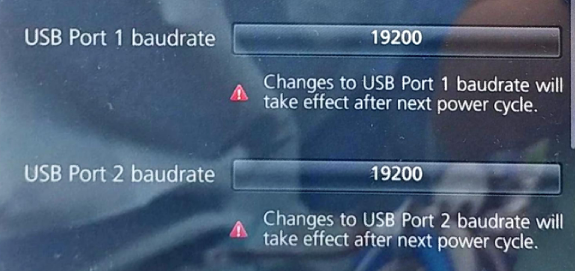
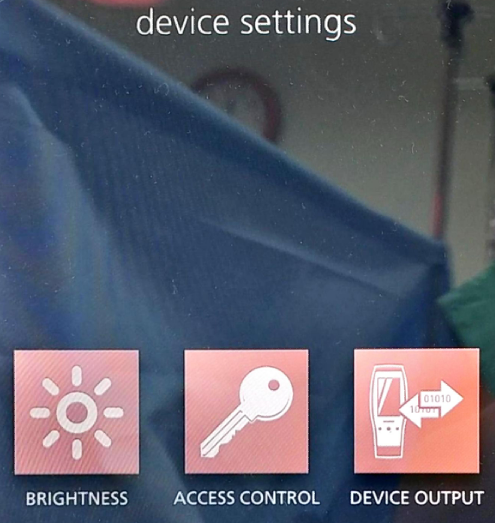
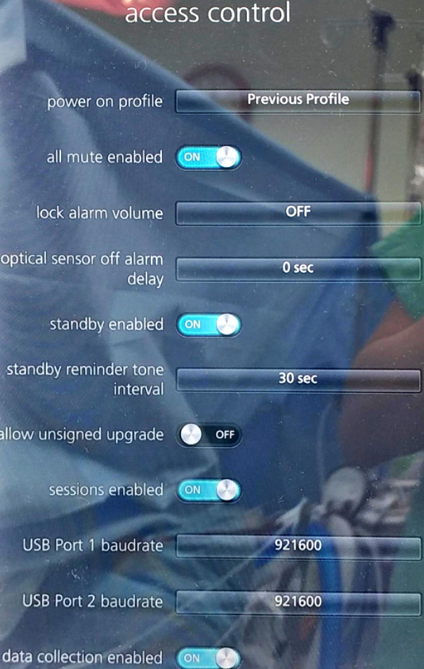

# Masimo ROOT

<!-- meta
category: Other
manufacturer: Masimo
vr_device_name: Root
-->
> ⚠️ **Compatible USB-Serial converters are limited.** Confirmed working: **NEXT USB 2.0 to SERIAL converter [NEXT-RS232U20]**. [Purchase link](http://cableguy.com/shop/mall.php?cat=005004001&query=view&no=6028)
> **Complete device configuration BEFORE connecting cables.**

| Cable | Adapter | Port | USB Baud Rate | Output Protocol | VR Device Name |
|-------|---------|------|---------------|-----------------|----------------|
| Masimo USB data cable (preferred) | None | USB1 or USB2 | 19200 | ASCII 1 | `Root` |

> **Rainbow Sensor:** Always turn on **Radical-7 first**, then turn on ROOT. If only ROOT is on: turn off ROOT → turn on Radical-7 → turn on ROOT.

## Device Configuration
1. Navigate to **DEVICE SETTINGS → ACCESS CONTROL**. Enter password **`6274`**.

   

2. Set **USB Port 1 baudrate** and **USB Port 2 baudrate → 19200**.

   

3. Navigate back → **DEVICE OUTPUT**.
4. Set **USB Port 1** and **USB Port 2 → ASCII 1**.

   

5. Hold power button (bottom right, >8 seconds) to power off → power on again.

## Connection Steps
- **Using Masimo USB data cable:** Plug into USB1 or USB2 on rear → connect to PC.
- **Without Masimo cable:** `ROOT USB1/2` → USB-Serial converter → Null Modem (F/F) → Serial-to-USB → PC.

  

In Vital Recorder, press **Add Device → Masimo ROOT** → assign to the new COM port.

**PiVR Ethernet Connection (Optional):**

1. Navigate to **Device Settings → ETHERNET → ETHERNET ON**.
2. Connect a **LAN cable** from the LAN port on the rear of ROOT to the LAN port of PiVR.

   
