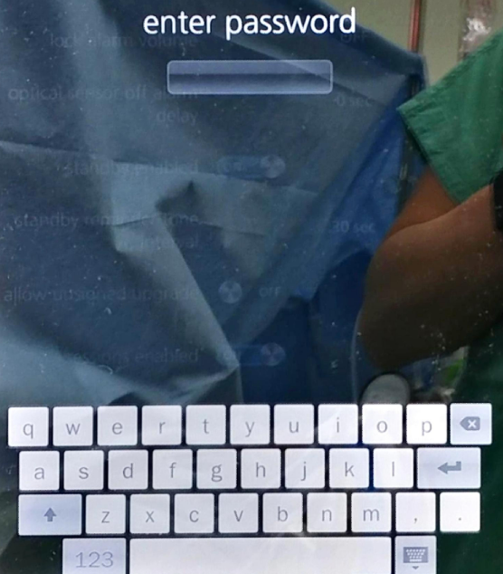
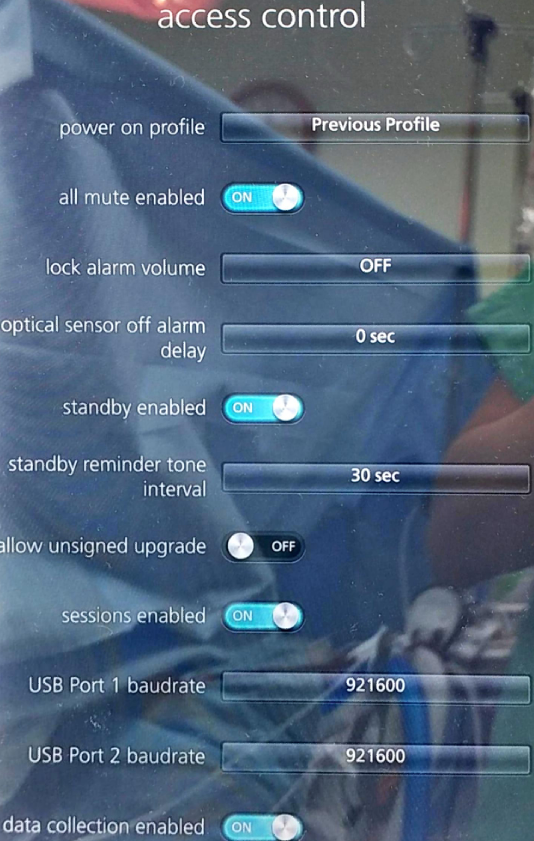
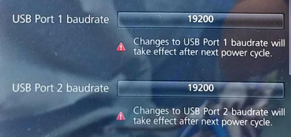
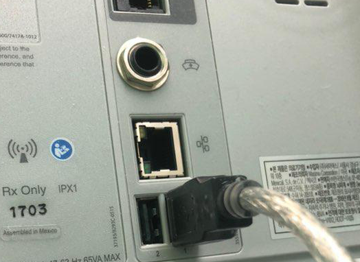
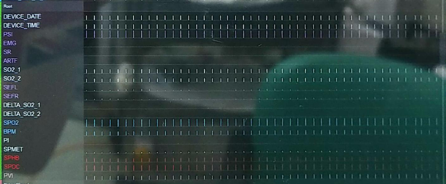
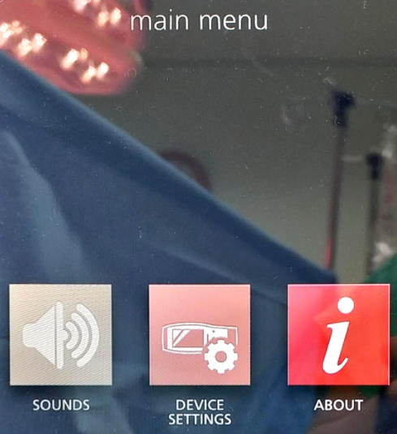
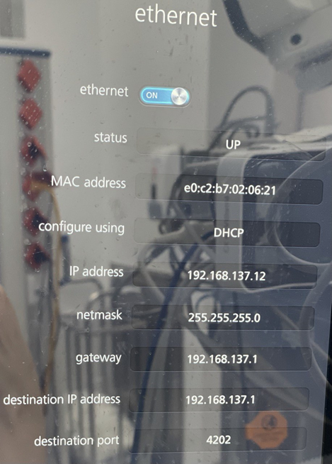
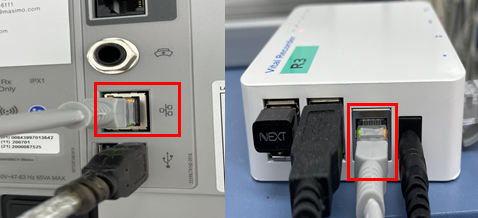

# Masimo ROOT

<!-- meta
category: Other
manufacturer: Masimo
vr_device_name: Root
-->
> ⚠️ **Complete the device configuration BEFORE connecting cables, and power-cycle afterwards.** The USB baud-rate change only takes effect after a full power cycle.
> ⚠️ **Compatible USB-Serial converters are limited.** Confirmed working: **NEXT USB 2.0 to SERIAL converter [NEXT-RS232U20]**. [Purchase link](http://cableguy.com/shop/mall.php?cat=005004001&query=view&no=6028)

| Cable | Adapter | Port | USB Baud Rate | Output Protocol | VR Device Name |
|-------|---------|------|---------------|-----------------|----------------|
| Masimo data-acquisition USB cable (preferred) | None | USB1 or USB2 | 19200 | ASCII 1 | `Root` |
| Generic USB-Serial converter (fallback) | Null Modem **F/F** | USB1 or USB2 | 19200 | ASCII 1 | `Root` |

> **Rainbow sensor:** always power on the **Radical-7 first**, then the ROOT. If only the ROOT is already on: turn the ROOT off → turn the Radical-7 on → turn the ROOT on.

## Device Configuration

1. From the **main menu**, select **DEVICE SETTINGS**.

   

2. The device settings screen offers **BRIGHTNESS**, **ACCESS CONTROL** and **DEVICE OUTPUT**. Select **ACCESS CONTROL**.

   

3. An on-screen keyboard prompts for the access-control password. Enter **`6274`**.

   

   > `6274` is the value recorded in the original Vital Recorder connection guide. It is not published in the Root Operator's Manual — if it is rejected on your unit, contact Masimo for the current access-control password.

4. Scroll the access-control list to **USB Port 1 baudrate** and **USB Port 2 baudrate**. From the factory these read **921600**.

   

5. Set **both** to **19200**. The screen warns that the change takes effect only after the next power cycle.

   

6. Go back to **DEVICE SETTINGS** and this time select **DEVICE OUTPUT**.

   

7. Set **USB Port 1** and **USB Port 2** to **ASCII 1**. Leave the nurse-call settings alone.

   

8. **Power-cycle the ROOT:** hold the power button (bottom right) for **more than 8 seconds** to power off, then power on again. The new baud rate is not active until this is done.

## Connection Steps

1. Identify the ports on the rear of the ROOT: the **Iris** ports (1–4) at the top, a round nurse-call jack, the **LAN** (RJ45) port, and the two **USB** ports numbered **2** and **1** at the bottom.

   

2. **With the Masimo data-acquisition USB cable (preferred):** plug it into **USB1** or **USB2** and connect the other end to the PC. Windows creates a new USB-Serial COM port.

   

3. **Without the Masimo cable:** `ROOT USB1/2` → USB-Serial converter → **Null Modem (F/F)** → USB-Serial converter → PC.

4. In Vital Recorder, press **Add Device → Masimo ROOT** and assign it to the new COM port. Once recording, the Root device exposes tracks such as `PSI`, `EMG`, `SR`, `ARTF`, `SO2_1`, `SO2_2`, `SEFL`, `SEFR`, `DELTA_SO2_1/2`, `SPO2`, `BPM`, `PI`, `SPMET`, `SPHB`, `SPOC` and `PVI`.

   

## Optional — Ethernet Connection to PiVR

1. From the **main menu**, select **DEVICE SETTINGS** again.

   

2. Scroll the tile row to the networking group — **KITE**, **ETHERNET** and **WIFI** — and select **ETHERNET**.

   

3. Turn **ethernet ON**. Confirm **status = UP**, then set the **destination IP address** to the recording PC and the **destination port** to **4202**. `configure using` may be left on **DHCP** if the recorder's subnet serves addresses; otherwise set a static address on both ends.

   

4. Run a **LAN cable** from the RJ45 port on the rear of the ROOT to the Ethernet port of the PiVR.

   

## Vital Recorder Setup

- Add the device in Vital Recorder as **`Root`**.

## Notes

- The USB ports on the ROOT are **data ports, not host ports** for the recorder — a Masimo cable or a USB-Serial converter is still what creates the COM port on the PC.
- If the ROOT was previously left at its **921600** default, Vital Recorder will show the device but no data; re-check step 5 and confirm the power cycle actually happened.
- Some ROOT firmware labels the output protocol list `X001` / `X002` rather than `ASCII 1` / `ASCII 2`; select the entry corresponding to ASCII 1. *Verify against your firmware's menu.*
- On the PiVR path, the ROOT and the recorder must be on the same subnet — the destination IP is the recorder, not a gateway.

## Sources

- Masimo Root Operator's Manual — access control contains password-protected configurable options; USB baud-rate changes require a power cycle to take effect; the Masimo data-acquisition USB cable connects USB1/USB2 to a PC and creates a USB-Serial COM port.
- Cable/adapter chain (generic USB-Serial + Null Modem F/F, "Masimo USB cable usable"): original Vital Recorder connection guide device table.
- Menu paths, factory 921600 default, power-cycle warning, port layout, Ethernet fields and Vital Recorder track list: photographs in this guide.
- Radical-7 power-on order and the NEXT-RS232U20 converter: original Vital Recorder connection guide.
