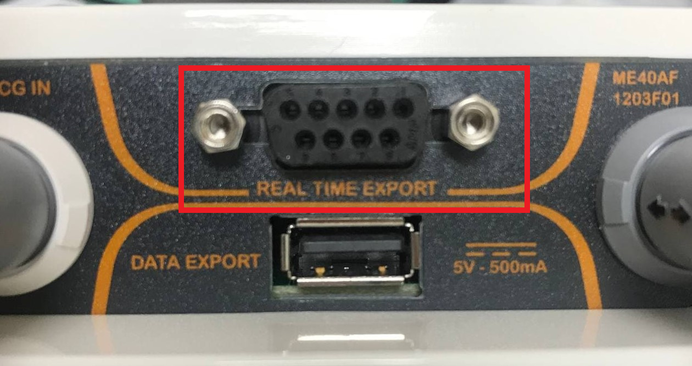
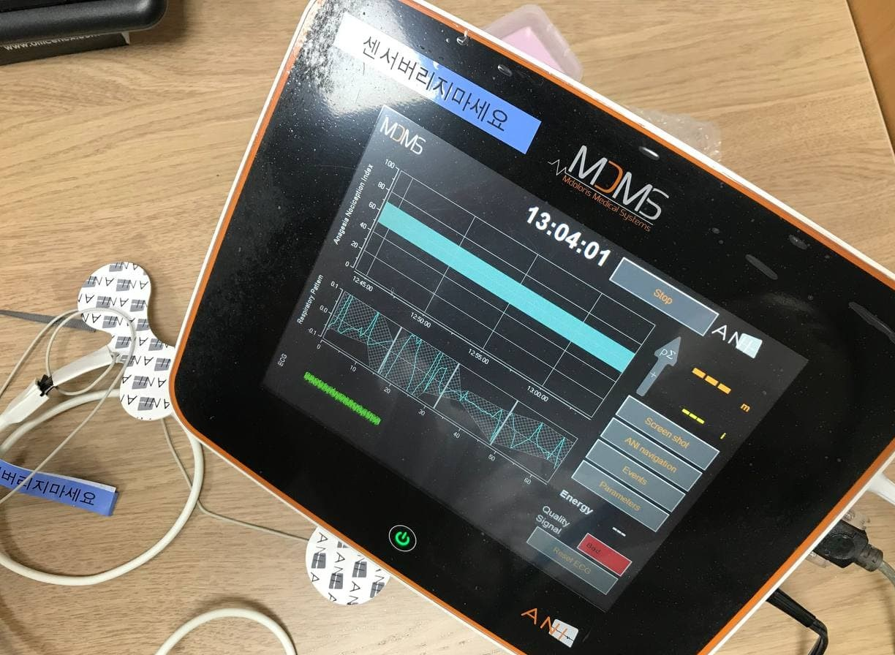

# MDMS ANI Monitor V2

<!-- meta
category: Other
manufacturer: MDMS
vr_device_name: ANIMonitor2
-->
> **Note:** After installing the sensor, press **"New Patient"** and wait approximately **one minute** for the initialization screen before connecting.

| Cable | Adapter | Port | VR Device Name |
|-------|---------|------|----------------|
| NEXT USB 2.0 to SERIAL [NEXT-RS232U20] | None | Serial port (right side) | `ANIMonitor2` |

## Connection Steps
1. Install the sensor → press **New Patient** → wait ~1 minute.

   

2. Connect **NEXT-RS232U20** to the serial port on the **right side** of the device.

   

3. Connect the USB end to the PC.

---

## Neuromuscular Monitors
