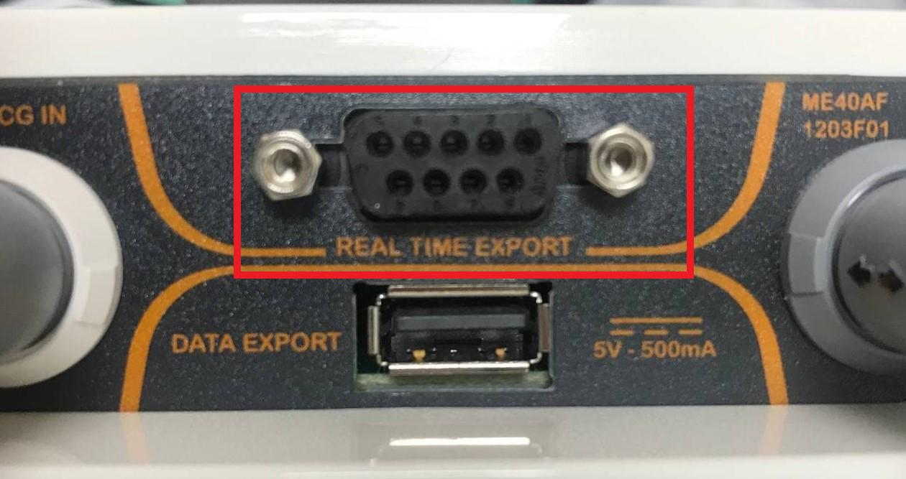
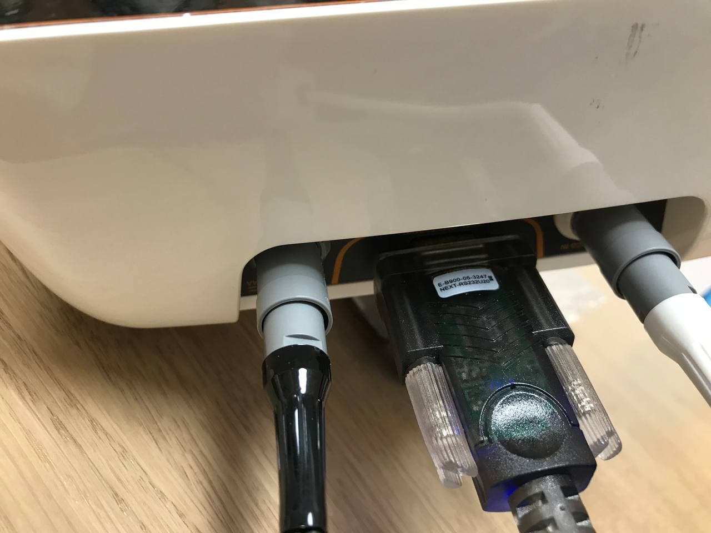

# Mdoloris ANI Monitor V2

<!-- meta
category: Other
manufacturer: MDMS
vr_device_name: ANIMonitor2
-->
> ⚠️ **Use the DB-9 port marked `REAL TIME EXPORT`.** The USB port beside it is marked `DATA EXPORT` and is for offline file export only — it will not stream data to Vital Recorder.

| Cable | Adapter | Port | VR Device Name |
|-------|---------|------|----------------|
| USB-Serial converter, e.g. NEXT USB 2.0 to SERIAL [NEXT-RS232U20] | None | `REAL TIME EXPORT` DB-9 (connector panel) | `ANIMonitor2` |

ANI = Analgesia Nociception Index. The V2 monitor derives it from the ECG-based respiratory pattern.

## Connection Steps

1. Attach the ANI sensor electrodes, press **New Patient**, and wait about **one minute** for the monitor to finish initialising. The ANI trend, respiratory pattern and ECG traces should be running before you connect.

   

2. Find the connector panel on the side of the monitor. Left to right it carries **ECG IN**, the **REAL TIME EXPORT** DB-9 connector, the **DATA EXPORT** USB port (5 V, 500 mA), and the power connector.

   

3. Plug the USB-Serial converter **directly into the `REAL TIME EXPORT` DB-9** — no Null Modem adapter is needed.

   

4. Connect the USB end to the PC.

## Device Configuration

**No on-device setting is required** — the ANI Monitor V2 streams on the `REAL TIME EXPORT` port as soon as a session is running.

- **Serial parameters (baud rate, data bits, parity) are not published** in the publicly available Mdoloris documentation — *verify with Mdoloris Medical Systems* if you need them for a third-party terminal. Vital Recorder applies them automatically.

## Vital Recorder Setup

- Add the device in Vital Recorder as **`ANIMonitor2`**.

## Troubleshooting

- **Vital Recorder shows the device but no values.** The most common cause is that **New Patient** was not pressed or the monitor is still initialising — the port is live but silent until a session starts.

## Notes

- The screwposts on the `REAL TIME EXPORT` connector are usable; fastening the converter prevents it working loose.

## Sources

- Original Vital Recorder connection guide device table — ANI Monitor V2 (Analgesia nociception monitor), device port Serial (DB-9F), generic USB-Serial converter, **no device-side setting required**.
- Port labeling (`REAL TIME EXPORT` / `DATA EXPORT`), panel layout and the New Patient workflow: photographs in this guide.
