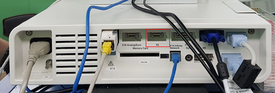

# Dräger Infinity Kappa

<!-- meta
category: Patient Monitor
manufacturer: Dräger
vr_device_name: Infinity
-->
> ⚠️ **X5 and X3 have different pinouts — a cable made for one will not work on the other.** No monitor-side configuration is required. Numeric data arrives every 2 seconds; **waveforms cannot be extracted over the Mini-D serial link** — use the Analog/Sync port with an ADC instead.

| Cable | Adapter | Port | VR Device Name |
|-------|---------|------|----------------|
| 14-pin Mini-D ↔ DB-9F, custom (numeric) | None | `X5` or `X3` on the module, monitor or docking station | `Infinity` |
| Analog/Sync cable → ADC (waveform) | None | Analog/Sync port (see Notes) | — (ADC device) |

The serial link can be taken from the **module, the monitor itself, or the docking station** — whichever exposes an X5 or X3 port. The DB-9F end goes to the PC's DB-9M serial port or a USB-Serial converter; no Null Modem adapter is used, because the crossover is built into the custom cable.

A factory cable is available instead of a custom-built one: **Dräger part `5206441`** ("Export/Expert Protocol Cable, 3 m, with 9-pin connector"), which carries the 14-pin universal connector on the monitor side.

## Connection Steps

### Numeric Data

1. Locate the **X5** (or **X3**) port. On a docking station it sits on the rear panel alongside the Analog/Sync, Infinity Network and X8 ports.

   

2. Identify the pin numbering on the 14-pin Mini-D connector: pin 1 is top-left, 7 top-right, 8 bottom-left, 14 bottom-right.

   

3. Wire the cable for the port you are using:

   | Port | 14-pin Mini-D | → | DB-9F |
   |------|---------------|---|-------|
   | **X5** | 7 (GND) | → | 5 (GND) |
   | **X5** | 10 (TX) | → | 2 (RX) |
   | **X5** | 11 (RX) | → | 3 (TX) |
   | **X3** | 10 (GND) | → | 5 (GND) |
   | **X3** | 13 (TX) | → | 2 (RX) |
   | **X3** | 12 (RX) | → | 3 (TX) |

   

4. Connect the DB-9F end to the PC via a USB-Serial converter.

### Waveform Data (Optional)

Waveforms are only available as analog voltages from the **Analog/Sync port** (Dräger part `4314618`), read through an ADC (SNU-ADC, DataQ DI-149/DI-155, …).

| Pin | Signal |
|-----|--------|
| 12 | CH1 (+) |
| 13 | CH1 (−) |
| 7 | CH2 (+) |
| 6 | CH2 (−) |

## Device Configuration

No monitor-side configuration is required — the export protocol is always active on X5/X3.

## Vital Recorder Setup

- In Vital Recorder, add **Patient monitor → Draeger : Infinity**.

## Troubleshooting

- **Data stops and does not resume on its own.** Expected on the Infinity family — restart Vital Recorder to re-establish the link.

## Known Limitations

- **Anesthesia-machine data shown on the Kappa (e.g. from an Atlan) is not forwarded** over the Kappa's export link. Connect Vital Recorder to the anesthesia machine directly.
- Numeric data is delivered at a **2-second interval**; do not expect higher-rate trends over this link.

## Notes

- For a recorder with a 3.5 mm serial jack (VRZ), the X5 cable is wired **pin 10 (TX) → tip, pin 11 (RX) → ring, pin 7 (GND) → sleeve**.
- Earlier documentation gives the Analog/Sync port as **X10**, but the docking station photographed above labels its analog/sync connector **X16**. Confirm the label on the actual unit before wiring. ❓ *Unverified — tracked in [unverified.md](../unverified.md).*
- Sibling model **Infinity C500 / C700** uses a completely different connection (P2500 RJ10 port) — see [Dräger Infinity C500 / C700](drager_infinity_c500.md).
