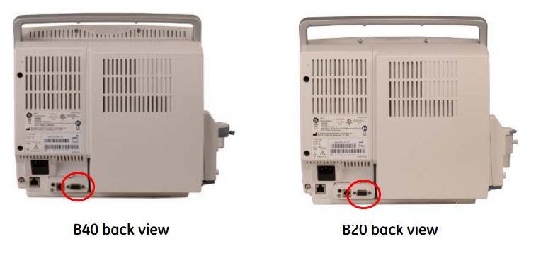

# GE B40 / B20

<!-- meta
category: Patient Monitor
manufacturer: GE
vr_device_name: Bx50
-->
| Cable | Adapter | Port | VR Device Name |
|-------|---------|------|----------------|
| 9-pin serial cable with **pin 4 physically removed** | None | 9-pin serial port | `Bx50` |

## Connection Steps
1. Obtain or fabricate a 9-pin serial cable with **pin 4 physically removed**.
2. Connect to the 9-pin serial port on the rear of the monitor.
3. Connect the other end to the PC via USB-Serial converter.

   
