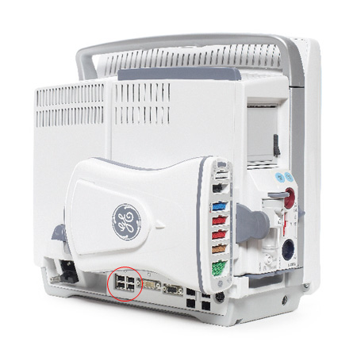

# GE CARESCAPE B850 / B650 / B450

<!-- meta
category: Patient Monitor
manufacturer: GE
vr_device_name: Bx50
-->
> **Note:** Protocol: **GE S5 Computer Interface** (the Datex DRI protocol, also used by the GE S/5, B40/B20 and B1x5M monitors). Data leaves the monitor through a **USB port**, not through the DB-9 serial connector on the rear panel.

| Cable | Adapter | Port | Serial | VR Device Name |
|-------|---------|------|--------|----------------|
| Monitor-side USB-to-RS-232 converter — **model depends on monitor software version** (see below) | Null Modem F/F | **USB port** on the rear panel | GE S5 Computer Interface | `Bx50` |

> ⚠️ **The monitor-side USB-to-RS-232 converter depends on monitor software version.** The CARESCAPE runs its own embedded OS and carries drivers for these converters only:
>
> | Monitor software | Converter |
> |---|---|
> | **v3.1.4 or later** | **Startech ICUSB232V2**. Newer Startech stock has been seen to fail on some units — the **MBF-RS232** USB-Serial cable is the proven alternative. |
> | **v3.1 – v3.1.3** | Ask GE for the **free firmware upgrade** to 3.1.4 or later, then use the row above. |
> | **v2** | **ATEN UC-232A**, legacy revision only — serial numbers starting **Z3L1** or later alphabetically (USB vendor ID `0x0557`); this revision is discontinued. **MBF-RS232** also works on v2 (chain: MBF-RS232 → Null Modem F/F → MBF-RS232). |
>
> Check the version under **Monitor setup → Defaults & Service → Service** before buying. If the monitor does not recognize a converter, recheck the software version and converter revision. Do **not** connect to the monitor's own DB-9 serial port; use a USB port.

> ⚠️ **Use an FTDI-based USB-Serial converter on the PC side.** A 3-wire cable connects but loses most of the waveform samples.

## Connection Steps

1. Plug the **monitor-side USB-to-RS-232 converter** that matches the monitor's software version (see above) into one of the USB ports on the rear of the monitor. The USB block sits on the lower connector strip, to the left of the DVI and DB-9 connectors.

   

   If no data appears, try another rear USB port before replacing the cable.

2. Attach a **Null Modem (F/F)** adapter to the DB-9 end of the monitor-side converter. This is what turns the two "direct" ends into a crossed link.

3. Run a **direct serial cable** from the Null Modem adapter to the recording PC. On a laptop or tablet, connect a separate FTDI-based PC-side USB-Serial converter.

   ```
   CARESCAPE USB -- monitor-side USB-to-RS-232 converter (DB-9M) -- Null Modem F/F -- direct serial cable -- PC-side USB-Serial converter (FTDI) -- PC
   ```

## Device Configuration

The monitor has to be told to emit the **S/5** data format on its wired device interface. On software version 1/2 monitors this is reached through **Configuration → Network → Wired Interfaces**, where the interface is set to **S/5**. The exact wording, and whether a service login is required, varies by monitor software version — confirm against the CARESCAPE technical manual for your version, or have the GE field engineer set it.

Once the interface is set to S/5, no baud rate has to be chosen on the monitor: Vital Recorder opens the port with the S/5 Computer Interface settings itself.

## Vital Recorder Setup

- Add the device in Vital Recorder as **GE :: Bx50**; in `vr.conf` the type is `Bx50`.
- The Bx50 uses the Datex DRI waveform options. Default waveforms are `ECG1, PLETH, IABP1, CO2, AWP`; request others with `wavs=` — see [Configuration Guide → S5 / Datex Device Settings](../../../Configuration_Guide.md#s5--datex-device-settings-ge-solar--bx50--b1x5m--canvas).
- Invasive arterial pressure is `IABP1` — the names `ART` and `INVP1` are not recognized.

## Troubleshooting

- **A freshly bought UC-232A produces nothing.** Converter revision matters: only the older ATEN UC-232A revision (USB vendor ID `0x0557`) is driven by the monitor's built-in driver; newer stock built around a different chipset (`0x067b`) is not. Check the revision before changing anything else.
- **Communication stops and does not recover on software version 2.** Reconnect the cable at the monitor end. Use a PC-side FTDI converter and update Vital Recorder before replacing the monitor-side converter.
- **The link drops intermittently.** Use an FTDI-based converter on the PC side. NETmate **KW-725 / KW-825** and UGREEN FTDI have proved stable on Linux/PiVR.
- **Waveforms drop out.** Trim the `wavs=` list if the monitor cannot sustain all of the defaults (`wavs=1,4,8,9,13` — ECG1, PLETH, IABP1, CO2, AWP).

## Notes

- **Confirm the model before the site visit.** The B1x5M (B105M/B125M/B155M) and the Bx50 look alike on a pre-survey form but need different cabling and a different Vital Recorder device type — see [GE B105M / B125M / B155M](ge_b105m.md).
- **VRZero note:** the USB cable that connects to VRZero must support handshaking. Cables known to work:
  - [NETmate KW-525 (0.45 m)](http://www.compuzone.co.kr/product/product_detail.htm?ProductNo=374732)
  - [ATEN UC-232A (0.35 m)](http://www.compuzone.co.kr/product/product_detail.htm?ProductNo=60189)
