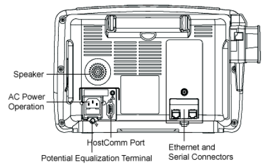

# GE Dash 2500

<!-- meta
category: Patient Monitor
manufacturer: GE
vr_device_name: Dash2500
-->
> **Note:** Protocol: **GE Dinamap Protocol**.

| Cable | Adapter | Port | VR Device Name |
|-------|---------|------|----------------|
| Direct Serial | None | Host Comm Port | `Dash2500` |

## Connection Steps
1. Connect a direct serial cable to **"Host Comm Port"** on the rear.
2. Connect the other end to the PC via USB-Serial converter.

   

**Device Configuration** *(only if communication is not established):*

1. Turn the Trim Knob → **Main Menu**.
2. Select **Other System Setting → Go to Config Mode → Yes**. Device reboots.
3. Enter code **`2508`** → **Done**.
4. Select **Configuration Menu → Other System Settings → Config HostComm**.
5. Select **Remote Access → Serial 2**.
6. Select **Serial 2 Setup → ASCII cmd → 9600 baud** (default).
7. Select **Go to Previous Menu → Save Default Changes**.
8. Select **Exit Configuration Mode → Yes**. Device reboots.
