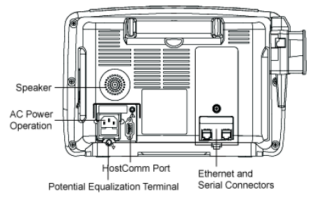

# GE Dash 2500

<!-- meta
category: Patient Monitor
manufacturer: GE
vr_device_name: Dash2500
-->
> **Note:** Protocol: **GE Dinamap Protocol** — *not* the Unity Network protocol used by the Dash 2000/3000/4000. The two families are wired and configured differently.

| Cable | Adapter | Port | VR Device Name |
|-------|---------|------|----------------|
| Direct Serial | None | **HostComm Port** (DB-9, rear panel) | `Dash2500` |

> ⚠️ **Use the DB-9 HostComm port only.** The Dash 2500 also carries a non-isolated DB-15 communication-adaptor connector that runs inverted-TTL signals and puts fused **+5 V and +12 V on two of its pins**. Plugging a PC serial cable into that connector can damage the converter or the monitor. The DB-9 HostComm port is the isolated, RS-232-level port.

## Connection Steps

1. Locate the **HostComm Port** on the rear panel. It is the D-sub connector immediately to the right of the AC power inlet, inside the same recessed bay; the potential-equalization stud sits just below it. The two RJ-45 jacks further to the right on the panel are the Ethernet/serial network connectors and are **not** used for this connection.

   

2. Plug a **direct serial cable** into the HostComm port. No Null Modem adapter is used.

3. Connect the other end to the PC through a USB-Serial converter.

   ```
   Dash 2500 HostComm (DB-9) -- direct serial cable -- USB-Serial -- PC
   ```

### HostComm DB-9 pin assignment

Per the GE Dash 2500 service manual (document 2042481-001), the isolated host communications connector is wired as:

| Pin | Signal | Pin | Signal |
|-----|--------|-----|--------|
| 1 | Ground | 6 | DSR |
| 2 | TX (RS-232) | 7 | RTS |
| 3 | RX (RS-232) | 8 | CTS |
| 4 | DTR | 9 | No connection |
| 5 | Ground | | |

Only pins 2, 3 and 5 are needed for recording. Note that **pin 1 is ground on this monitor**, not DCD as on a PC — this is harmless with an ordinary cable, but worth knowing if a cable is being built.

## Device Configuration

*(Only needed if communication is not established — the monitor usually ships with the HostComm port already enabled.)*

1. Turn the Trim Knob → **Main Menu**.
2. Select **Other System Setting → Go to Config Mode → Yes**. The monitor reboots.
3. Enter code **`2508`** → **Done**.
4. Select **Configuration Menu → Other System Settings → Config HostComm**.
5. Select **Remote Access → Serial 2**.
6. Select **Serial 2 Setup → ASCII cmd → 9600 baud** (default).
7. Select **Go to Previous Menu → Save Default Changes**.
8. Select **Exit Configuration Mode → Yes**. The monitor reboots.

- Serial: **9600 baud**, ASCII command mode, as set above.

## Vital Recorder Setup

- Add the device in Vital Recorder as **GE :: Dash 2500**; in `vr.conf` the type is `Dash2500`.
- Parameters delivered over this link are numerics (ECG/HR, NIBP, SpO2, Temp, Resp, IBP). If the site needs the MPS module's PLETH waveform, that is recorded as the separate **MPS** device type.

## Notes

- **Do not use the Dash 2000/3000/4000 procedure here.** Those models expose serial data on an RJ-45 Aux terminal over the Unity Network protocol and need a custom DB-9F ↔ RJ-45 cable — see [GE Dash 2000 / 3000 / 4000 / 5000](ge_dash2000.md).
- If the link stays silent after configuration, re-check that **Remote Access** is set to **Serial 2** — the setting reverts if *Save Default Changes* is skipped before leaving configuration mode.
