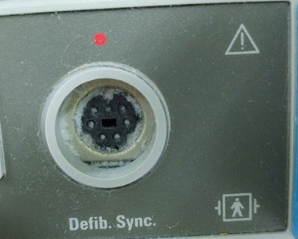
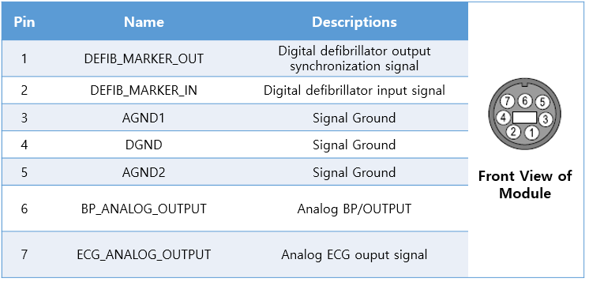

# GE Defib Connectors

<!-- meta
category: Patient Monitor
manufacturer: GE
-->
> **Note:** Use when the TRAM-RAC analog port is occupied. ECG and ABP signals available from the **Defib.Sync port** on the front panel.

| Cable | Port | ADC Required |
|-------|------|--------------|
| 7-pin DIN (or 8-pin DIN, center cut and modified) | Defib.Sync | Yes |

## Connection Steps
1. Obtain a 7-pin DIN cable (or modify an 8-pin DIN by cutting the center).
2. Connect to **Defib.Sync** on the front panel per the pin diagram.

   

3. Connect the other end to the ADC, then connect the ADC to the PC via USB.

   
