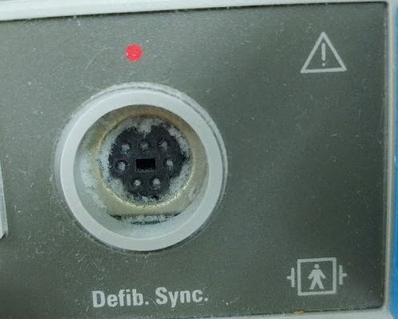

# GE Defib Connectors

<!-- meta
category: Patient Monitor
manufacturer: GE
vr_device_name: (none — ADC device)
-->
> **Note:** Use this route when the TRAM-RAC ANALOG OUT port is already occupied. ECG and ABP are available as voltages from the **Defib. Sync** connector on the front of the Tram / Patient Data Module. Like the TRAM-RAC analog port this is an **analog** output, so an ADC is required — the voltage scaling is the same.

| Cable | Adapter | Port | VR Device Name |
|-------|---------|------|---------------- |
| 7-pin mini-DIN cable to ADC analog inputs (or an 8-pin mini-DIN with the center pin cut away) | — | **Defib. Sync** (front panel of the Tram / Patient Data Module) | *(per ADC type)* |

## Connection Requirements

The ADC connects to the PC over **USB**. There is no separate VR device entry for the Defib.Sync port — add the ADC in Vital Recorder and map its channels.

## Cable Pinout

Defib. Sync connector:

| Pin | Name | Description |
|---|---|--- |
| 1 | DEFIB_MARKER_OUT | Digital defibrillator output synchronization signal |
| 2 | DEFIB_MARKER_IN | Digital defibrillator input signal |
| 3 | AGND1 | Signal ground |
| 4 | DGND | Signal ground |
| 5 | AGND2 | Signal ground |
| 6 | **BP_ANALOG_OUTPUT** | Analog BP output |
| 7 | **ECG_ANALOG_OUTPUT** | Analog ECG output |

- ECG channel: signal **pin 7**, ground **pin 3**.
- ABP channel: signal **pin 6**, ground **pin 3** (or pin 5).

## Connection Steps

1. Locate the round **Defib. Sync** socket on the front panel of the module.

   

2. Obtain a 7-pin mini-DIN cable. An 8-pin mini-DIN cable also fits if the center pin is cut away. Cut the far end off and wire the conductors you need to the ADC.

3. Wire the ADC inputs as shown in [Cable Pinout](#cable-pinout).

4. Connect the ADC to the PC via USB and map the two channels in Vital Recorder.

## Device Configuration

No configuration is required on the module — the analog outputs are always live. All setup happens on the ADC side in Vital Recorder: channel mapping, gain and unit (see Notes for the scaling values).

## Vital Recorder Setup

- There is no Vital Recorder device entry for this port. Add the **ADC** (DataQ DI-149 / DI-155 / DI-1110 or SNU-ADC) as the device and map each analog channel to a track.

## Known Limitations

- Only **ECG and ABP** are available here — for PLETH, RESP or additional pressures use the 15-pin [TRAM-RAC ANALOG OUT](ge_tram_rac.md) port instead.
- **Dash 4000:** the defib cable pin mapping differs from the SNUADCM default, so a dedicated mapping (`Dash defib-SNUADCM`) is needed rather than the stock channel map.

## Notes

- **Voltage scaling** matches the TRAM-RAC analog output: ECG **1 V/mV ± 10%**, invasive BP **1 V / 100 mmHg**.
