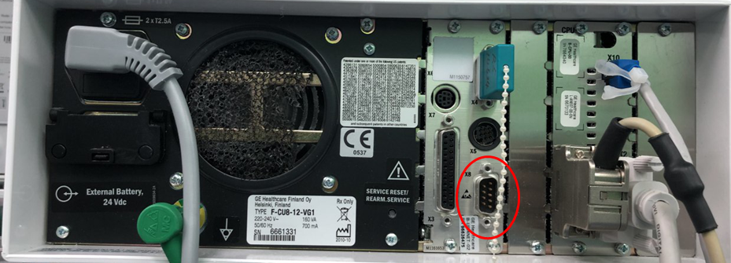

# GE S/5 AM

<!-- meta
category: Patient Monitor
manufacturer: GE
vr_device_name: Bx50
-->
| Cable | Adapter | Port | VR Device Name |
|-------|---------|------|----------------|
| Direct Serial | Null Modem F/F | Port X8 | `Bx50` |

## Connection Steps
1. Locate **Port X8** on the device.

   

2. Attach a **Null Modem (F/F)** adapter to Port X8.
3. Connect a direct serial cable from the adapter to the PC via USB-Serial converter.
