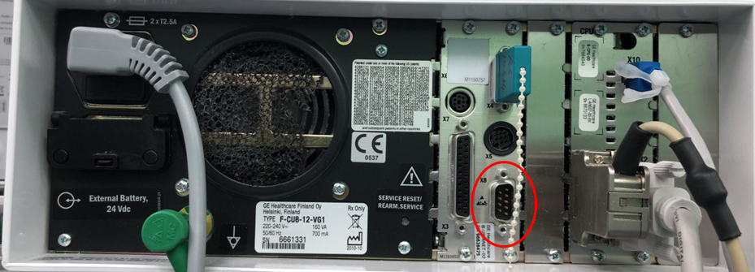

# GE S/5 AM

<!-- meta
category: Patient Monitor
manufacturer: GE
vr_device_name: Bx50
-->
> **Note:** Protocol: **GE S5 Computer Interface** (the Datex DRI protocol, shared with the CARESCAPE Bx50, the B1x5M and the B40/B20). On the frame configuration shown here, X8 is the serial/computer interface. Other configurations may use X7/X8 for analog output; confirm the connector labels before connecting.

| Cable | Adapter | Port | Serial | VR Device Name |
|-------|---------|------|--------|----------------|
| Direct Serial | **Null Modem F/F** | **X8** (9-pin D-type, rear of the frame; verify on other configurations) | GE S5 Computer Interface | `Bx50` |

> ⚠️ **The Null Modem adapter is not optional.** A direct serial cable straight into X8 leaves TX connected to TX and no data appears. Attach the Null Modem (F/F) adapter at the monitor end.

## Connection Steps

1. Locate connector **X8** on the rear of the monitor frame. It is a 9-pin D-type connector on the interface board in the middle of the rear panel, in the column of connectors silk-screened **X3 / X5 / X7 / X8** — below the round multi-pin connectors at X5 and X7 and above the board's serial-number label. The CPU board with X10 and X2, where the display and module-bus cables run, is the separate board to the right; do not use those.

   

2. Attach a **Null Modem (F/F)** adapter to X8.

3. Run a **direct serial cable** from the Null Modem adapter to the PC, through a USB-Serial converter if the PC has no serial port.

   ```
   S/5 frame X8 -- Null Modem F/F -- direct serial cable -- USB-Serial -- PC
   ```

## Device Configuration

No configuration is required on the monitor — X8 streams the S/5 Computer Interface as soon as Vital Recorder opens the port.

## Vital Recorder Setup

- Add the device in Vital Recorder as **GE :: Bx50**; in `vr.conf` the type is `Bx50`. The S/5 AM shares the Bx50 driver because both speak the S/5 Computer Interface.
- Default waveforms are `ECG1, PLETH, IABP1, CO2, AWP`; request others with `wavs=` — see [Configuration Guide → S5 / Datex Device Settings](../../../Configuration_Guide.md#s5--datex-device-settings-ge-solar--bx50--b1x5m--canvas). Invasive arterial pressure is `IABP1`, not `ART` or `INVP1`.

## Troubleshooting

- **No data arrives from X8.** Check the frame's connector labels. On some configurations the serial/computer interface is on an Interface Module (M-INT), while X7/X8 are analog outputs. Confirm the serial connector in the Datex-Ohmeda S/5 technical reference manual before re-cabling.

## Notes

- **Converter.** Use an FTDI-based USB-Serial converter on the PC side rather than a 3-wire adapter.
- Gas from Datex/S/5 devices arrives on the `AGENT1` channel. If a Philips monitor also reports gas, account for this shared track when configuring `vr.conf`.
