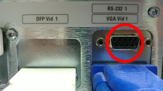

# GE Solar 8000m / 8000i

<!-- meta
category: Patient Monitor
manufacturer: GE
vr_device_name: Solar8000
-->
> **Note:** Protocol: **GE Unity Protocol** (also used by GE Dash 3000, 4000, 5000).

| Cable | Adapter | Port | VR Device Name |
|-------|---------|------|----------------|
| Direct Serial | None | **RS-232 1** | `Solar8000` |

## Connection Steps
1. Connect a direct serial cable to the port labeled **"RS-232 1"** on the right side of the rear panel. No additional settings required.
2. Connect the other end to the PC via USB-Serial converter.

   
