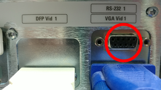

# GE Solar 8000m / 8000i

<!-- meta
category: Patient Monitor
manufacturer: GE
vr_device_name: Solar8000
-->
> **Note:** Protocol: **GE Unity Network** — shared with the GE Dash 2000 / 3000 / 4000 / 5000. No configuration is needed on the monitor: the RS-232 port streams as soon as Vital Recorder opens it.

| Cable | Adapter | Port | VR Device Name |
|-------|---------|------|----------------|
| Direct Serial | None | **RS-232 1** (9-pin D-type, female) | `Solar8000` |

## Connection Steps

1. Locate the connector labeled **RS-232 1** on the right-hand side of the rear connector panel. It is a 9-pin D-type **female** socket, sitting directly under its silk-screened label and beside the **VGA Vid 1** and **DFP Vid 1** video connectors. A blue VGA cable is usually already plugged into the connector immediately below it — do not confuse the two.

   

2. Plug a **direct serial cable** (DB-9 male end) straight into RS-232 1. No Null Modem adapter is used.

3. Connect the other end of the cable to the PC through a USB-Serial converter.

   ```
   Solar 8000 RS-232 1 (DB-9F) -- direct serial cable -- USB-Serial -- PC
   ```

## Device Configuration

Nothing has to be changed in the monitor's service menu — the RS-232 port streams as delivered.

- Serial: **9600 baud**, per the Vital Recorder supported-device list for the Solar family.

## Vital Recorder Setup

- Add the device in Vital Recorder as **GE :: Solar 8000**; in `vr.conf` the type is `Solar8000` — **written without a space**.
- The Solar 8000 uses the Datex/DRI waveform options in Vital Recorder. Default waveforms are `ECG1, PLETH, IABP1, CO2, AWP`; request others with `wavs=` — see [Configuration Guide → S5 / Datex Device Settings](../../../Configuration_Guide.md#s5--datex-device-settings-ge-solar--bx50--b1x5m--canvas).

## Troubleshooting

- **Dropout that never recovers.** Recording stops although the COM port stays open. This has been traced to the per-device restart thread in Vital Recorder dying in the background, and is seen most often when a TwitchView is being recorded on the same machine. Restarting Vital Recorder recovers it.
- **Garbage on the line after re-cabling.** Unplugging and re-plugging the serial cable while the device is running sends stray bytes into the stream. Stop the device in Vital Recorder before re-cabling, then start it again.

## Notes

- **RS-232 1 vs. the other serial connectors.** On the Solar 8000M/i the RS-232 ports on this panel also serve the iPanel computer and other serial peripherals. Use the one labeled **RS-232 1**; if a site already has something occupying it, confirm with biomedical engineering before moving cables.
- The **Dash 2000 / 3000 / 4000** share this protocol but expose it on an RJ-45 Aux terminal and need a custom cable — see [GE Dash 2000 / 3000 / 4000 / 5000](ge_dash2000.md). The **Dash 2500** uses a different protocol entirely — see [GE Dash 2500](ge_dash2500.md).

## Sources

- Original Vital Recorder connection guide (legacy English and Korean editions) — *GE Solar 8000m, 8000i*: direct serial cable (DB9M–DB9F) to the serial port, no adapter, `GE :: Solar 8000m` device selection, and the note that the GE Unity protocol is shared with the Dash 3000/4000/5000.
- `VitalRecorder/Supported_Devices.md` — *Solar 8000 / Solar 8000M, RS-232, 9600 baud, ECG, NIBP, SpO2, Temp, Resp, IBP*; the `Solar8000` device type.
- `VitalRecorder/Configuration_Guide.md` (S5 / Datex Device Settings) — default waveforms `ECG1, PLETH, IABP1, CO2, AWP` and the `wavs=` option.
- RS-232 1 connector location on the rear panel: photographs in this guide.
- Field records (VitalDB installation and support logs, 2024–2026) — the non-recovering drop-out traced to the per-device restart thread (seen with a TwitchView on the same machine) and stray bytes after re-cabling a running device.
