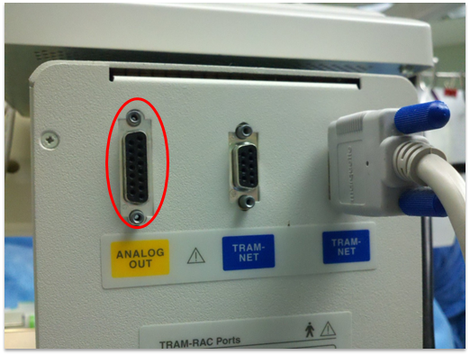
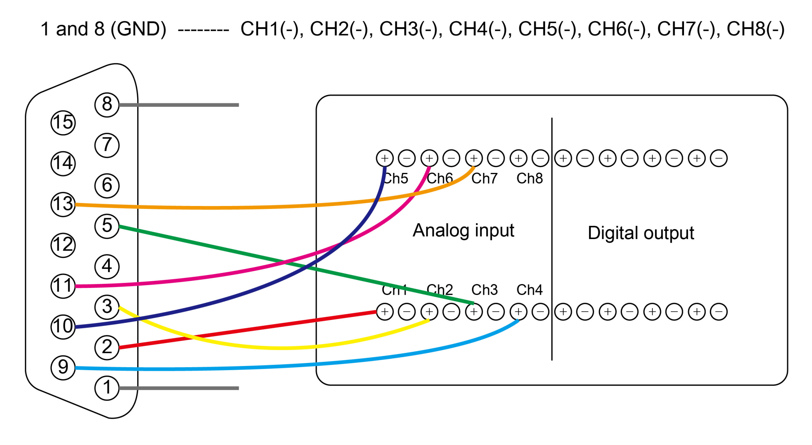
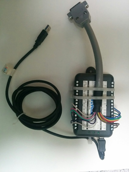

# GE TRAM-RAC 4A

<!-- meta
category: Patient Monitor
manufacturer: GE
-->
> **Note:** The TRAM-RAC 4A uses a **15-pin ANALOG OUT port** — this is an analog signal requiring an Analog-to-Digital Converter (ADC).

| Cable | Adapter | Port | ADC Required |
|-------|---------|------|--------------|
| Custom 15-pin analog cable → ADC | — | 15-pin ANALOG OUT | DataQ DI-149, DI-155, DI-1110, or SNU-ADC |

> ⚠️ **Do NOT connect the cable to the BP connector (BP2 slot)** when receiving the PLETH waveform. PLETH and BP waveforms look identical — incorrect connections are easy to miss.

## Connection Steps
1. Fabricate or order a cable for the **15-pin ANALOG OUT** port per the pinout diagram.

2. Connect to the correct module slot — **NOT BP2** if using PLETH.

   

3. Connect the ADC output (USB) to the PC.

   

> **ICP note:** When monitoring ICP, the ICP module must be in the **first slot** of the TRAM-RAC.

> **DataQ DI-1110 and newer:** Change device to **CDC mode** before use. Vital Recorder only recognizes CDC mode. See [manufacturer guide](https://www.dataq.com/blog/data-acquisition/usb-daq-products-support-libusb-cdc).

