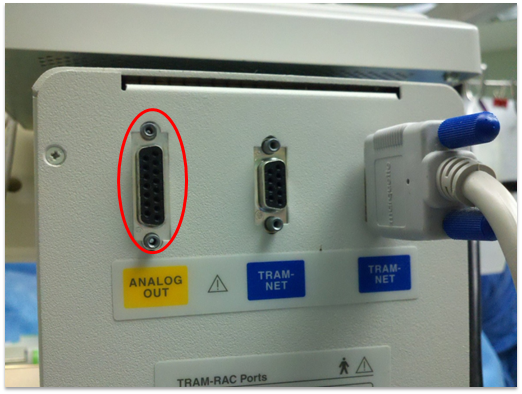
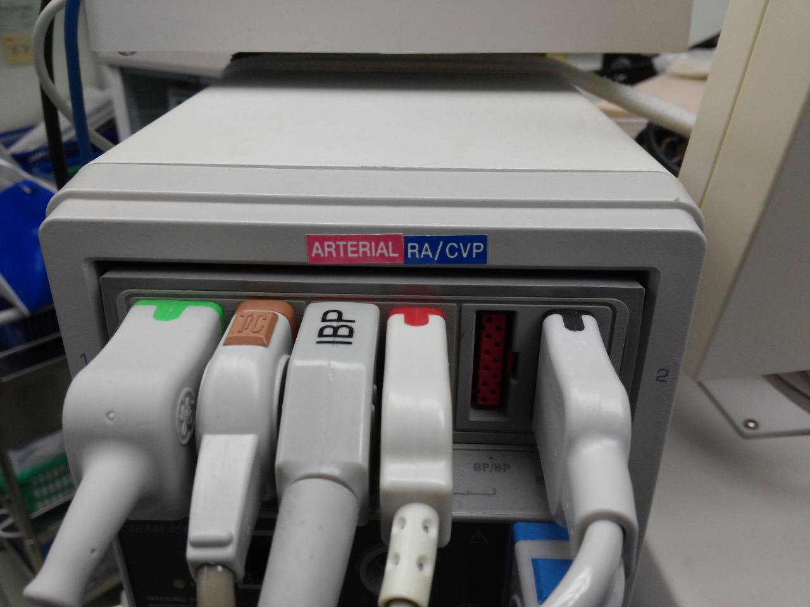
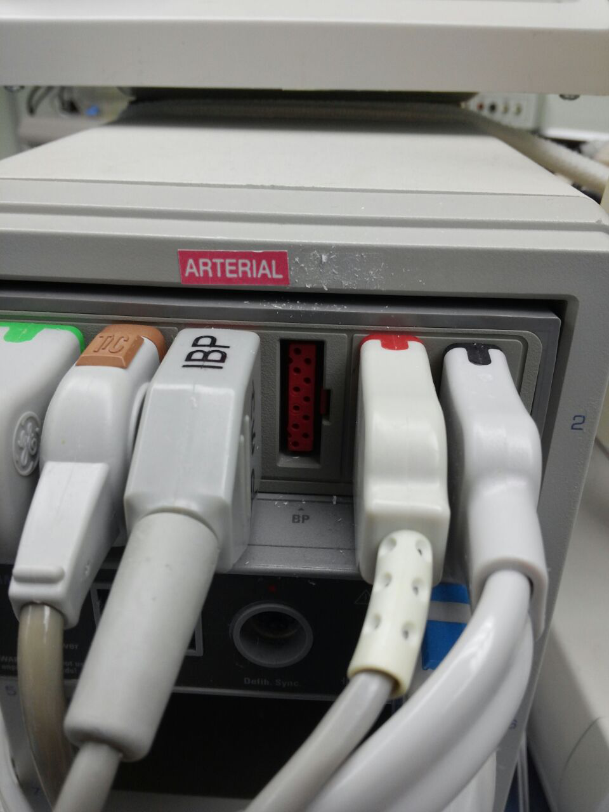

# GE TRAM-RAC 4A

<!-- meta
category: Patient Monitor
manufacturer: GE
vr_device_name: (none — ADC device)
-->
> ⚠️ **This is an analog connection, not serial.** ECG, arterial pressure and PLETH waveforms can only be taken from the **15-pin ANALOG OUT** connector on the rear of the TRAM-RAC 4A housing. The connector outputs the measured waveforms as voltages, so an **Analog-to-Digital Converter (ADC)** is required between the TRAM-RAC and the PC. A Tram-rac **2** housing has no analog output connector.

| Cable | Adapter | Port | ADC Required |
|-------|---------|------|--------------|
| Custom DB-15M → ADC analog inputs | — | 15-pin **ANALOG OUT** (rear of TRAM-RAC 4A housing) | DataQ DI-149, DI-155, DI-1110, or SNU-ADC |

The ADC connects to the PC over **USB**. There is no VR device entry for the TRAM-RAC itself — the ADC is added in Vital Recorder as the ADC device (DataQ or SNU-ADC) and each analog channel is mapped to a track.

> ⚠️ **Do NOT leave a transducer cable in the second BP connector (BP2)** when you want the PLETH waveform. Analog pin 13 carries **"Tram BP2 *or* SpO2 waveform"** — it only outputs PLETH while BP2 is unused. If a CVP or second arterial transducer is plugged into BP2, BP2 is recorded on the PLETH channel instead. PLETH and BP waveforms look almost identical, so this is easy to miss.

## Connection Steps

1. Locate the **ANALOG OUT** connector on the rear of the TRAM-RAC 4A housing. It is a 15-pin D-type connector (yellow label), next to the two DB-9 **TRAM-NET** ports.

   

2. Build or order a cable that routes the ANALOG OUT pins to the ADC's analog inputs. Only the pins you actually need have to be wired.

   

   | ANALOG OUT pin | Signal | ADC channel in the diagram |
   |---|---|---|
   | 1 | Signal GND for Tram waveforms | Ch1–Ch8 (−), common |
   | 2 | Trace I — the top displayed trace (ECG II unless aVR/aVL/aVF is selected) | Ch1 (+) |
   | 3 | Tram BP3 or SpO2 value | Ch2 (+) |
   | 4 | Reserved for future use | — |
   | 5 | Tram ART1 or BP1 | Ch3 (+) |
   | 6 | Slot 3 Series 7000 waveform A | — |
   | 7 | Slot 4 Series 7000 waveform A | — |
   | 8 | Signal GND for Series 7000 waveforms | Ch1–Ch8 (−), common |
   | 9 | Tram ECG II | Ch4 (+) |
   | 10 | Tram ECG V | Ch5 (+) |
   | 11 | Tram BP4 or RESP | Ch6 (+) |
   | 12 | Reserved for future use | — |
   | 13 | **Tram BP2 or SpO2 (PLETH) waveform** | Ch7 (+) |
   | 14 | Slot 3 Series 7000 waveform B | — |
   | 15 | Slot 4 Series 7000 waveform B | — |

   *Pin assignments per the GE Solar 8000M/i service manual (analog output signals, TRAM-RAC 4A). Which pins actually carry a signal depends on which Tram and input modules are active on the monitor.*

3. Connect the finished cable to the ADC's analog input terminals, then connect the ADC to the PC over USB.

   

   - Ordering the cable from a cable shop (e.g. cableguy.com) plus a DataQ DI-149 and its 15-pin adapter typically costs about ₩100,000–200,000 per bed once shipping and customs are included.
   - **SNU-ADC** is an in-house 8-channel ADC built to avoid that cost. Besides the 8 analog channels it accepts a wired or wireless push button for event markers.

     

## Device Configuration

No configuration is required on the TRAM-RAC — the analog outputs are always live. All setup happens on the ADC side in Vital Recorder: channel mapping, gain and unit (see Notes for the scaling values).

## Choosing the module slots

1. Verify in Vital Recorder that each channel carries the waveform you expect. Below, PLETH shows no pulsatile signal and CVP does not come through at all — the signature of a BP2 conflict.

   

2. **Incorrect:** the CVP transducer cable is in the **second** BP connector from the left (BP2), so pin 13 outputs BP2 instead of the PLETH waveform.

   

3. **Correct:** leave **BP2 empty** and move the CVP transducer to the **third** BP connector (BP3).

   

## Vital Recorder Setup

- There is no Vital Recorder device entry for this port. Add the **ADC** (DataQ DI-149 / DI-155 / DI-1110 or SNU-ADC) as the device and map each analog channel to a track.

## Troubleshooting

- **The ECG channel stays flat.** Vital Recorder records **ECG lead II only** from this port — if the monitor is displaying another lead, switch it to **lead II**.
- **A DataQ DI-1110 (or newer) is not recognised.** These can run in either libusb or CDC mode, and Vital Recorder only recognises **CDC mode** — switch the device over before use; see the [manufacturer guide](https://www.dataq.com/blog/data-acquisition/usb-daq-products-support-libusb-cdc).
- **The channel on Trace I (pin 2) changes unexpectedly.** It mirrors whatever trace sits at the top of the monitor screen, so changing the displayed lead changes what is recorded on that channel. Pins 9 and 10 (ECG II and ECG V) are fixed and are the safer choice.

## Notes

- **Analog output scaling** (GE Solar 8000M/i service manual): ECG **1 V/mV ± 10%**, invasive BP **1 V / 100 mmHg**, SpO2 **0–100 % equivalent to 0–1 V**. Use these to set the per-channel gain and unit in Vital Recorder.
- **ICP:** when monitoring ICP, the ICP module must be in the **first slot** of the TRAM-RAC.
- **Choosing an ADC:** the DI-149 and DI-155 differ mainly in voltage resolution. The DI-149 is adequate for general monitoring; use the DI-155 if you intend to analyse ECG detail such as P- or T-waves.
- If the analog port is already in use for another purpose, ECG and ABP can also be taken from the **Defib.Sync** connector on the module front panel — see [GE Defib Connectors](ge_defib.md).

## Sources

- Original Vital Recorder connection guide (legacy English and Korean editions) — *GE TRAM-RAC 4A*: waveforms only through the 15-pin ANALOG OUT connector, ADC (DataQ DI-149 / DI-155 / SNU-ADC) over USB, building or ordering the custom cable (cable shop, cost estimate), **leave BP2 empty** to obtain PLETH, ICP module in the first slot, Tram-rac 2 has no analog output, and the DI-149 vs DI-155 resolution note.
- GE Solar 8000M/i service manual (analog output signals, TRAM-RAC 4A) — the 15-pin ANALOG OUT pin assignment and the output scaling (ECG 1 V/mV ± 10 %, invasive BP 1 V / 100 mmHg, SpO2 0–100 % = 0–1 V).
- ANALOG OUT location, wiring diagram, DI-149 terminal block, SNU-ADC board and the BP2 conflict screens: photographs in this guide.
- DataQ manufacturer guide on libusb vs CDC mode — <https://www.dataq.com/blog/data-acquisition/usb-daq-products-support-libusb-cdc>.
- Field records (VitalDB installation and support logs, 2024–2026) — Vital Recorder records ECG lead II only from this port; Trace I (pin 2) follows the displayed lead.
