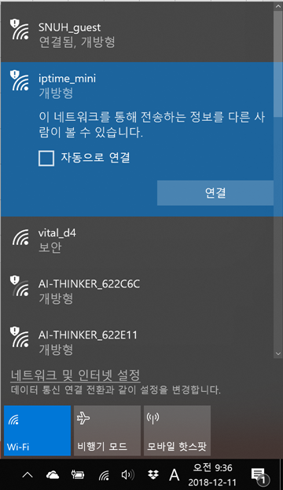
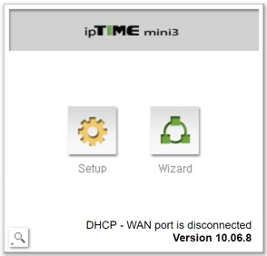
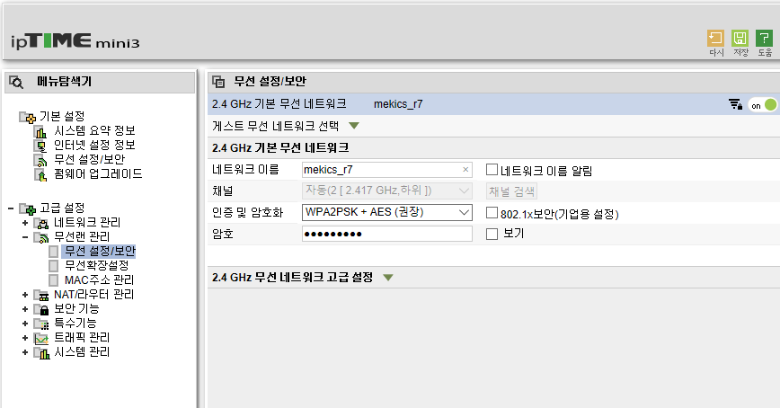
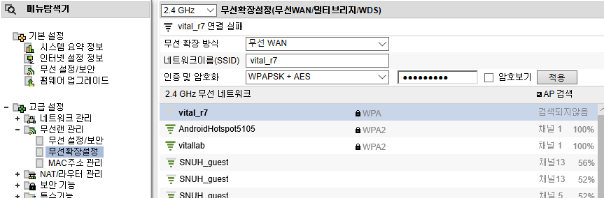
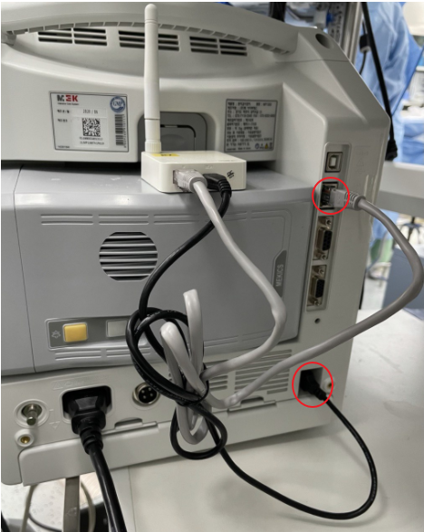

# MEKICS MP1300

<!-- meta
category: Patient Monitor
manufacturer: MEKICS
vr_device_name: MEKICS
-->
> ⚠️ **No serial cable — this monitor is collected over TCP/IP via a dedicated Wi-Fi router.** The router must be configured before first use, and the MP1300 must be rebooted for its network settings to apply.

| Cable | Adapter | Port | VR Device Name |
|-------|---------|------|----------------|
| Ethernet — monitor → dedicated Wi-Fi router (`192.168.0.1`) → VR PC | — | TCP `6002` (monitor **Server Port**; Server IP = VR PC, see [Device Configuration](#device-configuration)) | `MEKICS` |

The MP1300 speaks the **MP601 central-station protocol**; Vital Recorder listens as the central station on TCP port `6002`. The example below uses an ipTIME mini3 router — other models are configured the same way.

## Connection Steps

### Router Setup

1. Power the router and connect the PC to its default AP, **`iptime_mini`** (open network).

   

2. Open a browser → `192.168.0.1` → log in with **`admin` / `admin`**.

   

3. Press **Setup** (not Wizard).

   

4. Go to **Advanced Settings → Wireless LAN Management → Wireless Settings/Security**. Set the network name (SSID) and password, choose encryption **WPA2PSK + AES**, and **uncheck "Broadcast SSID"** → **Apply**.

   

   > Saving this drops the PC's connection because the SSID changed. Reconnect by adding a **hidden network** and typing the new SSID and password manually, then reopen `192.168.0.1`.

   

5. *(Optional — only if the router must reach an upstream network)* Go to **Advanced Settings → Wireless LAN Management → Wireless Extension Settings**. Set the extension method to **Wireless WAN** and enter the SSID and password of the **VR PC's hotspot**.

   

6. Go to **Advanced Settings → System Management → Other Settings**. Under *wired port function*, select **LAN Port** → **Apply**.

   

### Monitor Cabling

Mount the router on the monitor, power it from the **USB port on the rear of the MP1300**, and run a **LAN cable** from the router to the MP1300's Ethernet port.

   

## Device Configuration

1. On the monitor, go to **System → Network** and set the monitor's own address:
   - **IP:** `192.168.0.xxx` — the first three octets must match the router's subnet; the last octet is any unused value from 2–255, unique per monitor
   - **Mask:** `255.255.255.0`
   - **Gateway:** `192.168.0.1` (the router)

   

2. Go to **System → Network → Central → Mode** and select **MP601**.

   

3. Still under **Central**, set **Server IP** to the address of the Vital Recorder PC and **Server Port** to **`6002`**.

   

   - `192.168.137.1` is the Windows mobile-hotspot / ICS address, used when the router's wireless WAN uplinks to the VR PC's hotspot ([Router Setup](#router-setup), step 5). If the VR PC is instead a wired or wireless client on the router's own LAN, use its `192.168.0.x` address.

4. **Restart the monitor** — network changes only apply after a power cycle.

## Vital Recorder Setup

In Vital Recorder press **Add Device**, select **Patient monitor → MEKICS : MEKICS**, and set **Port** to **`6002`**.

## Troubleshooting

- **The router does not appear in Wi-Fi scans.** Expected — the SSID broadcast is disabled. Always reconnect as a hidden network.
- **Vital Recorder shows the device but no values.** Check that the `Port` value in Vital Recorder and the monitor's **Server Port** match — `6002` is the default on both sides.

## Notes

- One router can serve several MP1300s; give each monitor a distinct last octet and point them all at the same Server IP and port.
