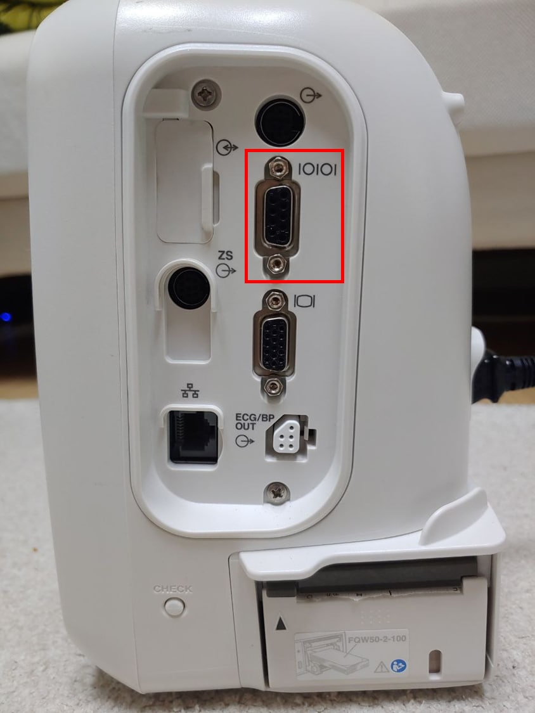

# Nihon Kohden BSM

<!-- meta
category: Patient Monitor
manufacturer: Nihon Kohden
vr_device_name: BSM
-->
> ⚠️ **Whether a BSM has an RS-232C output depends on the model and on which optional interface unit is fitted.** Photograph the monitor's connector panel and confirm the model number before ordering anything. Requires Vital Recorder **1.8.16.2** or later.

| Cable | Adapter | Port | VR Device Name |
|-------|---------|------|----------------|
| Direct serial DB-9M ↔ DB-9F (numeric) | Null Modem M/F | RS-232C socket on the interface unit | `BSM` |
| Nihon Kohden ECG/BP output cable + custom 5.5pi Mono ↔ RJ45 (waveform) | None | `ECG/BP OUT` port | — (ADC device) |

## Model / Interface Matrix

| Model | RS-232C output | What is needed |
|-------|----------------|----------------|
| **BSM-1700 series** | Present | Collect directly over serial. If a cable is already fitted, confirm it is free and not feeding another system. |
| **BSM-3000 series (e.g. BSM-3763)** | **Not on the base interface** | Add an RS-232C output interface — **`QF-910P`** or an RS-232C-capable **`QI-373P`** — for numeric data. |
| **BSM-6000 series (BSM-6301 / 6501 / 6701, incl. K variants)** | Present only with the optional interface unit | **`QI-631P`** for BSM-6301; **`QI-671P`** for BSM-6501 / BSM-6701. Both provide the RS-232C socket. |
| ECG / invasive BP **waveforms**, any model | Separate analog path | **`ECG/BP Output Cable`** — `YJ-910P` or `YJ-920P` — on the `ECG/BP OUT` port, plus an ADC. |

Confirm the exact interface unit that applies to a given serial number with Nihon Kohden — the option list differs between the A and K market variants.

## Connection Steps — Numeric Data

1. Identify the **RS-232C socket** (DB-9 female, marked with the serial `IOIOI` icon) on the interface unit's panel. Do not confuse it with the 15-pin RGB/video socket (`IOI`) directly below it, or with the RJ-45 network socket.

   

2. Attach a **Null Modem (M/F)** gender changer to that socket. Screwing it down keeps it from working loose.
3. Connect a **direct serial cable** from the adapter to the PC's DB-9M port or a USB-Serial converter.
4. In Vital Recorder, add **Patient monitor → Nihon Kohden : BSM**.

- Serial: **RS-232C**. The BSM RS-232C socket supports **9600 / 19200 / 38400 baud**; no monitor-side menu change is normally required. If nothing arrives, confirm the port's configured baud rate with Nihon Kohden.

## Connection Steps — ECG / ART Waveform

The RS-232C link carries numeric data only. ECG and arterial pressure waveforms come out of the **`ECG/BP OUT`** port as analog voltages, visible on the same connector panel as the serial socket.

1. Plug the Nihon Kohden **ECG/BP output cable** (`YJ-910P` or `YJ-920P`) into the `ECG/BP OUT` port.
2. Fabricate a **5.5pi Mono ↔ RJ45** cable to bring the analog outputs into the ADC (SNU-ADC / SNUADCM, DataQ DI-149/DI-155, …).
3. Connect the ADC to the PC via USB.

## Troubleshooting

- **The port opens but no data arrives.** Sources disagree on whether this link needs a crossover: the legacy main guide describes a plain direct cable, while the Patient Monitor documentation and our own field notes call for a **Null Modem (M/F)**. This page follows the latter. If the connection was made with the adapter and stays silent, **remove it** and retry direct — and vice versa. Record which one worked for that model so the matrix above can be tightened.
- **No RS-232C socket on the panel.** The interface unit is missing or is a variant without the serial option — see the [Model / Interface Matrix](#model--interface-matrix). No cable will help.
- **Numerics arrive but no waveforms.** Expected: the RS-232C link carries numeric data only. Waveforms need the `ECG/BP OUT` path and an ADC.

## Notes
- Requires Vital Recorder **1.8.16.2** or later.
- The `QI-373P` interface carries **both** the RS-232C socket and the `ECG/BP OUT` port, so a single added board can serve numeric and waveform collection — but the waveform side still needs its own output cable and an ADC.
- **CSM / LifeScope** models are less well verified than BSM — treat support as unconfirmed.
- Where a Nihon Kohden **central station** exists, data can be taken from the server instead of per-bed serial. Where there is no central server, per-bed serial is the only route.
