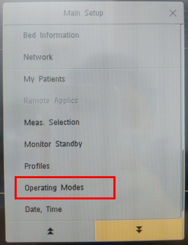
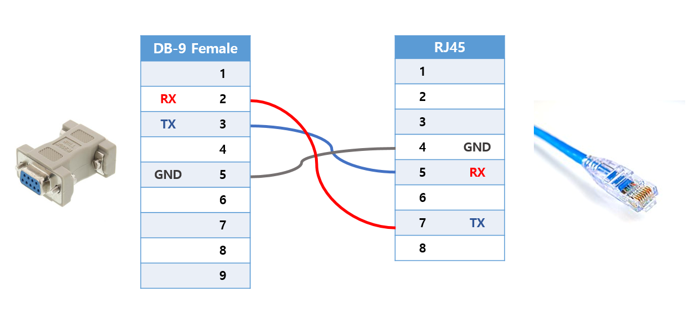
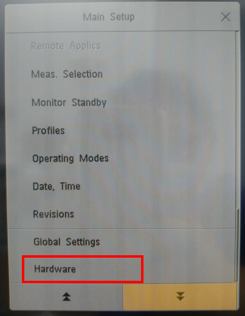
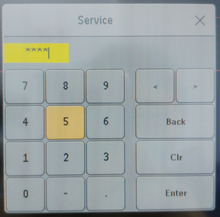
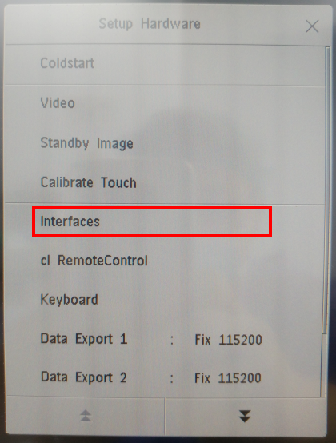
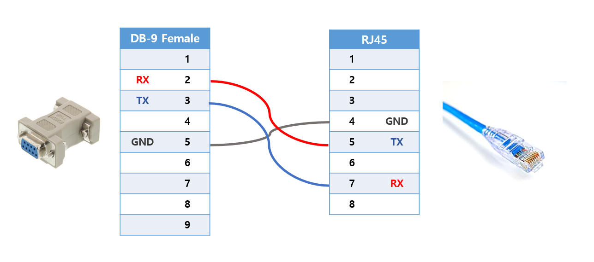
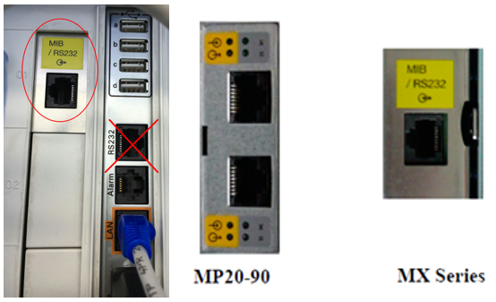
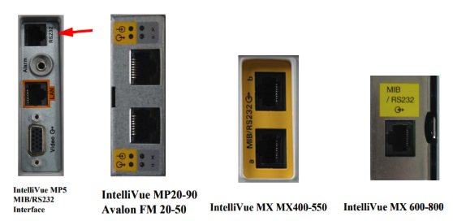

# Philips Intellivue MP / MX Series

<!-- meta
category: Patient Monitor
manufacturer: Philips
vr_device_name: Intellivue
-->
> **Note:** Serial communication via the **MIB port** (RJ-45 style). Works regardless of connection to a central station.

| Cable | Adapter | Port | VR Device Name |
|-------|---------|------|----------------|
| Custom RJ-45 ↔ DB-9F | None | MIB port | `Intellivue` |

## Connection Steps
1. Prepare a cable connecting **RJ-45 pins 4, 5, 7** → **DB-9F pins 5, 2, 3**.

   

2. Plug the **RJ-45 end** into the MIB port on the monitor.

   

3. Plug the **DB-9F end** into the PC via USB-Serial converter.
4. **MX400–550 series only:** Use the Advanced Interface Card (Rx/Tx pins connect differently).

   

> MX600–800 series: MIB board must be installed.

## Device Configuration
1. Press **Main Setup → Operation Modes → Service**.

   

2. Enter service password (default: **`1345`**). Contact manufacturer if this fails.

   

3. Press **Main Setup → Hardware** (press and hold at bottom of menu).
4. Set **Data Export 1** and **Data Export 2** baud rate to **"Fix 115200"**.

   

5. Press **Interfaces**.

   

6. Verify port **01a** driver is set to **"DtOut1"**. If not, press **Change Driver → DtOut1**.

   

7. **Restart the monitor.**

**Optional — Extract ETCO2 Waveform (via IntelliBridge EC10 Module):**

1. Navigate to **Main Setup → Operating Modes → Config**.
   - Config password: **71034**
2. Press the **Setup** button on the **IntelliBridge EC10 module** connected to the anesthesia machine.
3. On the monitor, select **Setup Device**.
4. Navigate to **Setup Anesth. Machine → Device Driver → Setup Waves**.
5. Press **Add** and select **CO2** and **AWP**.
   - If incorrect waves appear, press **Delete All**, then re-add the correct waves.
6. Select **Select to change operating mode → monitoring**.
7. Press **Confirm** to apply the settings.

> **Note:** MP2 and X2 monitors do not support serial communication and **cannot be used** with Vital Recorder.
