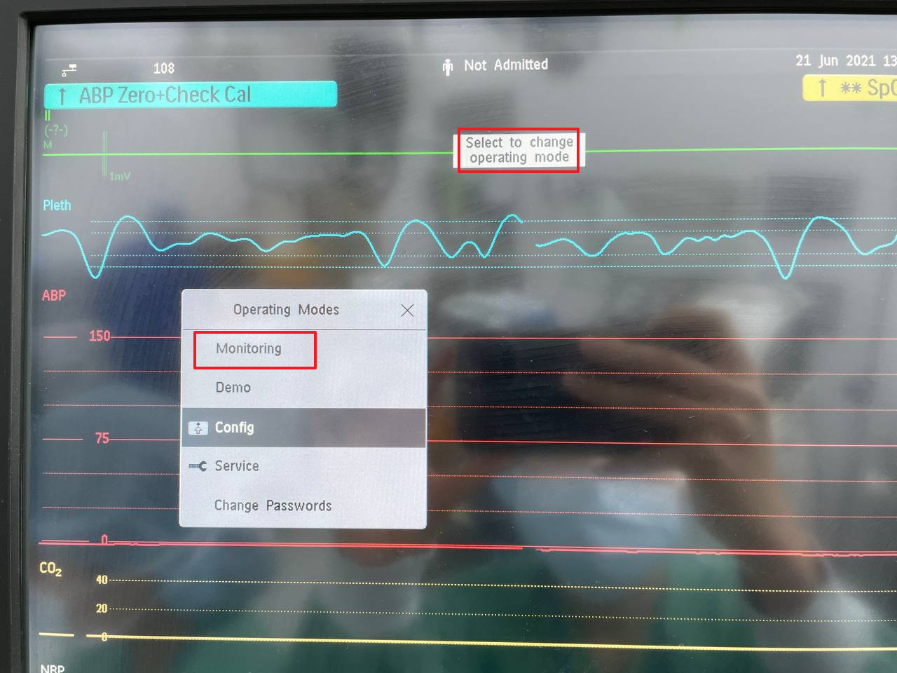

# Philips Intellivue MP / MX Series

<!-- meta
category: Patient Monitor
manufacturer: Philips
vr_device_name: Intellivue
-->
> ⚠️ **Use the port labeled `MIB/RS232`, not the plain `RS232` port.** Service-mode configuration is mandatory. The MIB port works whether or not the monitor is connected to a central station. **MP2 and X2 monitors have no usable serial port and cannot be used.**

| Cable | Adapter | Port | VR Device Name |
|-------|---------|------|----------------|
| Custom RJ-45 ↔ DB-9F (MP / MX via MIB) | None | `MIB/RS232` (RJ-45) | `Intellivue` |
| Custom RJ-45 ↔ DB-9F with pins 2/3 swapped (MX400–550 via ASIB) | None | `MIB/RS232` on the Advanced Interface Card | `Intellivue` |

The DB-9F end goes to the PC's DB-9M serial port or a USB-Serial converter (e.g. ATEN UC-232A). The monitor side is RJ-45, so **no Null Modem adapter is used** — the crossover is built into the custom cable.

## Connection Steps
1. Locate the port labeled **`MIB/RS232`** on the monitor. A separate port labeled only `RS232` (next to `Alarm`) is **not** the data-export port and will not work.

   

2. Port placement and labeling differ by model — compare the unit against the variants below.

   

3. Prepare a cable connecting **RJ-45 pins 4 (GND), 5 (TX), 7 (RX)** → **DB-9F pins 5 (GND), 2 (RX), 3 (TX)**.

   

   - Only three conductors are needed. Instead of soldering, a standard Cat5/Cat6 patch cable plus an off-the-shelf **RJ-45 female → DB-9 female modular adapter** (screw-terminal type) can be wired to the same three positions.

4. Plug the **RJ-45 end** into the MIB/RS232 port and the **DB-9F end** into the PC via USB-Serial converter.

5. **MX400–550 series only:** the **Advanced Interface Card (ASIB)** port can be used instead. Its Rx/Tx are reversed relative to the MIB port — **DB-9F pins 2 and 3 are swapped** (RJ-45 4, 5, 7 → DB-9F 5, 3, 2).

   

> MX600–800 series: the MIB board must be installed.

## Device Configuration
1. Press **Main Setup → Operating Modes**.

   

2. Select **Service** and enter the service password (default: **`1345`**). Contact the manufacturer if this fails.

   

3. Go back into **Main Setup** and scroll to the bottom of the list for **Hardware**.

   

4. In **Setup Hardware**, set **Data Export 1** and **Data Export 2** to **`Fix 115200`**, then press **Interfaces**.

   

5. In **Setup Interfaces**, verify the driver on the **MIB/RS232** slot (usually port **`01a`**) is **`DtOut1`**. If it shows anything else (`GM`, `AGM`, `Mouse/Keybd`, …), press **Change Driver → DtOut1**.

   

   - The digit after `DtOut` follows the slot the port is assigned to, so `DtOut2` may be correct on a monitor with a different card layout.

6. **Restart the monitor.** The driver change only takes effect after a power cycle.

- Serial: **115200 baud, fixed** (set via *Data Export 1 / 2*). No hardware flow control — the cable carries only RxD, TxD and GND.
- Verification: when a MIB/RS232 port is configured for data export, the yellow **arrow-out LED** beside that port lights up.

**Optional — Extract ETCO2 / AWP Waveform (via IntelliBridge EC10 Module):**

1. Navigate to **Main Setup → Operating Modes → Config**.
   - Config password: **`71034`**

   

2. Press the **Setup** button on the **IntelliBridge EC10 module** connected to the anesthesia machine.

   

3. On the monitor, select **Setup Device** in the *External Devices* bar.

   

4. Navigate to **Setup Anesth. Machine → Device Driver → Setup Waves**.

   

5. Press **Add** and select **CO2** and **AWP**.
   - If incorrect waves appear, press **Delete All**, then re-add the correct waves.

6. Select **Select to change operating mode → Monitoring**.

   

7. Press **Confirm** to leave configuration mode and apply the settings.

   

## Vital Recorder Setup

- Add the device in Vital Recorder as **`Intellivue`**.

## Notes

- **Invasive pressure label must be `ART1` / `IBP1`.** Beds labelled `ART2` (or another second-channel label) on the monitor have recorded numerics but **no pressure waveform**. Relabel on the monitor — the track name is not configurable in Vital Recorder.
- **Datex-Ohmeda machine bridged through IntelliBridge:** the wave order Vital Recorder receives is whatever the monitor sends. Set the anesthesia-machine wave order on the monitor to **C-F-V-P** (CO2, Flow, Volume, Pressure) rather than relying on `wavs=`, which only tells Vital Recorder how to interpret the order.
- **AWF looks wrong after a machine swap:** the airway-flow bias differs by bridged machine (about −130 for Datex-Ohmeda, −160 for Dräger). Re-request `awp`/`awf` in `vr.conf` after swapping the anesthesia machine.
- **Powering a recorder from the monitor's rear USB port** is unreliable on the MX750 and MX400 (most units fail to boot the recorder). Use an external power supply.
- **Transport monitors:** the IntelliVue **X3** module has no MIB port and cannot be recorded when detached; the **MX400** is the smallest IntelliVue with an MIB board. Confirm the MIB option is fitted before purchase — it is optional on the MX400.
- If the service password has been changed from `1345`, only the Philips service agent can supply it.
- **MP2 / X2** monitors do not support serial communication and **cannot be used** with Vital Recorder.
- **MX600–800** require the MIB board to be installed; **MX400–550** can use either the MIB port or the ASIB port on the Advanced Interface Card.
- Vital Recorder versions: serial-communication fixes affecting Intellivue landed in **1.16.4**, a multi-bed crash was fixed in **1.19.3**, and waveform-dropout handling improved in **1.19.9**. Use **1.19.9** or later where possible.
- **The `DtOut1` setting can be lost silently** after a monitor swap or a power event, which shows up as a bed that records nothing. Re-check *Setup Interfaces*, then power-cycle the monitor and restart Vital Recorder.
- **The ECG waveform disappears when the monitor is displaying lead I or III** — use lead II.
- Ventilator parameters (CO2 / AWP) additionally require the monitor's ventilator-data setup to be enabled.
- When an anesthesia machine is bridged into the monitor via IntelliBridge, a **Datex-Ohmeda** bridge does not forward gas-agent data to the monitor (a Dräger bridge does).
- On old firmware (e.g. some MP20 units) waves may have to be requested explicitly in `vr.conf`.
