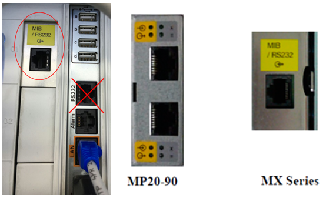
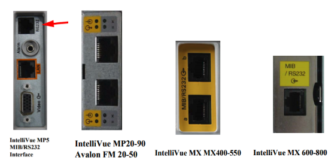
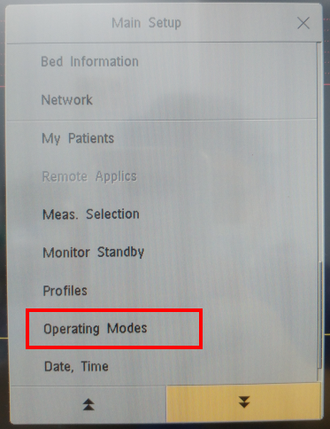
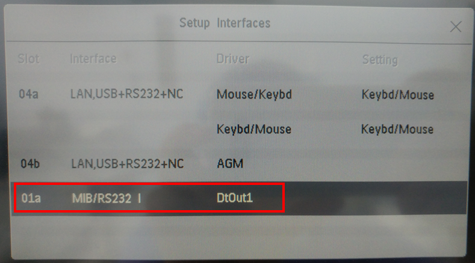
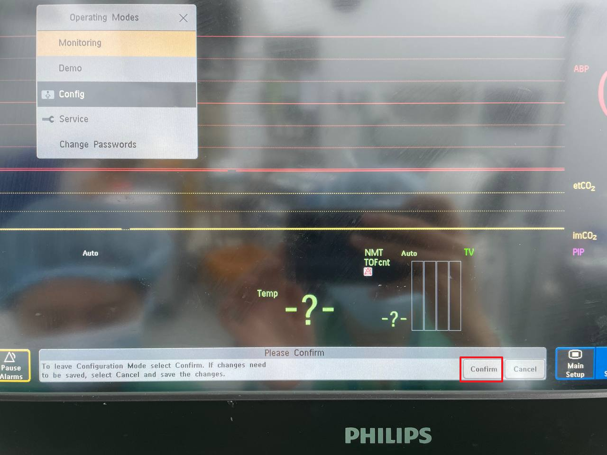

# Philips IntelliVue MP / MX Series

<!-- meta
category: Patient Monitor
manufacturer: Philips
vr_device_name: Intellivue
-->
> ⚠️ **Use the port labeled `MIB/RS232`, not the plain `RS232` port.** Service-mode configuration is mandatory. The MIB port works whether or not the monitor is connected to a central station. **MP2 and X2 monitors have no usable serial port and cannot be used.**

| Cable | Adapter | Port | VR Device Name |
|-------|---------|------|----------------|
| Custom RJ-45 ↔ DB-9F | None | `MIB/RS232` | `Intellivue` |

## Connection Steps
1. Locate the port labeled **`MIB/RS232`** on the monitor. A separate port labeled only `RS232` (next to `Alarm`) is **not** the data-export port and will not work.

   

2. Port placement and labeling differ by model — compare the unit against the variants below.

   

3. Prepare a cable connecting **RJ-45 pins 4 (GND), 5 (TX), 7 (RX)** → **DB-9F pins 5 (GND), 2 (RX), 3 (TX)**.

   

   - Only three conductors are needed. Instead of soldering, a standard Cat5/Cat6 patch cable plus an off-the-shelf **RJ-45 female → DB-9 female modular adapter** (screw-terminal type) can be wired to the same three positions.

4. Plug the **RJ-45 end** into the MIB/RS232 port and the **DB-9F end** into the PC via USB-Serial converter.

5. **MX400–550 series only:** the **Advanced Interface Card (ASIB)** port can be used instead. Its Rx/Tx are reversed relative to the MIB port, so the cable is wired as follows:

   | DB-9F (PC side) | Signal | RJ-45 (ASIB) | Signal |
   |---|---|---|---|
   | 2 | RX | 7 | TX |
   | 3 | TX | 5 | RX |
   | 5 | GND | 4 | GND |

   

> MX600–800 series: the MIB board must be installed.

## Device Configuration
1. Press **Main Setup → Operating Modes**.

   

2. Select **Service** and enter the service password (default: **`1345`**).

   

3. Go back into **Main Setup** and scroll to the bottom of the list for **Hardware**.

   

4. In **Setup Hardware**, set **Data Export 1** and **Data Export 2** to **`Fix 115200`**, then press **Interfaces**.

   

5. In **Setup Interfaces**, verify the driver on the **MIB/RS232** slot is **`DtOut1`**. If it shows anything else (`GM`, `AGM`, `Mouse/Keybd`, …), press **Change Driver → DtOut1**.

   

   - The digit after `DtOut` follows the slot the port is assigned to, so `DtOut2` may be correct on a monitor with a different card layout.

   > When both data-export connections are in use, only one can receive waveforms at a time. The connection whose waveform request succeeds first receives the waveforms; waveform requests from the other connection are rejected.

6. **Reboot the monitor.** The driver change only takes effect after a power cycle.

## Optional: CO2 and Airway Pressure Waveforms via IntelliBridge EC10

Use this section when an anesthesia machine is connected to the IntelliVue monitor through an IntelliBridge EC10 module.

1. Open **Main Setup → Operating Modes → Config** and enter the configuration password.
   - Config password: **`71034`**

   

2. Press the **Setup** button on the IntelliBridge EC10 module.
3. On the monitor, select **Setup Device** in the **External Devices** bar.
4. Open **Setup Anesth. Machine → Device Driver → Setup Waves**.

   

5. Add **CO2** and **AWP**, if available for the connected device.
6. Press **Confirm** to leave configuration mode and apply the settings.

   

## Vital Recorder Setup

- Add the device as **`Intellivue`** and select the PC serial port used for the connection.

## Troubleshooting

- **A bed records nothing after a monitor swap or a power event.** The `DtOut1` setting can be lost silently. Re-check *Setup Interfaces*, then power-cycle the monitor and restart Vital Recorder.
- **Waveforms stop a few seconds after recording starts while numerics continue.** More waveforms were requested than the serial link can carry, and the monitor then stops sending all of them. By default Vital Recorder adds a waveform for every numeric present on top of the ones selected. Clear the auto-add checkbox in the device dialog (`auto_wavs=0`) so only the selected waveforms are requested.
- **Waves missing on old firmware (e.g. some MP20 units).** Request them explicitly in `vr.conf`.
- **Repeated crashes on a multi-bed installation, or serial reception failing.** The multi-bed crash was fixed in 1.19.3; serial reception failure was fixed in 1.16.4.
